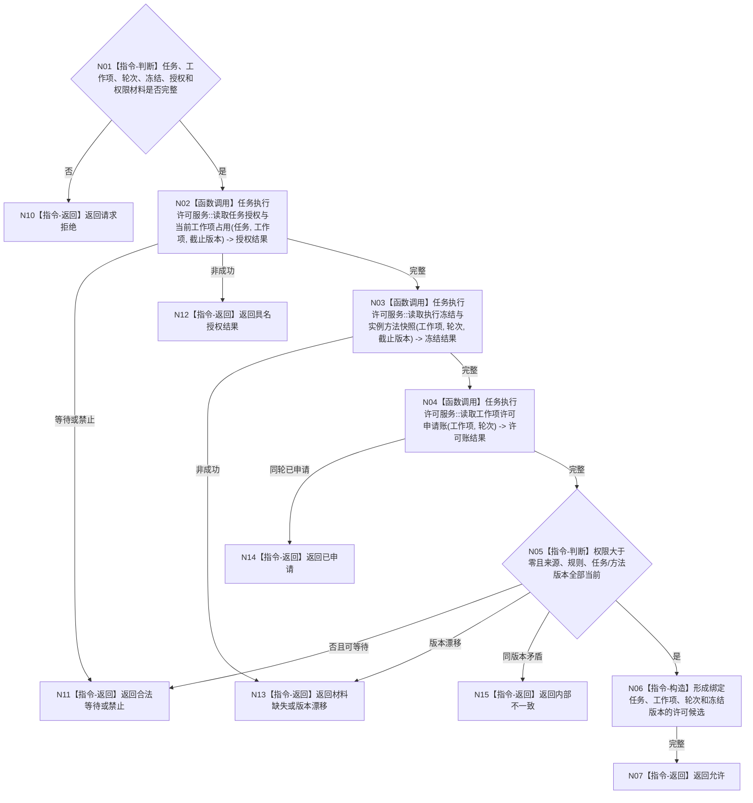

# BIZ-L3-002-05-02 复核工作项执行冻结与许可前置目标函数流程图 v0.1

更新时间：2026-08-03

## 依据

```text
0050、5090、5230、6170、8100；BIZ-L2-002-05
```

## 身份与边界

正式目标函数设计图。复核一个真实外部动作工作项的任务授权、执行冻结、方法版本和正权限，只返回许可前置材料，不发放许可。

## 函数合同

```text
根函数：任务执行许可服务::复核工作项执行冻结与许可前置
归属模块 / 文件 / 层级：任务执行许可 / 海中鱼巣/领域/服务.任务执行许可.ixx / L3
现有或待新增：适配扩展；复用现行许可预判材料和任务冻结读取
完整签名：工作项执行许可前置结果 任务执行许可服务::复核工作项执行冻结与许可前置(const 工作项执行许可前置请求& 请求) const
参数：请求为只读借用；含任务/工作项身份、尝试轮次、执行冻结、实例方法版本、任务授权、权限快照、运行代次和事实截止版本
返回结果：不可变值式结果；含允许、禁止、合法等待、材料缺失、已申请、版本漂移或内部不一致，以及绑定工作项的一次性许可候选材料
被调函数流程图：BIZ-L4-002-05-02-01 任务执行许可服务::读取任务授权与当前工作项占用；BIZ-L4-002-05-02-02 任务执行许可服务::读取执行冻结与实例方法快照；BIZ-L4-002-05-02-03 任务执行许可服务::读取工作项许可申请账
父图：BIZ-L2-002-05
```

## 流程图



## 节点合同

| 节点 | 类型 | 输入 | 输出 | 事实读写 | 验证 |
| --- | --- | --- | --- | --- | --- |
| N01—N04 | 判断 / 调用 | 前置请求 | 授权、冻结、许可账快照 | 只读任务/方法/许可所有者 | 工作项唯一、同轮单申请 |
| N05—N06 | 判断 / 构造 | 快照和权限 | 许可候选材料 | 无 | 权限正值、来源和版本当前 |
| N07—N15 | 返回 | 复核结论 | 结构化结果 | 不发放许可、不执行动作 | 等待/禁止/漂移分离 |

## 关键边界

前置允许不等于任务可执行状态已经改变，也不等于动作成功；一次性许可仍由上层裁决并与当前工作项绑定。
