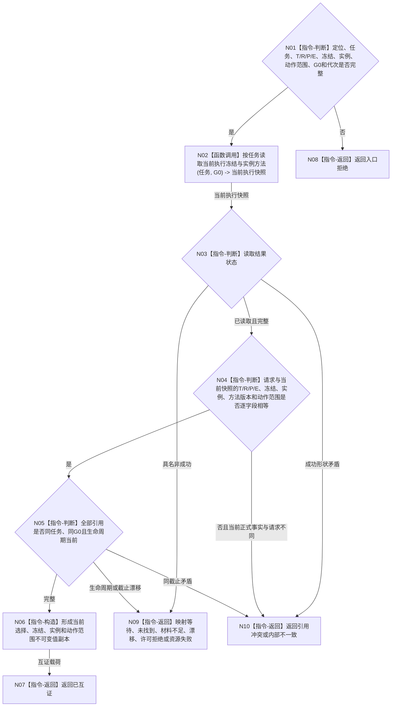

# BIZ-L3-002-05-02 复核现实执行授权请求与当前冻结目标函数流程图 v0.2

更新时间：2026-08-26

## 依据

```text
0050、5090、5230、5300、8100、8200；BIZ-L2-002-05 v0.2
替代关系：v0.2退出任务授权 / 工作项占用、旧许可账和通用执行令牌候选
```

## 身份与边界

正式目标函数设计图。函数按任务和 `G0` 独立读取当前正式选择、执行绑定冻结材料和当前实例方法，再与任务管理线程提交的强类型现实执行授权请求逐字段互证。它不读取旧任务授权、不判断工作项占用、不查询旧许可账，也不形成授权或调度结论。

## 函数合同

```text
根函数：现实执行授权前置组合器::复核现实执行授权请求与当前冻结
归属模块 / 文件 / 目标分解深度：现实执行授权前置组合 / 海中鱼巣/领域/组合.现实执行授权前置.ixx / BIZ-L3
现有或待新增：待新增组合入口；复用已发布L2任务当前选择 / 当前实例方法读取
完整签名：现实执行授权请求冻结复核结果 现实执行授权前置组合器::复核现实执行授权请求与当前冻结(const 现实执行授权请求冻结复核请求& 请求) const noexcept
参数：`请求`，类型 `const 现实执行授权请求冻结复核请求&`，输入、只读借用且仅在调用期间有效；字段为授权请求定位、任务、T/R/P/E、冻结身份、实例方法身份、完整有序冻结动作范围、G0、运行代次和合同版本；任一身份 / 轮次 / G0 / 版本为零或动作范围非规范均非法
返回结果：`现实执行授权请求冻结复核结果`，按值交给调用方；已互证、合法等待、未找到、材料不足、当前性漂移、引用冲突、许可拒绝、资源失败、入口拒绝或内部不一致；成功携带当前选择、冻结、实例和动作范围值副本，非成功零成功载荷
被调函数流程图：BIZ-L4-002-05-02-02 v0.2 按任务读取当前执行冻结与实例方法
父图：BIZ-L2-002-05 v0.2
```

## 流程图



## 节点合同

| 节点 | 类型 | 参数 / 输入绑定 | 结果 / 输出绑定 | 事实读写 | 后继条件 | 验证 |
| --- | --- | --- | --- | --- | --- | --- |
| N01 | 指令-判断 | 完整复核请求 | 准入结论 | 无写入 | 合法或入口拒绝 | 定位、T/R/P/E、冻结、实例、G0完整 |
| N02/N03 | 函数调用 / 判断 | 任务与G0 | 当前执行快照 | 只经任务owner领域服务读取当前选择、冻结和实例；无写入 | 完整或具名非成功 | 截止和成功形状 |
| N04/N05 | 判断 | 请求与当前快照 | 逐字段互证结论 | 无写入 | 完整、漂移或冲突 | T/R/P/E、冻结、实例、动作范围、生命周期 |
| N06/N07 | 构造 / 返回 | 已互证快照 | 已互证值副本 | 无写入 | 返回父图 | 不包含调度或授权结论 |
| N08—N10 | 返回 | 非成功来源 | 结构化非成功 | 无写入 | 返回父图 | 非成功零载荷 |

## 关键边界

- `来源需求组`不能替代完整执行冻结；请求必须绑定正式冻结身份和完整动作范围。
- 当前选择和实例方法只能由任务owner在G0正式读回；线程缓存、旧工作包和调用方自报都不是当前事实。
- 本函数不判断A、不计算调度资格、不发布自我授权，也不接触硬否决或技术许可。
