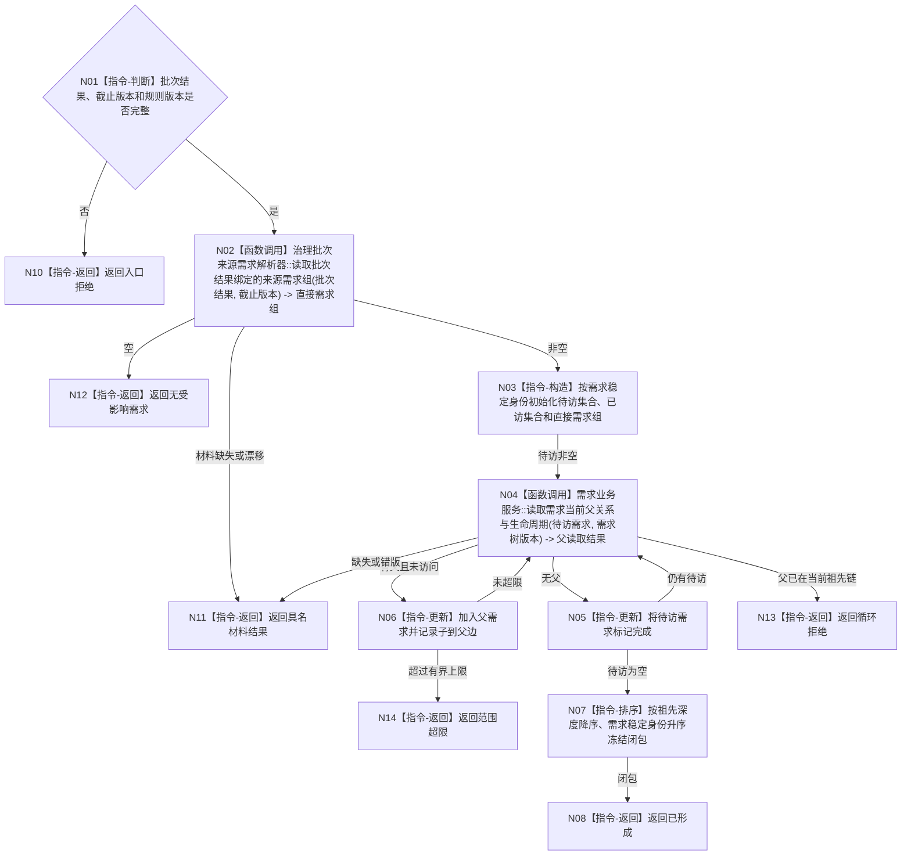

# BIZ-L3-002-06-01 形成受影响需求闭包目标函数流程图 v0.1

更新时间：2026-08-03

## 依据

```text
3100、5110、5160、5090、8100；BIZ-L2-002-06
```

## 身份与边界

正式目标函数设计图。由本批任务结果、需求结算和事实变化引用形成受影响需求及其祖先闭包；只读结构，不裁决活动路径，不写需求事实。

## 函数合同

```text
根函数：需求业务服务::形成受影响需求闭包
归属模块 / 文件 / 层级：需求领域 / 海中鱼巣/领域/服务.需求.ixx / L3
现有或待新增：适配扩展；复用需求、父需求和来源任务读取，新增批次级闭包结果
完整签名：需求受影响闭包结果 需求业务服务::形成受影响需求闭包(const 需求受影响闭包请求& 请求) const
参数：请求为只读借用；含唯一自我、治理批次、批次处理结果、事实截止版本、需求树版本和闭包规则版本
返回结果：不可变值式结果；含无受影响需求、已形成、材料缺失、循环拒绝、范围超限、版本漂移或内部不一致，以及稳定排序的直接需求和祖先闭包
被调函数流程图：BIZ-L4-002-06-01-01 治理批次来源需求解析器::读取批次结果绑定的来源需求组；复用BIZ-L4-002-04-02-01 需求业务服务::读取需求当前父关系与生命周期
父图：BIZ-L2-002-06
```

## 流程图



## 节点合同

| 节点 | 类型 | 输入 | 输出 | 事实读写 | 验证 |
| --- | --- | --- | --- | --- | --- |
| N02/N04 | 函数调用 | 批次结果、需求身份和版本 | 直接需求、唯一父需求 | 只读需求结构 | 来源绑定、当前性、单父 |
| N03/N05—N07 | 指令 | 需求和父边 | 有界稳定闭包 | 无写入 | 去重、循环、祖先先处理 |
| N08/N10—N14 | 返回 | 闭包状态 | 结构化结果 | 无写入 | 空、缺失、循环、超限分离 |

## 关键边界

闭包只由正式来源绑定和当前父关系形成；日志、任务名称、历史子节点和拓扑数量不得扩展范围。循环是结构错误，不得截断后继续发布部分重判。
