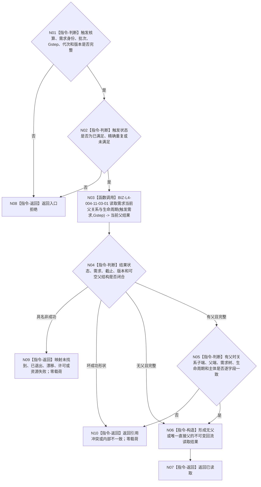

# BIZ-L3-002-06-01 读取核算需求当前直接父关系目标函数流程图 v0.2

更新时间：2026-08-26

## 依据与替代

```text
0050、3100、5110、5160 v0.5、4015；BIZ-L2-002-06 v0.2
BIZ-L4-004-11-03-01 v0.3
```

本图替代旧“从任意批次结果形成受影响需求闭包”v0.1。函数只验证一项显式需求核算触发，并在指定当前截止读取该需求的可空唯一直接父关系；不枚举祖先、不读取任务结果、不推断其它受益需求。

## 身份与边界

正式目标函数设计图。显式核算结果只负责提供触发需求身份和本批来源见证；当前需求、父关系和父需求端点均由需求领域在 `Gstep` 正式读回。无父是合法成功；触发需求已退出、关系漂移或半结构不能降级成无父。

## 函数合同

```text
根函数：读取核算需求当前直接父关系
归属模块 / 文件 / 目标分解深度：需求父关系回流读取组合 / 海中鱼巣/领域/组合.需求父关系回流读取.ixx / BIZ-L3
现有或待新增：待新增组合器；复用 BIZ-L4-004-11-03-01 v0.3 和已发布 L2 当前父关系读取
完整签名：核算需求直接父关系读取结果 需求父关系回流读取组合器::读取核算需求当前直接父关系(const 核算需求直接父关系读取请求& 请求) const noexcept
参数：`请求`为只读借用；含合同版本、运行代次、治理批次身份、一项状态为已满足/精确重复/未满足且身份完整的 `需求独立核算结果` 触发核算、非零Gstep、需求树/父关系/读取规则版本；触发核算不完整、失败态或截止晚于Gstep非法
返回结果：按值返回；已读取时携带触发需求、完整当前需求、可空唯一当前父关系、可空父需求和截止Gstep；入口拒绝、未找到、已退出、当前性/版本漂移、引用冲突、许可拒绝、资源失败或内部不一致均零成功载荷
被调函数流程图：复用 BIZ-L4-004-11-03-01 v0.3 `需求业务服务::读取需求当前父关系与生命周期`
父图：BIZ-L2-002-06 v0.2
```

## 流程图



## 节点合同

| 节点 | 类型 | 参数 / 输入绑定 | 结果 / 输出绑定 | 事实读写 | 后继条件 | 验证 |
| --- | --- | --- | --- | --- | --- | --- |
| N01/N02 | 指令-判断 | 一项显式需求核算结果 | 合法回流触发 | 无写入 | 合法或入口拒绝 | 失败核算、任意批次结果和任务结果均不得进入 |
| N03/N04 | 函数调用 / 判断 | 触发需求和Gstep | 当前需求与可空唯一父 | 只经具名需求领域服务读取 | 已读取或具名非成功 | 截止、版本和零变更形状互证 |
| N05—N07 | 判断 / 构造 / 返回 | 当前父关系和两端点 | 无父或唯一直接父结果 | 无写入 | 返回父图 | 多父、半结构、错端点和跨主体为冲突 |
| N08—N10 | 返回 | 入口或读取失败 | 结构化非成功 | 无写入 | 返回父图 | 无父不与未找到/已退出混淆 |

## 关键边界

- 本函数不读取完整祖先闭包、当前活动子组、权重、预算、任务或历史结算；父图每上行一级都重新取得当前截止。
- 核算结果只是触发，不是父关系来源；父关系只能来自当前需求 owner 正式读回。
- 当前父关系为空不证明需求是主需求、最高优先级或当前活动；这里只证明本回流分支到达结构根。
