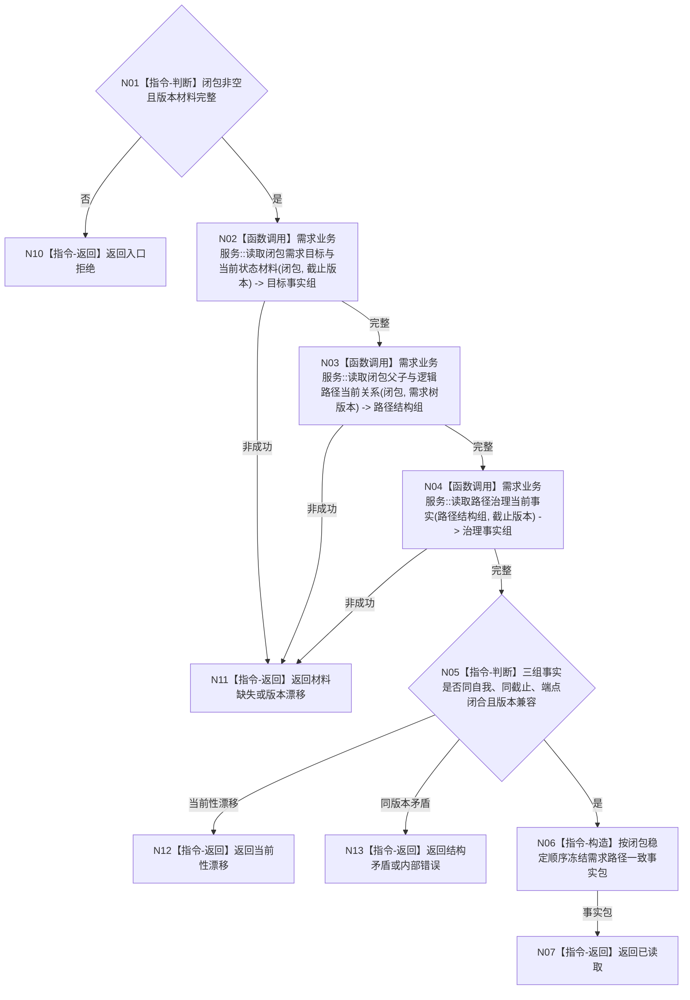

# BIZ-L3-002-06-02 读取需求路径一致事实目标函数流程图 v0.1

更新时间：2026-08-03

## 依据

```text
3100、5100、5110、5160、5090；BIZ-L2-002-06
```

## 身份与边界

正式目标函数设计图。一次读取闭包内需求的父子、目标、活动路径、授权、权重和当前结算证据，形成同一截止版本的值式事实包；不比较目标，不推断角色。

## 函数合同

```text
根函数：需求业务服务::读取需求路径一致事实
归属模块 / 文件 / 层级：需求领域 / 海中鱼巣/领域/服务.需求.ixx / L3
现有或待新增：适配扩展；组合现有需求和父子读取，新增同截止路径事实包
完整签名：需求路径一致事实读取结果 需求业务服务::读取需求路径一致事实(const 需求路径一致事实读取请求& 请求) const
参数：请求为只读借用；含受影响闭包、唯一自我、事实截止版本、需求树版本、路径规则版本
返回结果：不可变值式结果；含已读取、材料缺失、当前性漂移、版本漂移、结构矛盾或内部错误，以及逐需求目标、父子、路径角色、活动状态、授权、权重、结算和来源版本
被调函数流程图：BIZ-L4-002-06-02-01 需求业务服务::读取闭包需求目标与当前状态材料；BIZ-L4-002-06-02-02 需求业务服务::读取闭包父子与逻辑路径当前关系；BIZ-L4-002-06-02-03 需求业务服务::读取路径治理当前事实
父图：BIZ-L2-002-06；BIZ-L4-002-06-05-01复用本入口读取活动重判写前路径一致事实
```

## 流程图



## 节点合同

| 节点 | 类型 | 输入 | 输出 | 事实读写 | 验证 |
| --- | --- | --- | --- | --- | --- |
| N02—N04 | 函数调用 | 闭包和固定版本 | 三组权威事实 | 只读需求领域 | 不跨版本补齐 |
| N05/N06 | 判断 / 构造 | 三组事实 | 一致事实包 | 无写入 | 父子端点、目标、角色和来源闭合 |
| N07/N10—N13 | 返回 | 读取状态 | 结构化结果 | 无写入 | 缺失、漂移、矛盾分离 |

## 关键边界

历史关系可以作为历史材料返回，但不得冒充当前活动路径；缓存、SQL、日志和控制面板不得补齐缺失字段或选择较新记录拼包。
