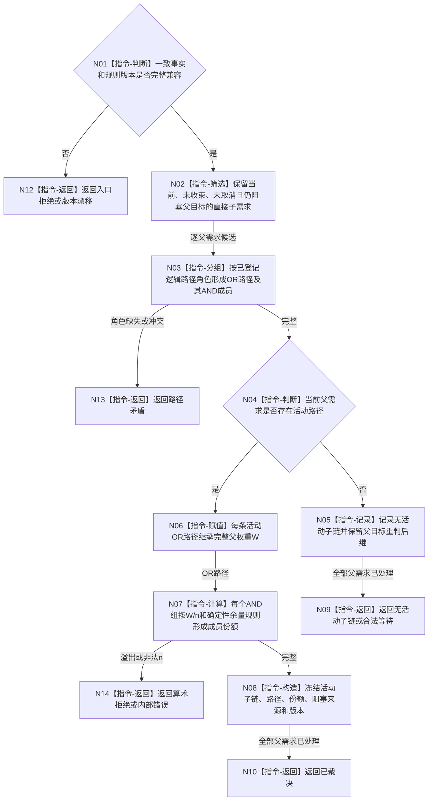

# BIZ-L3-002-06-03 裁决活动子链与路径目标函数流程图 v0.1

更新时间：2026-08-03

## 依据

```text
3100、5110、5090、6150；BIZ-L2-002-06
```

## 身份与边界

正式目标函数设计图。纯值裁决当前活动直接子需求、OR 路径、AND 组及权重份额；不读取仓库、不写需求、不计算安全任务权限。

## 函数合同

```text
根函数：需求路径裁决服务::裁决活动子链与路径
归属模块 / 文件 / 层级：需求路径纯裁决 / 海中鱼巣/领域/服务.需求路径裁决.ixx / L3
现有或待新增：待新增
完整签名：需求活动路径裁决结果 需求路径裁决服务::裁决活动子链与路径(const 需求活动路径裁决请求& 请求) const
参数：请求为只读借用；含需求路径一致事实、路径规则版本、权重值域版本和确定性余量规则版本
返回结果：不可变值式结果；含已裁决、无活动子链、合法等待、路径矛盾、算术拒绝或版本漂移，以及逐父需求活动OR路径、AND成员、权重份额和阻塞来源
被调函数流程图：无；本函数只执行确定性判断、分组和checked整数计算
父图：BIZ-L2-002-06
```

## 流程图



## 节点合同

| 节点 | 类型 | 输入 | 输出 | 事实读写 | 验证 |
| --- | --- | --- | --- | --- | --- |
| N02—N04 | 指令 | 一致事实 | 当前活动成员与路径 | 无 | 不按子节点数量推断角色 |
| N06/N07 | 指令 | 父权重、OR/AND结构 | 完整W和组内份额 | 无 | OR不平分、AND确定舍入 |
| N08—N14 | 构造 / 返回 | 裁决材料 | 结构化结果 | 无 | 历史路径、零成员、溢出覆盖 |

## 关键边界

需求权重、冻结结算预算、任务基础优先级和安全执行权限是不同机器量。本函数只裁决需求路径权重，不产生任务执行权限或总分。
