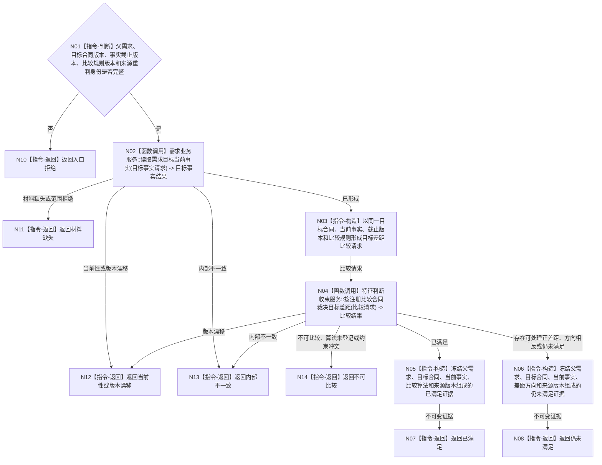

# BIZ-L3-002-06-04 重新比较父需求目标当前事实目标函数流程图 v0.1

更新时间：2026-08-03

## 依据

```text
3100、5100、5110、5160、4160；BIZ-L2-002-06
```

## 身份与边界

正式目标函数设计图。通过正式状态与判断收束合同重新比较一个父需求的当前实际事实和目标状态；不直接比较裸值，不发布满足记录。

## 函数合同

```text
根函数：需求业务服务::重新比较父需求目标当前事实
归属模块 / 文件 / 层级：需求领域 / 海中鱼巣/领域/服务.需求.ixx / L3
现有或待新增：适配扩展；复用需求目标读取和正式判断收束能力
完整签名：需求目标当前比较结果 需求业务服务::重新比较父需求目标当前事实(const 需求目标当前比较请求& 请求) const
参数：请求为只读借用；含父需求、目标合同版本、事实截止版本、比较规则版本和来源重判身份
返回结果：不可变值式结果；含已满足、仍未满足、不可比较、材料缺失、当前性漂移、版本漂移或内部不一致，以及目标、实际状态、比较证据和来源版本
被调函数流程图：复用 BIZ-L3-004-01-01 `需求业务服务::读取需求目标当前事实`；复用 BIZ-L3-004-01-02 `特征判断收束服务::按注册比较合同裁决目标差距`；本函数不再建立重复L4读取或比较入口
父图：BIZ-L2-002-06
```

## 流程图



## 节点合同

| 节点 | 类型 | 参数 / 输入绑定 | 结果 / 输出绑定 | 事实读写 | 后继条件 | 验证 |
| --- | --- | --- | --- | --- | --- | --- |
| N01 | 指令-判断 | 请求全部身份和版本 | 入口完整性 | 无 | 完整或入口拒绝 | 缺一项即拒绝 |
| N02 | 函数调用 | 父需求解析出的目标宿主、场景、目标特征和状态合同，加请求的快照、代次、截止与值域版本 -> `需求目标当前事实请求` | `需求目标当前事实结果` -> 目标合同与同截止当前事实 | 只读世界、状态和特征正式服务 | 已形成或具名非成功 | 复用BIZ-L3-004-01-01；不得拆成第二套目标/实际读取 |
| N03 | 指令-构造 | 目标合同、当前事实、特征定义、算法身份、单位/维度、误差、左右语义和规则版本 | `目标差距比较请求` | 无 | 请求形成 | 不丢失读取结果的截止版本和来源 |
| N04 | 函数调用 | `目标差距比较请求` -> 请求 | `目标差距比较结果` -> 比较结果 | 无 | 具名比较状态 | 复用BIZ-L3-004-01-02；需求服务不比较裸值 |
| N05/N06 | 指令-构造 | 父需求、目标事实和比较结果 | 已满足或仍未满足不可变证据 | 无 | 证据形成 | 目标、当前、算法、方向和来源版本可回查 |
| N07/N08/N10—N14 | 指令-返回 | 入口、读取或比较状态 | 结构化比较结果 | 无 | 返回 | 满足、未满足、缺失、漂移、不可比较和内部不一致分离 |

## 关键边界

子任务完成、子需求收束和历史满足记录都不能替代本次当前比较；本函数不建立5160正式结算记录，也不把“未满足”写成需求终态。目标合同和当前实际事实必须由同一个 `读取需求目标当前事实` 结果提供，比较只能经注册比较合同执行；不得再新增“读取需求当前目标合同”“读取目标宿主当前实际状态”或“按目标类型比较”三个重复入口。
