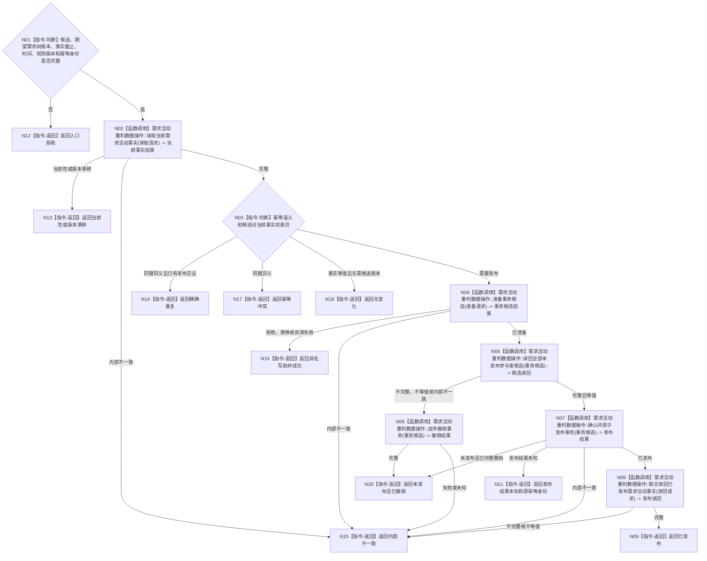

# BIZ-L3-002-06-05 发布需求活动重判事务目标函数流程图 v0.1

更新时间：2026-08-03

## 依据

```text
3100、5110、5160、4010—4050；BIZ-L2-002-06
```

## 身份与边界

正式目标函数设计图。由需求领域把完整活动路径、权重、当前性和父目标重判候选作为一个事务发布并联合读回；不创建任务，不发布价值结算。

## 函数合同

```text
根函数：需求业务服务::发布需求活动重判事务
归属模块 / 文件 / 层级：需求领域 / 海中鱼巣/领域/服务.需求.ixx / L3
现有或待新增：待新增；需专用需求活动重判事务参与者
完整签名：需求活动重判发布结果 需求业务服务::发布需求活动重判事务(const 需求活动重判发布请求& 请求) const
参数：请求为只读借用；含完整候选、期望需求树版本、事实截止版本、路径规则版本、发生时间和幂等身份
返回结果：不可变值式结果；含已发布、无变化、精确重复、幂等冲突、当前性漂移、版本漂移、写前拒绝、资源失败、未发布且已撤销、发布结果未知或内部不一致，以及发布版本、发布见证、持久证据状态和联合读回
被调函数流程图：BIZ-L4-002-06-05-01、BIZ-L4-002-06-05-02、BIZ-L4-002-06-05-03、BIZ-L4-002-06-05-04、BIZ-L4-002-06-05-05、BIZ-L4-002-06-05-06，分别冻结当前事实读取、事务候选准备、未发布候选读回、逆序撤销、确认与原子发布、已发布联合读回
父图：BIZ-L2-002-06
```

## 流程图



## 节点合同

| 节点 | 类型 | 输入 | 输出 | 事实读写 | 验证 |
| --- | --- | --- | --- | --- | --- |
| N02/N03 | 函数调用 / 指令-判断 | 候选范围、期望版本、幂等身份和完整语义摘要 | 当前事实、发布见证及差异 | 只读需求已发布事实 | 重复、冲突、无变化或需发布 | 无假更新；同键异义为幂等冲突而非内部错误 |
| N04 | 函数调用 | 不可变完整写集、期望代次和幂等语义 | 仅领域内部持有的移动候选 | 形成普通查询不可见候选 | 已准备或写前非成功 | 第一笔候选前最终复核 |
| N05/N06 | 函数调用 | 事务候选 | 完整候选读回或撤销结果 | 未发布候选 | 等值后确认；否则逆序撤销 | 候选不外泄、不半保留 |
| N07 | 函数调用 | 已读回等值的移动候选 | 已发布、已撤销、发布未知或内部不一致 | 唯一原子代次发布点 | 按具名结果后继 | 全确认后最后发布；函数内部收敛发布前失败 |
| N08/N09 | 函数调用 / 指令-返回 | 原稳定身份、幂等身份、发布代次和见证 | 联合读回与已发布结果 | 只读新代次需求事实 | 完整且等值 | SQL、日志或普通返回不得代替读回 |
| N12—N21 | 指令-返回 | 各分支状态 | 结构化结果 | 无额外写入 | 返回 | 入口、漂移、冲突、资源、撤销、未知和内部不一致分离 |

## 关键边界

父目标已满足比较证据可以进入活动收束候选，但5160正式结算和4320价值结算仍走各自专用入口；事务不得以日志、缓存或SQL写入成功代替内存已发布联合读回。发布前确认失败必须在数据操作内部完成逆序撤销或返回无法继续的内部不一致；发布结果未知只能携原幂等身份与发布见证回读，禁止换键重试。
