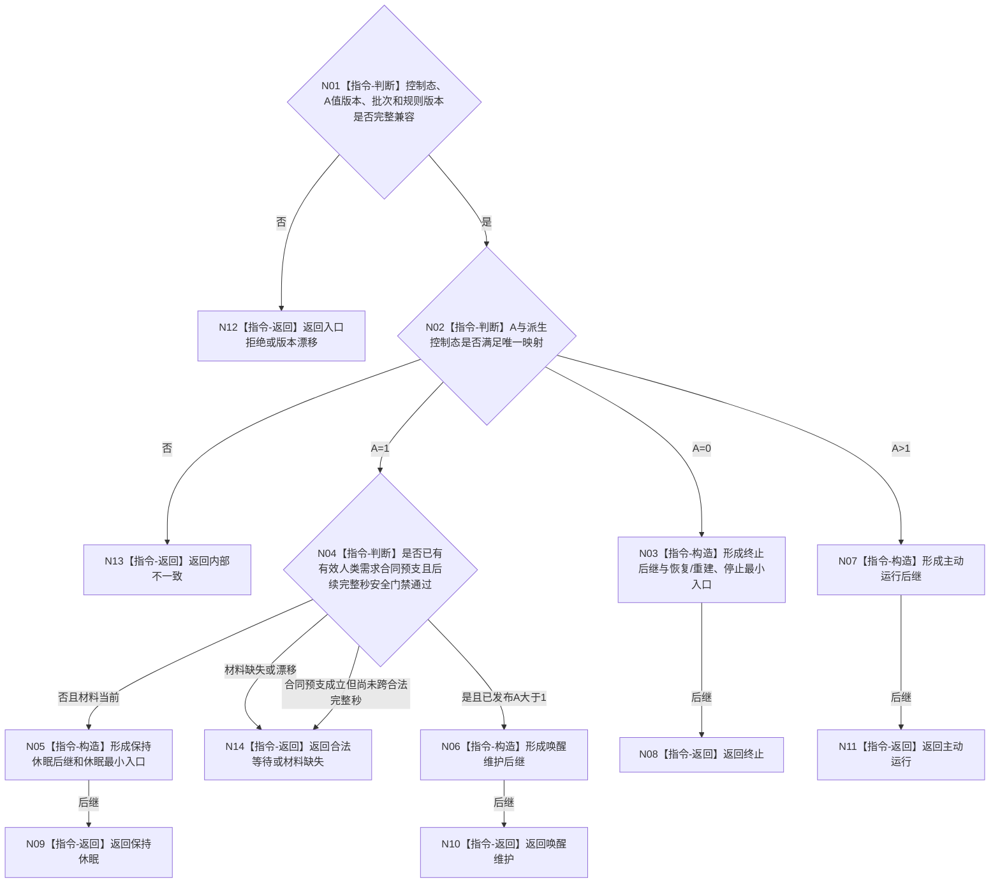

# BIZ-L3-002-07-01 裁决生存控制根后继目标函数流程图 v0.1

更新时间：2026-08-03

## 依据

```text
6120、6170、6180、8100、8200；BIZ-L2-002-07
```

## 身份与边界

正式目标函数设计图。纯值裁决 `A=0/1/>1` 对应的终止、保持休眠、唤醒维护或主动运行后继；不修改安全值、服务值或线程状态。

## 函数合同

```text
根函数：自我治理裁决服务::裁决生存控制根后继
归属模块 / 文件 / 层级：自我治理纯裁决 / 海中鱼巣/领域/服务.自我治理裁决.ixx / L3
现有或待新增：待新增；复用6170已发布生存控制态投影
完整签名：生存控制根后继结果 自我治理裁决服务::裁决生存控制根后继(const 生存控制根后继请求& 请求) const
参数：请求为只读借用；含唯一自我、生存控制态及A值版本、服务合同预支结果、安全门禁、完整秒边界、治理批次和规则版本
返回结果：不可变值式结果；含终止、保持休眠、唤醒维护、主动运行、合法等待、材料缺失、版本漂移或内部不一致，以及具名最小入口集合和来源版本
被调函数流程图：无；本函数仅执行控制态真值表和当前性判断
父图：BIZ-L2-002-07
```

## 流程图



## 节点合同

| 节点 | 类型 | 输入 | 输出 | 事实读写 | 验证 |
| --- | --- | --- | --- | --- | --- |
| N02 | 判断 | A及派生控制态 | 唯一根分支 | 无 | 0/1/>1互斥且完备 |
| N04 | 判断 | 合同预支、完整秒、安全门禁 | 休眠或唤醒候选 | 无 | 请求本身不直接唤醒 |
| N03/N05—N11 | 构造 / 返回 | 根分支 | 不可变后继 | 无写入 | 最小入口不混入普通竞争 |

## 关键边界

`A=0` 不被动唤醒；`A=1` 的有效人类需求和30%预支只允许后续完整秒重新评估，必须等已发布 `A>1` 才形成主动运行。线程、队列和UI不得裁决控制态。

