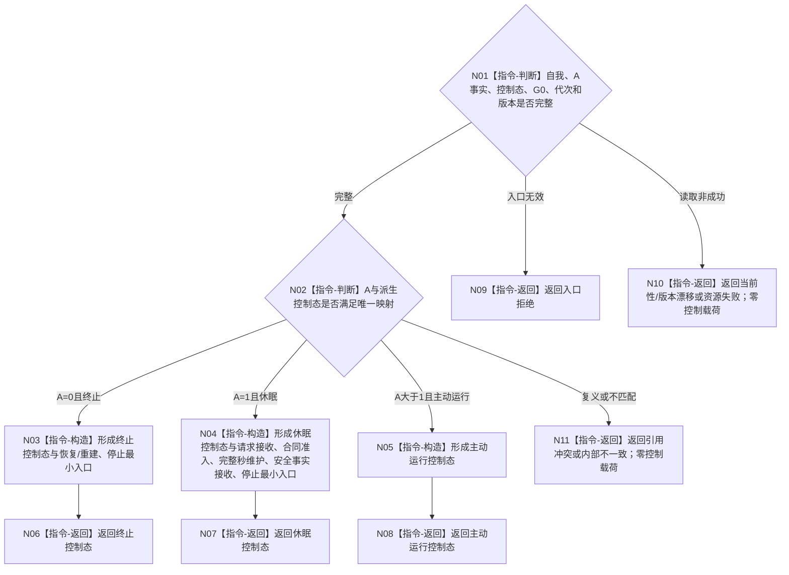

# BIZ-L3-002-07-01 裁决生存控制根后继目标函数流程图 v0.2

更新时间：2026-08-26

## 依据与替代

```text
0050 v1.5、6120、6170 v0.3、8100 v0.7、8200 v0.7、8300 v0.6；BIZ-L2-002-07 v0.2
```

本图替代 v0.1。旧图在 `A=1` 分支读取人类合同预支和安全门禁并形成“唤醒维护后继”，重复承担了6170完整秒维护的控制态发布职责。当前函数只消费正式控制态读回并验证 `A=0/1/>1` 唯一映射，不计算、不维护也不切换 `A`。

## 身份与边界

正式目标函数设计图。`A=0` 返回终止控制态，`A=1` 返回休眠控制态，`A>1` 返回主动运行控制态。请求接收、合同准入、完整秒维护、安全事实接收、恢复 / 重建和停止都是各控制态允许的具名最小入口，不是本函数内的唤醒算法。

## 函数合同

```text
根函数：裁决生存控制根后继
归属模块 / 文件 / 目标分解深度：自我治理纯裁决 / 海中鱼巣/领域/组合.自我治理裁决.ixx / BIZ-L3
现有或待新增：待新增；复用6170正式生存控制态读回，不持久化第二控制态
完整签名：生存控制根后继结果 自我治理裁决组合器::裁决生存控制根后继(const 生存控制根后继请求& 请求) const noexcept
参数：`请求`为只读借用；含唯一自我、正式A值事实、由A派生的控制态、共同事实截止G0、运行代次及读取 / 派生规则版本；不携带合同预支、安全门禁、线程状态或调用方唤醒标志
返回结果：按值返回；终止控制态、休眠控制态、主动运行控制态、入口拒绝、当前性 / 版本漂移、引用冲突、资源失败或内部不一致；成功载荷携带A、控制态、G0、版本和该控制态具名最小入口集合
被调函数流程图：无；本函数仅执行正式控制态真值表和成功形状互证
父图：BIZ-L2-002-07 v0.2
```

## 流程图



## 节点合同

| 节点 | 类型 | 输入 | 输出 | 事实读写 | 验证 |
| --- | --- | --- | --- | --- | --- |
| N01/N02 | 判断 | 正式A事实、控制态、G0和版本 | 唯一真值表分支 | 只读 | 0/1/>1互斥完备；截止和版本一致 |
| N03—N08 | 构造 / 返回 | 唯一控制分支 | 不可变根后继 | 无写入 | 最小入口不混入普通任务竞争 |
| N09—N11 | 返回 | 非成功来源 | 结构化非成功 | 无写入 | 非成功零控制载荷 |

## 关键边界

- 人类请求、服务合同或30%预支可以成为后续6170完整秒维护的输入，但本身不直接唤醒，也不进入本函数请求。
- `A=1` 时本函数始终返回休眠控制态；只有6170后续正式发布 `A>1` 后，新的读回才返回主动运行控制态。
- 队列、线程、UI、任务权重和调度资格都不得裁决控制态，也不得把具名最小入口混入普通任务竞争。
