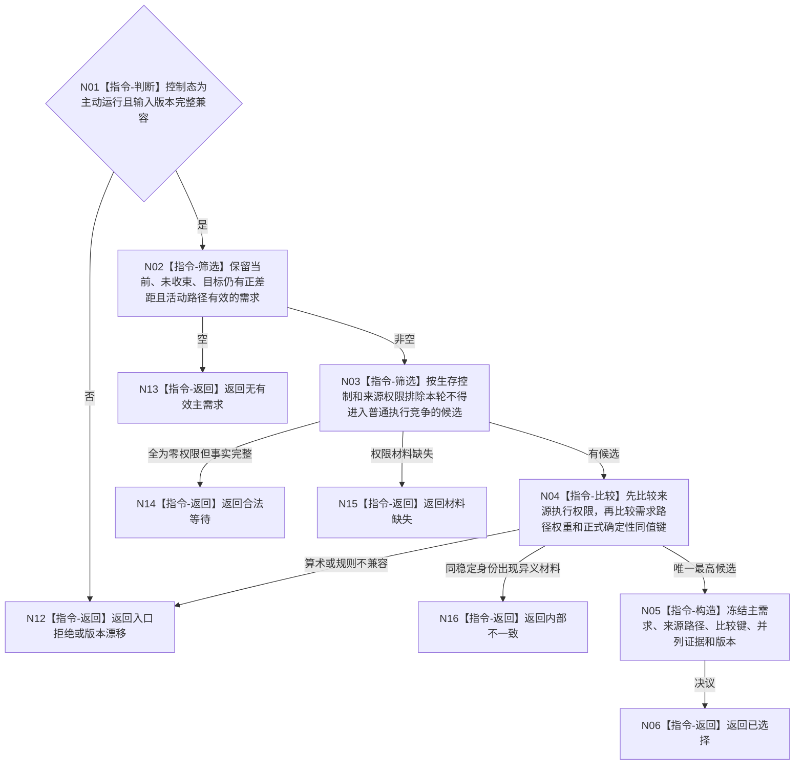

# BIZ-L3-002-07-02 选择当前主需求目标函数流程图 v0.1

更新时间：2026-08-03

## 依据

```text
3100、5110、5090、6150、6170、8200；BIZ-L2-002-07
```

## 身份与边界

正式目标函数设计图。在主动运行态从当前活动需求中确定本轮唯一主需求；只读已发布权重、权限和路径材料，不修改未选需求。

## 函数合同

```text
根函数：自我治理裁决服务::选择当前主需求
归属模块 / 文件 / 层级：自我治理纯裁决 / 海中鱼巣/领域/服务.自我治理裁决.ixx / L3
现有或待新增：待新增；旧固定安全/服务根串联不复用为通用选择器
完整签名：主需求选择结果 自我治理裁决服务::选择当前主需求(const 主需求选择请求& 请求) const
参数：请求为只读借用；含活动需求快照、需求路径权重、任务后继、来源权限投影、生存控制态、事实截止版本和选择规则版本
返回结果：不可变值式结果；含已选择、无有效主需求、合法等待、材料缺失、版本漂移或内部不一致，以及主需求、活动路径、比较键、并列证据和来源版本
被调函数流程图：无；本函数只执行正式维度上的确定性筛选和比较
父图：BIZ-L2-002-07
```

## 流程图



## 节点合同

| 节点 | 类型 | 输入 | 输出 | 事实读写 | 验证 |
| --- | --- | --- | --- | --- | --- |
| N02/N03 | 指令 | 活动需求、差距、权限 | 可竞争候选 | 无 | 零权限不删除需求 |
| N04 | 指令 | 权限、权重、同值键 | 唯一排序 | 无 | 不合并成不可审计总分 |
| N05/N06 | 构造 / 返回 | 最高候选 | 主需求决议 | 无写入 | 未选需求零变化 |

## 关键边界

选择只影响本轮治理输入，不改变需求活动状态、权重或满足事实。任务数量、队列压力、线程空闲、名称和显示顺序都不得进入比较键。

