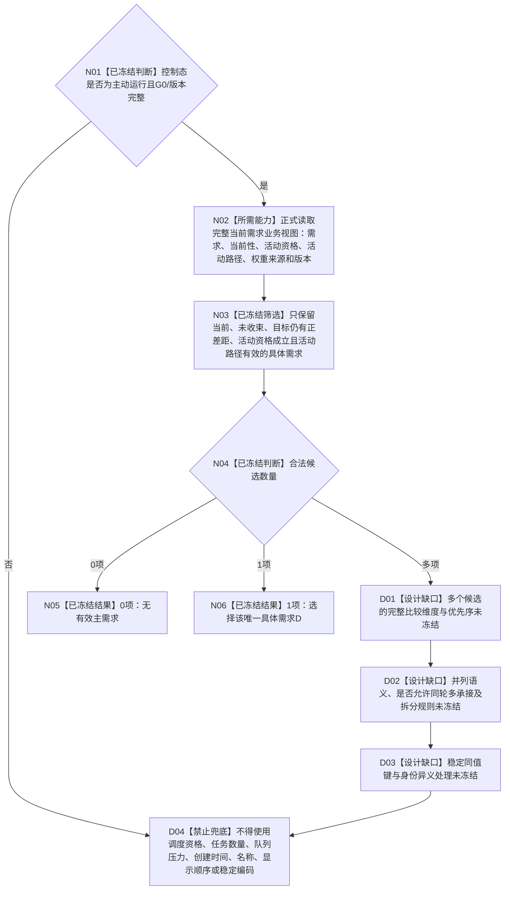

# BIZ-L3-002-07-02 选择当前主需求目标函数设计缺口图 v0.2

更新时间：2026-08-26

## 依据与替代

```text
0050 v2.1、3100 v0.9、5090 v0.7、5110 v0.4、6150 v0.7、6170 v0.3、8200 v0.7、8300 v1.0
BIZ-L2-002-07 v0.2
```

本图替代 v0.1，但不是可施工函数合同。旧图用“来源执行权限 -> 需求路径权重 -> 稳定键”选择主需求；6150 / 6170 已明确调度资格只在执行冻结后、真实派发前形成，不能作为需求活动、任务化、承接、路径选择或冻结前置。0050同时明确需求权重完整维度仍未裁决，因此不能把旧排序换个名字继续使用。

## 身份与边界

目标函数设计缺口图。已经冻结的边界只有：控制态必须为主动运行；候选必须来自当前需求业务视图并逐项保留活动资格、当前路径和权重来源；无候选合法返回；唯一候选无需跨候选比较即可选择；多个合法候选必须调用正式比较规则。该比较规则当前不存在。

具名缺口：`DRIFT-BIZ-L3-002-07-02-CURRENT-MAIN-DEMAND-SELECTION-RULE-UNFROZEN`。

## 函数合同

```text
根函数：选择当前主需求（目标身份保留）
归属模块 / 文件 / 目标分解深度：自我治理纯裁决 / 目标模块待比较规则裁决后冻结 / BIZ-L3
现有或待新增：待新增；当前仅冻结输入边界、0/1候选路径和禁止项
完整签名：未冻结；不得从本图生成C++ ABI、DTO字段顺序或枚举数值
参数：至少需要唯一自我、G0、运行代次、主动运行控制态见证、完整当前需求业务视图及需求树 / 活动资格 / 路径 / 权重 / 选择规则版本；最终字段由比较规则裁决后冻结
返回结果：至少区分无有效主需求、已选择、材料不足、当前性 / 版本漂移、引用冲突、资源失败和内部不一致；多候选比较、并列和同值形状尚未冻结
被调函数流程图：未冻结；当前需求业务视图提供者和主需求比较规则均不得由实现者临场发明
父图：BIZ-L2-002-07 v0.2
```

## 已冻结边界与缺口



## 节点合同

| 节点 | 类型 | 输入 | 输出 | 事实读写 | 验证 |
| --- | --- | --- | --- | --- | --- |
| N01—N03 | 已冻结判断 / 所需能力 / 筛选 | 主动运行控制态与完整当前需求业务视图 | 0..N合法活动具体需求 | 只读需求业务视图 | 当前性、活动资格、路径、权重和G0逐项可追溯 |
| N04—N06 | 已冻结判断 / 结果 | 0或1项候选 | 无有效主需求或唯一D | 无写入 | 不执行跨候选比较 |
| D01—D04 | 设计缺口 / 禁止兜底 | 多个合法候选 | 不形成可施工选择 | 无写入 | 必须先由正式规范冻结比较规则 |

## 缺口裁决清单

| 缺口 | 必须冻结的机器语义 | 当前不能使用的替代物 | 完成证据 |
| --- | --- | --- | --- |
| 比较维度 | 多个合法活动需求的全部可比较量及来源owner | 6150/6170调度资格、不可审计总分 | 正式规范逐维度定义 |
| 优先序 | 各维度比较顺序、方向、缺项和不可比较语义 | 代码容器顺序、消息顺序 | 完整真值 / 排序矩阵 |
| 并列 | 并列保留、单选、轮转或多承接规则 | 任取第一个、稳定编码强拆 | 具名并列结果与后继合同 |
| 同值键 | 仅在业务同值后使用的稳定键及异义处理 | 需求身份、创建时间、名称 | 版本化同值规则和冲突矩阵 |
| 业务视图 | 当前活动资格、路径、权重的完整同G0读取合同 | DATA拓扑、旧缓存、回流结果 | 正式provider及前后当前性守卫 |

## 关键边界

- 权限 / 调度资格为零不删除需求，也不阻止需求确认、活动、任务化、承接、路径选择、筹办、实例形成或执行冻结。
- 需求权重、冻结结算预算、任务基础优先级和执行调度资格是不同机器量，不得压成总分。
- 当前DATA读取可以提供需求、列表、父子和任务后继结构，但不得判断活动资格、权重、主需求或业务优先级。
- 在本缺口闭合前，002-07不得宣称多候选主需求选择可施工；0/1候选边界的冻结不等于完整函数ABI已经冻结。
