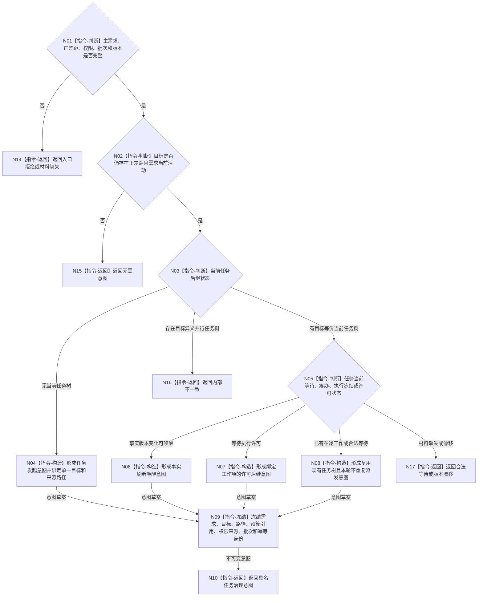

# BIZ-L3-002-07-03 形成任务治理意图目标函数流程图 v0.1

更新时间：2026-08-03

## 依据

```text
3100、3200、5090、5110、5200、8100、8200；BIZ-L2-002-07
```

## 身份与边界

正式目标函数设计图。把主需求、正差距和当前权限冻结为任务管理可消费的任务发起、复用、唤醒或治理意图；不创建任务、不指定任务状态。

## 函数合同

```text
根函数：自我治理裁决服务::形成任务治理意图
归属模块 / 文件 / 层级：自我治理纯裁决 / 海中鱼巣/领域/服务.自我治理裁决.ixx / L3
现有或待新增：待新增；可复用现有任务意图值式材料的身份字段
完整签名：任务治理意图结果 自我治理裁决服务::形成任务治理意图(const 任务治理意图请求& 请求) const
参数：请求为只读借用；含主需求决议、正差距结果、当前任务后继快照、权限证据、治理批次、事实截止版本、意图规则版本和幂等身份
返回结果：不可变值式结果；含任务发起、复用现有任务树、事实刷新唤醒、许可后继、无需意图、合法等待、材料缺失、版本漂移或内部不一致，以及唯一单目标、来源需求、路径预算引用和任务绑定
被调函数流程图：无；本函数只构造值式意图并执行一致性判断
父图：BIZ-L2-002-07
```

## 流程图



## 节点合同

| 节点 | 类型 | 输入 | 输出 | 事实读写 | 验证 |
| --- | --- | --- | --- | --- | --- |
| N02/N03/N05 | 判断 | 主需求和任务后继 | 意图类别 | 无 | 同需求唯一任务树、单目标 |
| N04/N06—N09 | 构造 | 需求、差距、路径、权限 | 不可变意图 | 无 | 不携带可变指针或事务令牌 |
| N10/N14—N17 | 返回 | 意图状态 | 结构化结果 | 不创建任务 | 等待、漂移、内部错误分离 |

## 关键边界

自我线程只形成意图；任务创建、状态推进、筹办、执行和取消仍由任务管理调用任务领域正式入口。权限为零可以形成保留或等待材料，但不得伪造正常执行派发。
