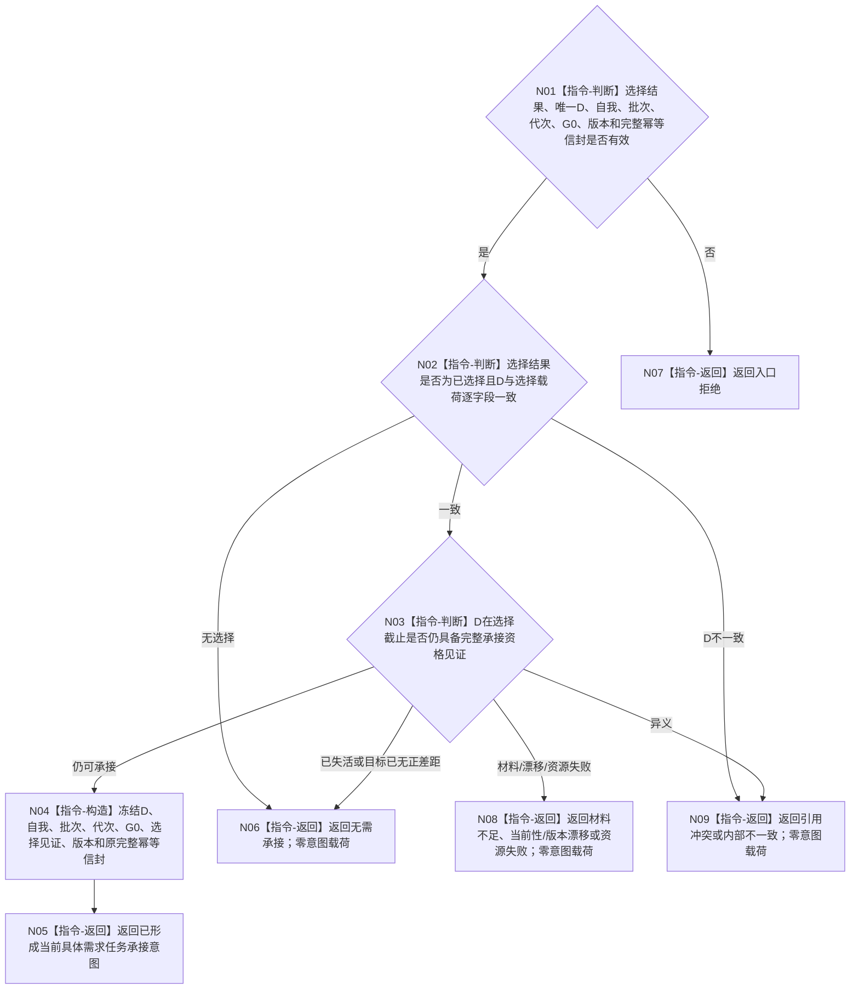

# BIZ-L3-002-07-03 形成当前具体需求任务承接意图目标函数流程图 v0.2

更新时间：2026-08-26

## 依据与替代

```text
0050 v1.5、3100 v0.9、3200、4260 v0.9、5090 v0.7、5110 v0.4、5200 v0.9、8100 v0.7、8200 v0.7、8300 v0.6
BIZ-L2-002-07 v0.2
```

本图替代旧“形成任务治理意图”v0.1。旧图由自我侧读取当前任务后继，并形成任务发起、复用、事实刷新唤醒或许可后继；这越过了任务管理和task owner。当前函数只把已经唯一选择的具体需求 `D` 冻结为任务管理可消费的一份承接意图。

## 身份与边界

正式目标函数设计图。意图只说明“请任务管理按原完整幂等信封承接这个具体需求D”，不说明当前是否已有任务、应创建还是复用、任务处于什么阶段、能否派发或是否取得授权。任务管理收到后必须按D所属列表项L查询0..1当前任务：既有任务使用来源关系承接键幂等扩展 `T→D`；新任务使用准备键和六阶段键组分owner建立并读回首轮材料。

## 函数合同

```text
根函数：形成当前具体需求任务承接意图
归属模块 / 文件 / 目标分解深度：自我治理纯裁决 / 海中鱼巣/领域/组合.自我治理裁决.ixx / BIZ-L3
现有或待新增：待新增；旧任务治理意图值式材料只能作字段候选，不能保留当前任务 / 许可语义
完整签名：具体需求任务承接意图结果 自我治理裁决组合器::形成当前具体需求任务承接意图(const 具体需求任务承接意图请求& 请求) const noexcept
参数：`请求`为只读借用；含唯一主需求选择结果、一个非零具体需求D、唯一自我、治理批次、运行代次、G0、需求业务视图 / 选择 / 承接合同版本，以及由T02在形成原请求信封时一次分配的输入幂等身份、来源关系承接幂等身份、准备幂等身份和六阶段幂等身份组；准备键必须等于P1建立键，六键全部非零且两两不同；不得携带当前任务身份、任务阶段、调度资格、执行许可、现实执行授权或任务状态缓存
返回结果：按值返回；已形成、无需承接、入口拒绝、材料不足、当前性 / 版本漂移、引用冲突、资源失败或内部不一致；成功载荷只携带D、自我、批次、代次、G0、版本、选择见证引用和原完整幂等信封
被调函数流程图：无；本函数只验证并构造不可变值式意图
父图：BIZ-L2-002-07 v0.2
```

## 流程图



## 节点合同

| 节点 | 类型 | 输入 | 输出 | 事实读写 | 验证 |
| --- | --- | --- | --- | --- | --- |
| N01—N03 | 判断 | 唯一D选择见证与同G0承接资格 | 可构造、无需或非成功 | 只读已有见证；不访问任务服务 | D、G0、批次和版本逐字段一致 |
| N04/N05 | 构造 / 返回 | 一个具体需求D及原完整幂等信封 | 一份不可变任务承接意图 | 只形成值式材料 | 不携带可变指针、事务令牌、当前任务或许可材料；准备键=P1键，六键非零且两两不同 |
| N06—N09 | 返回 | 无需或非成功来源 | 结构化零意图结果 | 无写入 | 等待、漂移、冲突和内部错误分账 |

## 关键边界

- 自我线程只发送具体需求D，不发送需求列表项L作为目标，也不把列表全部成员自动承接。
- 本函数不读取当前任务。任务管理先读D所属L，再以L查询0..1当前任务：无任务时按原六阶段键分owner建立正式E、T、`T→L/T→D/T→E`、R1和首态链；有任务时按原来源关系承接键同目标复核后幂等新增 `T→D`。
- 输入幂等身份、来源关系承接键、准备键和六阶段键组均由T02在原请求信封形成时一次分配并跨队列、重试、发布未知和竞争重读原样传递；不得从时间、代次、D/T身份、哈希、算术或任一阶段结果派生。
- 任务承接、筹办、路径选择和执行冻结均不需要现实执行授权；6150 / 6170调度资格只在冻结完成后、真实派发前形成。
- 事实刷新、等待条件变化、取消、挂起、调度和self后继均有各自消息与owner，不得重新塞回通用任务承接意图。
