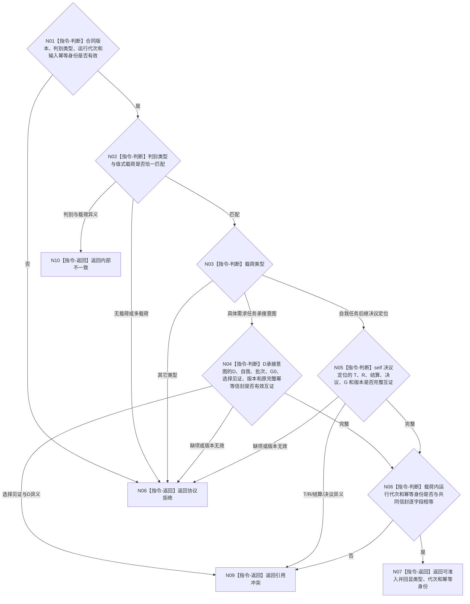

# BIZ-L3-002-08-01 复核一个任务管理具名输入目标函数流程图 v0.2

更新时间：2026-08-26

## 依据与替代

```text
4050、5090 v0.7、8100 v0.7、8200 v0.7
BIZ-L2-002-08 v0.2
```

本图替代旧 v0.1“复核任务治理消息组”。旧图遍历不具名的多类型消息组并检查任务 / 工作项绑定；当前函数只复核一个有明确判别类型的强类型输入，不访问任务管理队列或领域事实。

## 身份与边界

正式目标函数设计图。函数只做结构、类型、版本和字段绑定复核，不判断业务事实当前仍成立。当前穷尽两种载荷：

| 类型 | 必填业务绑定 | 明确禁止 |
| --- | --- | --- |
| 具体需求任务承接意图 | 具体需求D、唯一自我、治理批次、运行代次、G0、选择见证引用、承接合同版本、输入幂等身份、来源关系承接幂等身份、准备幂等身份、存在建立/任务核心建立/阶段特征实例建立/首态建立/P1建立/首迁移六阶段幂等身份组；准备键=P1键，六键非零且两两不同 | 当前任务 / 列表项L、任务阶段、调度资格、许可、现实授权；任何由时间、身份、哈希或阶段结果派生的键 |
| 自我任务后继决议定位 | 任务 T、任务轮次 R、轮次结算身份、正式决议身份、事实截止 G、运行代次、决议合同版本和输入幂等身份 | 决议正文缓存、旧路径 / 冻结、线程当前任务、需求满足结论 |

## 函数合同

```text
根函数：复核一个任务管理具名输入
归属模块 / 文件 / 目标分解深度：任务治理消息协议 / 海中鱼巣/线程/任务治理消息协议.ixx / BIZ-L3
现有或待新增：待新增；不得把执行工作包、任务结果回执或旧重筹办意图换名复用
完整签名：任务管理具名输入复核结果 复核一个任务管理具名输入(const 任务管理具名输入提交请求& 请求) noexcept
参数：`请求`为只读借用；含恰一判别类型和恰一对应值式载荷
返回结果：按值返回；可准入、协议拒绝、引用冲突或内部不一致，以及回显载荷类型、运行代次和输入幂等身份；不返回摘要替代原载荷
被调函数流程图：无；全部为本函数内纯值判断
父图：BIZ-L2-002-08 v0.2
```

## 流程图



## 节点合同

| 节点 | 类型 | 输入 | 输出 | 事实读写 | 验证 |
| --- | --- | --- | --- | --- | --- |
| N01/N02 | 判断 | 共同信封和判别载荷 | 结构完整性 | 无 | 恰一载荷；不以空字段推断类型 |
| N03—N05 | 判断 | 类型专属字段 | 类型专属绑定结论 | 无 | D承接载荷的承接键、准备键和六阶段键组完整；与self决议定位字段互不混入 |
| N06/N07 | 判断 / 返回 | 载荷与共同信封 | 可准入回显 | 无 | 运行代次和幂等身份逐字段相等 |
| N08—N10 | 返回 | 无效、异义或内部矛盾 | 具名非成功 | 无 | 非成功不返回可入队载荷 |

## 关键边界

- 本函数不读取D所属L、当前任务、正式self决议、任务轮次结算或G当前性；这些由T03取出后按类型调用正式读回链完成。它只验证D承接幂等信封的结构与键约束，不产生、派生或替换任何键。
- 不生成规范化摘要、哈希或排序结果替代完整载荷。队列幂等比较使用首次完整载荷逐字段相等。
- 不接受通用 `vector` 消息组、裸稳定编码、空字段联合体或“未知类型但字段看似完整”的输入。
- 其它合法治理消息若后续加入，必须先扩展穷尽类型表和本函数矩阵；不能由调用方跳过复核直接入队。
