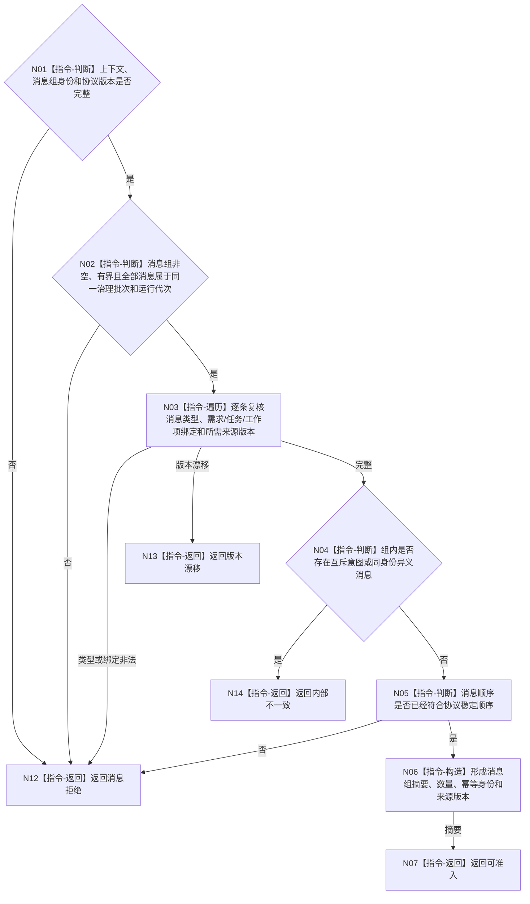

# BIZ-L3-002-08-01 复核任务治理消息组目标函数流程图 v0.1

更新时间：2026-08-03

## 依据

```text
4050、5090、8100；BIZ-L2-002-08
```

## 身份与边界

正式目标函数设计图。纯值复核同一治理批次的任务治理消息组类型、绑定、版本、顺序和幂等身份；不访问队列或领域仓库。

## 函数合同

```text
根函数：复核任务治理消息组
归属模块 / 文件 / 层级：任务治理消息协议 / 海中鱼巣/线程/任务治理消息协议.ixx / L3
现有或待新增：待新增；不得把现有强类型任务执行请求当作通用治理消息组
完整签名：任务治理消息组复核结果 复核任务治理消息组(const 任务治理消息组& 消息组, const 任务治理消息组复核上下文& 上下文)
参数：消息组和上下文均为只读借用；上下文含治理批次、运行代次、事实截止版本、停止阶段版本、协议版本和当前完整秒
返回结果：不可变值式结果；含可准入、精确重复、消息拒绝、版本漂移或内部不一致，以及规范化消息组摘要、数量和幂等身份
被调函数流程图：无；本函数只做结构、类型和版本判断
父图：BIZ-L2-002-08
```

## 流程图



## 节点合同

| 节点 | 类型 | 输入 | 输出 | 事实读写 | 验证 |
| --- | --- | --- | --- | --- | --- |
| N02/N03 | 判断 / 遍历 | 消息组和上下文 | 逐条协议结论 | 无 | 同批、同代次、强类型绑定 |
| N04/N05 | 判断 | 组内消息 | 一致稳定顺序 | 无 | 不二次排序、不容许互斥意图 |
| N06/N07 | 构造 / 返回 | 已复核组 | 可准入摘要 | 无 | 摘要不承载业务事实 |

## 关键边界

消息只能传递意图和引用，不能自证任务、需求、权限或世界事实已经改变。稳定顺序由生产者冻结；本函数不得静默重排并制造第二种顺序语义。
