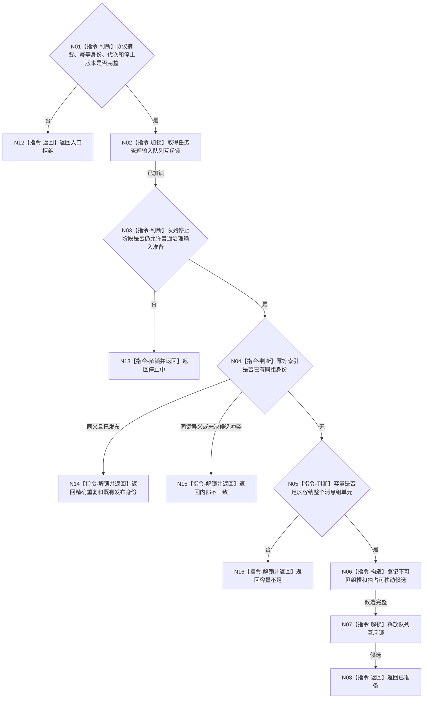

# BIZ-L3-002-08-02 准备任务管理输入组目标函数流程图 v0.1

更新时间：2026-08-03

## 依据

```text
4050、5090、8100；BIZ-L2-002-08
```

## 身份与边界

正式目标函数设计图。在任务管理输入队列锁内为完整不可变消息组形成一个尚不可消费的有界候选；不调用领域服务，不逐条公开。

## 函数合同

```text
根函数：任务管理输入队列::准备任务管理输入组
归属模块 / 文件 / 层级：任务管理输入队列 / 海中鱼巣/线程/任务管理输入队列.ixx / L3
现有或待新增：待新增；可复用有界队列容量和幂等思想，不复用单条执行请求协议
完整签名：任务管理输入组准备结果 任务管理输入队列::准备任务管理输入组(const 任务治理消息组& 消息组, const 任务管理输入组准备上下文& 上下文)
参数：消息组和上下文为只读借用；上下文含消息组幂等身份、运行代次、停止阶段版本和已通过的协议摘要
返回结果：值式结果；含已准备、精确重复、容量不足、停止中、同键异义、版本漂移或内部不一致，以及独占可移动候选或既有发布身份
被调函数流程图：无；候选生命周期、锁和幂等索引均为本队列内部指令
父图：BIZ-L2-002-08
```

## 流程图



## 节点合同

| 节点 | 类型 | 输入 | 输出 | 事实读写 | 验证 |
| --- | --- | --- | --- | --- | --- |
| N02—N05 | 指令 | 组身份和队列状态 | 准备裁决 | 只读/锁内队列元数据 | 停止、容量、幂等 |
| N06 | 指令 | 完整消息组 | 不可见独占候选 | 锁内队列预留 | 整组单元、不逐条可见 |
| N07/N08/N13—N16 | 指令 / 返回 | 候选状态 | 结构化结果 | 解锁 | 无持锁返回外部调用 |

## 关键边界

候选只拥有队列预留的短生命周期，不得跨线程复制、持久化或携带服务指针。领域读取必须在调用本函数前完成；队列锁内不得调用外部函数。

