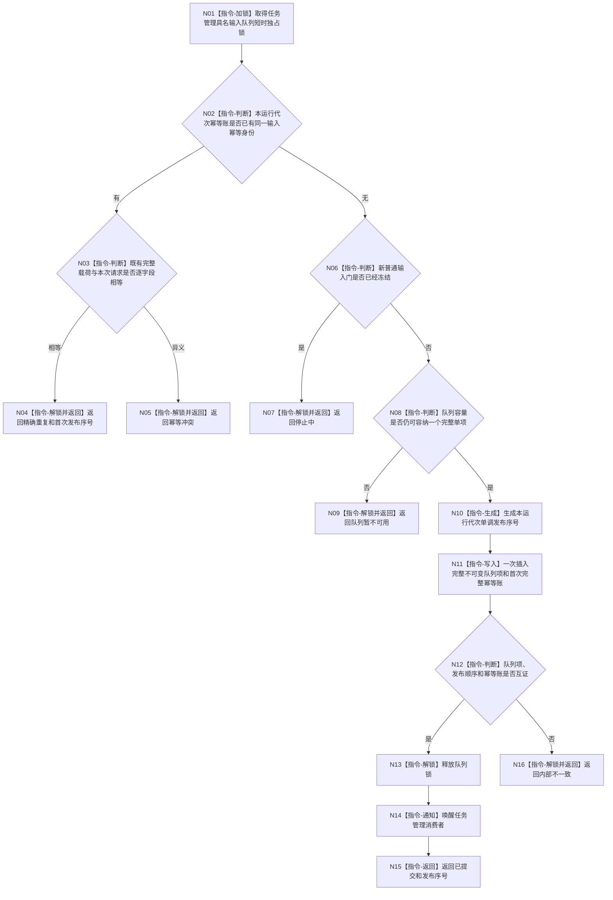

# BIZ-L3-002-08-02 原子提交一个已复核任务管理具名输入目标函数流程图 v0.2

更新时间：2026-08-26

## 依据与替代

```text
4050、8100 v0.7、8200 v0.7
BIZ-L2-002-08 v0.2、BIZ-L3-002-08-01 v0.2
```

本图替代旧“准备任务管理输入组 / 撤销任务管理输入组 / 确认任务管理输入组”三函数。当前只提交一个不可变值式输入，容量、停止、幂等和可见性可以在同一短锁内一次裁决，不建立跨调用存活的不可见候选。

## 身份与边界

正式目标函数设计图。队列只保存进程内异步材料和本运行代次幂等账，不拥有需求、任务、轮次或 self 决议机器事实。队列项一经插入即作为一个完整单元可见；通知发生在解锁后。

## 函数合同

```text
根函数：任务管理输入队列::原子提交一个已复核任务管理具名输入
归属模块 / 文件 / 目标分解深度：任务管理输入队列 / 海中鱼巣/线程/任务管理输入队列.ixx / BIZ-L3
现有或待新增：待新增；可复用现有有界队列、停止锁存和幂等思想，不复用执行请求或结果回执载荷
完整签名：任务管理具名输入队列结果 任务管理输入队列::原子提交一个已复核任务管理具名输入(const 任务管理具名输入提交请求& 请求) noexcept
参数：`请求`为只读借用；调用前已经由 BIZ-L3-002-08-01 返回可准入。函数只由同 module 的下行桥调用，不作为绕过协议复核的外部入口
返回结果：按值返回；已提交、精确重复、队列暂不可用、停止中、幂等冲突或内部不一致，以及首次发布序号
被调函数流程图：无；锁、查账、容量、插入、解锁和通知均为本函数内指令
父图：BIZ-L2-002-08 v0.2
```

## 流程图



## 节点合同

| 节点 | 类型 | 输入 | 输出 | 事实读写 | 验证 |
| --- | --- | --- | --- | --- | --- |
| N01—N05 | 锁 / 判断 / 返回 | `{运行代次, 输入幂等身份}`和完整载荷 | 重复、冲突或继续 | 只读队列幂等账 | 同键完整逐字段比较；重复先于停止判断 |
| N06—N09 | 判断 / 返回 | 新输入门和容量 | 停止、暂不可用或继续 | 只读队列状态 | 不删除已提交项；容量按单项计数 |
| N10/N11 | 生成 / 写入 | 完整载荷 | 发布序号、队列项和首次账 | 只写进程内队列与账 | 单项一次可见；无半载荷 |
| N12—N16 | 判断 / 解锁 / 通知 / 返回 | 插入后队列状态 | 已提交或内部不一致 | 解锁后通知 | 不持锁调用外部函数；通知丢失由非空谓词恢复 |

## 关键边界

- 旧三步候选协议退出：不存在调用方持有的队列候选、确认令牌、撤销补偿或整组容量预留。
- 同义重试只读既有首次发布序号，不再插入；同键异义不覆盖首次账，不降级为协议拒绝或新输入。
- 队列项被取出后只释放容量，不删除本运行代次的首次幂等账；停止完成并销毁该运行实例后账随队列生命周期结束。
- 队列锁内不读取领域事实、不调用 T03、不发送 self 消息、不写任务状态。通知只提示可能有输入，不证明消费者已取出或处理。
