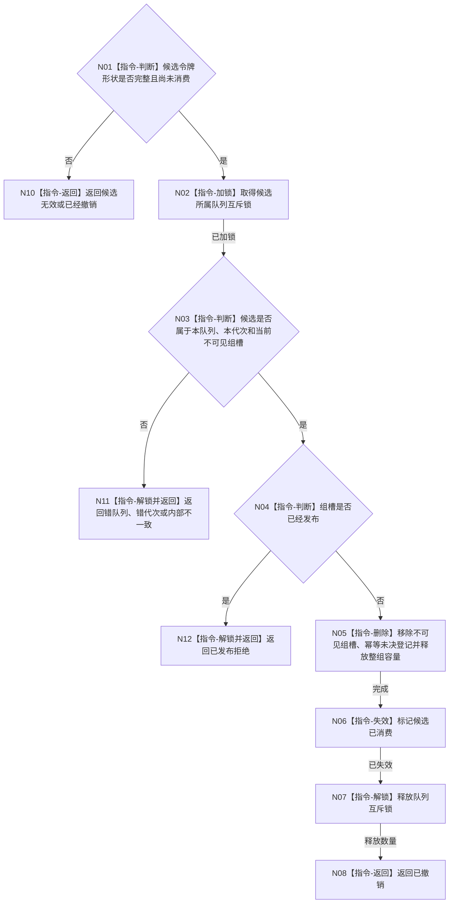

# BIZ-L3-002-08-03 撤销任务管理输入组目标函数流程图 v0.1

更新时间：2026-08-03

## 依据

```text
4050、5090、8100；BIZ-L2-002-08
```

## 身份与边界

正式目标函数设计图。撤销一个尚未公开的任务管理输入组候选并释放整组容量；不能撤销已发布组，也不生成业务失败事实。

## 函数合同

```text
根函数：任务管理输入队列::撤销任务管理输入组
归属模块 / 文件 / 层级：任务管理输入队列 / 海中鱼巣/线程/任务管理输入队列.ixx / L3
现有或待新增：待新增
完整签名：任务管理输入组撤销结果 任务管理输入队列::撤销任务管理输入组(任务管理输入组候选&& 候选) noexcept
参数：候选为独占右值；仅在已准备、未确认、同队列实例和同运行代次时合法，调用后失效
返回结果：值式结果；含已撤销、已经撤销、候选无效、错队列、错代次、已发布拒绝或内部不一致，以及释放数量
被调函数流程图：无；全部操作在队列锁内完成
父图：BIZ-L2-002-08
```

## 流程图



## 节点合同

| 节点 | 类型 | 输入 | 输出 | 事实读写 | 验证 |
| --- | --- | --- | --- | --- | --- |
| N02—N04 | 指令 | 独占候选 | 所属和发布状态 | 锁内队列元数据 | 错队列、错代次、已发布拒绝 |
| N05/N06 | 指令 | 未发布组槽 | 容量释放、令牌失效 | 删除队列候选 | 整组撤销、不可重用 |
| N07/N08 | 指令 / 返回 | 撤销结果 | 结构化结果 | 解锁 | 不产生业务事实 |

## 关键边界

撤销只恢复队列自身预留，不撤销自我治理裁决或任何领域事实。若候选已确认发布，必须由消费者按正式消息合同处理，不能从队列背后删除。
