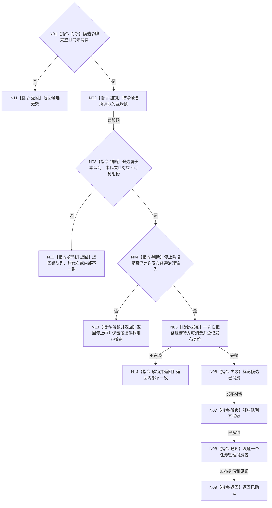

# BIZ-L3-002-08-04 确认任务管理输入组目标函数流程图 v0.1

更新时间：2026-08-03

## 依据

```text
4050、5090、8100；BIZ-L2-002-08
```

## 身份与边界

正式目标函数设计图。把一个完整候选原子转为单一可消费任务管理输入组并唤醒消费者；确认不代表任务管理已经处理，也不改变任务状态。

## 函数合同

```text
根函数：任务管理输入队列::确认任务管理输入组
归属模块 / 文件 / 层级：任务管理输入队列 / 海中鱼巣/线程/任务管理输入队列.ixx / L3
现有或待新增：待新增
完整签名：任务管理输入组确认结果 任务管理输入队列::确认任务管理输入组(任务管理输入组候选&& 候选)
参数：候选为独占右值；仅在已准备、未确认、同队列实例、同运行代次且停止阶段仍允许发布时合法，调用后失效
返回结果：值式结果；含已确认、精确重复、停止中、候选无效、错队列、错代次或内部不一致，以及队列发布身份、消息数量和唤醒见证
被调函数流程图：无；整组可见性切换和通知为队列内部指令
父图：BIZ-L2-002-08
```

## 流程图



## 节点合同

| 节点 | 类型 | 输入 | 输出 | 事实读写 | 验证 |
| --- | --- | --- | --- | --- | --- |
| N02—N04 | 指令 | 独占候选、停止版本 | 发布资格 | 锁内队列元数据 | 同队列、同代次、停止门 |
| N05/N06 | 指令 | 不可见组槽 | 单一可消费组、失效令牌 | 队列可见性与幂等索引 | 整组原子发布 |
| N07—N09 | 指令 / 返回 | 发布材料 | 唤醒见证和发布身份 | 锁外通知 | 通知不等于业务消费 |

## 关键边界

确认后消费者仍须从正式仓库重读任务、需求、权限和停止状态，自行决定筹办、执行、等待或收口。通知丢失必须由队列非空条件恢复，不得重复发布消息组。

