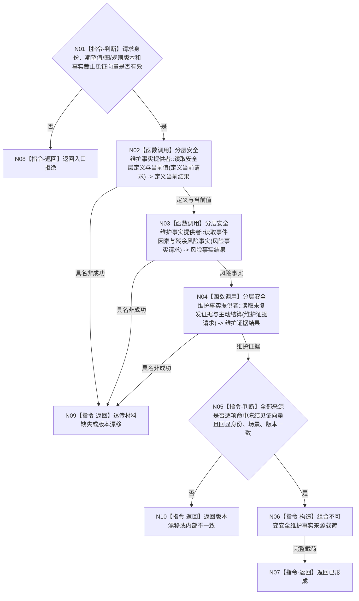

# BIZ-L3-003-01-01 读取已发布安全维护事实目标函数流程图 v0.1

更新时间：2026-08-03

## 依据

```text
0050、6140
父图：BIZ-L2-003-01
当前代码：海中鱼巣/领域/服务.分层安全维护.ixx
```

## 身份与边界

正式目标函数设计图。现行抽象端口已经存在；本图冻结具体提供者必须满足的读取行为，不把缓存、SQL或日志提升为安全事实。

## 函数合同

```text
根函数：读取已发布安全维护事实
归属模块 / 文件 / 层级：安全维护事实提供者 / 接口位于海中鱼巣/领域/服务.分层安全维护.ixx，目标具体提供者位于海中鱼巣/领域/提供者.分层安全维护事实.ixx / L3
现有或待新增：抽象端口当前存在；具体提供者待新增或由现行具名提供者适配
完整签名：安全维护事实来源结果 安全维护事实提供者::读取已发布安全维护事实(const 安全维护事实来源请求& 请求) const
参数：请求为只读借用；绑定自我、维护族、适用场景、期望当前值版本、因果图版本、维护规则版本和冻结的事实截止见证向量；任一身份、版本或必需提供者见证无效时拒绝
返回结果：安全维护事实来源结果；包含已形成、材料缺失、版本漂移、入口拒绝、资源失败或内部不一致，以及调用方拥有的不可变完整载荷、实际消费见证向量和来源版本组
被调函数流程图：BIZ-L4-003-01-01-01、BIZ-L4-003-01-01-02、BIZ-L4-003-01-01-03，分别冻结安全层定义与当前值、事件因素与残余风险、未复发证据与主动结算读取
```

## 流程图



## 节点合同

| 节点 | 类型 | 输入绑定 | 输出绑定 | 事实读写 | 后继条件 | 验证 |
| --- | --- | --- | --- | --- | --- | --- |
| N02-N04 | 函数调用 | 同一自我、维护族、场景及各提供者冻结见证 | 各自不可变来源结果和实际消费见证 | 只读各所有者内存已发布代次 | 不允许隐式最新 | 单项缺失、漂移和提供者见证错配 |
| N05 | 指令-判断 | 冻结见证向量、全部实际消费见证、身份和版本 | 一致性裁决 | 无 | 全部逐项命中才组合 | 不伪造全局标量代次，不跨见证拼接 |
| N06 | 指令-构造 | 完整来源材料 | 值式完整载荷 | 无 | 不持有可写引用 | 生命周期 |

## 关键边界

- SQL、缓存、控制面板和日志不得成为本函数的当前事实来源。
- 材料缺失是合法非成功；前置通过后来源回显复义属于内部不一致。
- 本端口不生成身份、不修改风险因素、不结算安全值。
- 多事实所有者没有可推导的全局标量版本；调用方必须冻结具名提供者见证向量，本函数只验证各结果逐项命中该向量。
