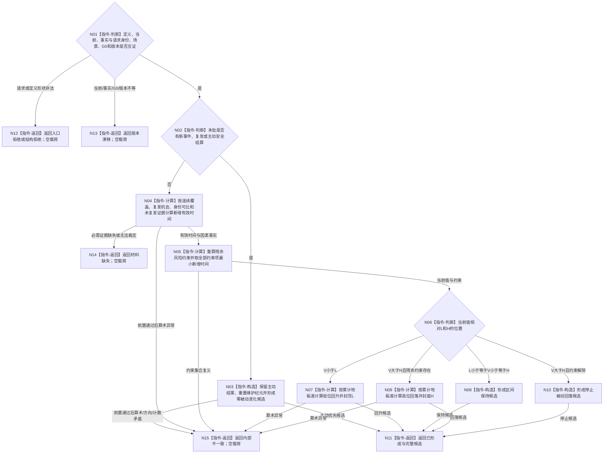

# BIZ-L3-003-01-02 计算分层安全维护候选目标函数流程图 v0.2

更新时间：2026-08-27

## 依据

```text
6140
父图：BIZ-L2-003-01 v0.2
当前代码：海中鱼巣/领域/算法.分层安全维护.ixx
```

## 身份与边界

正式目标函数设计图。当前复用的纯值算法；只计算候选，不读取仓库、不生成身份、不发布事实。

## 函数合同

```text
根函数：计算分层安全维护候选
归属模块 / 文件 / 目标分解深度：分层安全纯值算法 / 海中鱼巣/领域/算法.分层安全维护.ixx / BIZ-L3
现有或待新增：当前函数存在但需按本图校正；HEAD 在 `事实截止=当前游标` 时由纯值算法返回 `精确重复`，该状态缺正式幂等账读回证明，目标改为只形成候选，最终重复只由提交入口正式读回裁决
完整签名：安全维护结果 计算分层安全维护候选(const 安全层定义快照& 定义, const 安全层当前快照& 当前, const 安全维护事实来源载荷& 事实, const 安全维护请求& 请求) noexcept
参数：四项均为只读借用且只在调用期间有效；必须同属自我、维护族、场景、当前值、事实截止和规则版本
返回结果：安全维护结果；只有已形成携带方向、前后值、累计有效时间、维护账候选和来源批次；入口拒绝、结构拒绝、材料缺失、版本漂移或内部不一致不含载荷。纯值算法不返回权威发布代次或精确重复
被调函数流程图：无独立被调项目函数；checked wide整数中间值、累计地板差、边界夹取和算术异常均为本函数内明确指令
```

## 流程图



## 节点合同

| 节点 | 类型 | 输入绑定 | 输出绑定 | 事实读写 | 后继条件 | 验证 |
| --- | --- | --- | --- | --- | --- | --- |
| N01 | 指令-判断 | 定义、当前、事实、请求 | 入口/结构/版本裁决 | 无 | 全部互证才计算 | 外部形状非法与已成立身份版本漂移分账 |
| N04 | 指令-计算 | 证据区间和覆盖版本 | 新增有效时间或材料缺失 | 无 | 可裁定但门禁不成立时增量为0；必需材料缺失时不得冒充0 | 重叠、缺口与不可裁定分账 |
| N05 | 指令-计算 | 事件、因素、排除事实 | 当前残余约束 | 无 | 未知不等于排除 | 多事件多因素 |
| N07/N09 | 指令-计算 | R、Told、Tnew、Utime、V、L/H | 后值和变化量 | 无 | checked wide成功 | 累计余数等价 |

## 关键边界

- 新事件和主动结算优先，本批不消费事件前累计时间。
- `V=L`和`V=H`均属于闭区间保持。
- 算术异常不得钳制；前置通过后的异常返回内部不一致并禁止发布。
- `事实截止=当前事实处理游标`只能形成值式候选或由上层转正式提交读回，不能由本纯值函数单独证明精确重复；权威重复状态、首次G1和既有载荷只来自BIZ-L3-003-01-04。
