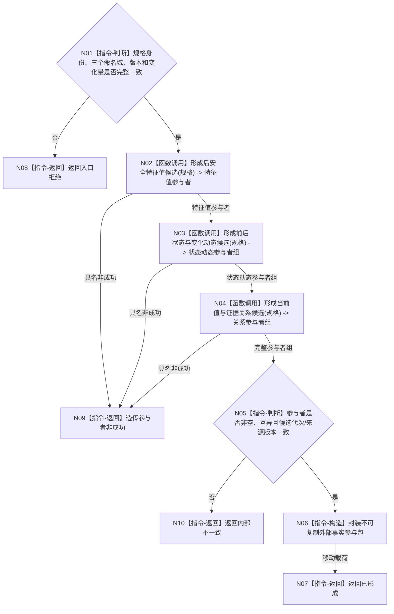

# BIZ-L3-003-01-03 形成安全维护外部事实参与包目标函数流程图 v0.1

更新时间：2026-08-03

## 依据

```text
0050、4190、4220、6140
父图：BIZ-L2-003-01
当前接口：海中鱼巣/领域/数据操作.分层安全.ixx
```

## 身份与边界

正式目标函数设计图。当前抽象端口已经存在；它只形成可移动的不透明事务参与包，不发布状态、动态或安全值。

## 函数合同

```text
根函数：形成安全维护外部事实参与包
归属模块 / 文件 / 层级：安全维护外部事实参与提供者 / 接口位于海中鱼巣/领域/数据操作.分层安全.ixx，目标实现位于海中鱼巣/领域/提供者.分层安全外部事实.ixx / L3
现有或待新增：抽象端口当前存在；具体实现待新增或适配
完整签名：安全维护外部事实参与结果 安全维护外部事实参与提供者::形成安全维护外部事实参与包(const 安全维护外部事实规格& 规格)
参数：规格为只读借用；绑定幂等、自我、维护族、场景、三个待形成稳定主键、前状态、前后值、方向、时间、来源批次、动作方法和来源版本
返回结果：可移动且不可复制的安全维护外部事实参与结果；包含完整参与包、候选代次和来源版本，或具名非成功
被调函数流程图：未形成；6140只提供后特征值、后状态和一个状态变化动态稳定主键，4220却要求另建被动动作动态并引用互异的同源状态迁移动能，缺少第四稳定主键前禁止展开或伪造接口
```

## 流程图



## 节点合同

| 节点 | 类型 | 输入绑定 | 输出绑定 | 事实读写 | 后继条件 | 验证 |
| --- | --- | --- | --- | --- | --- | --- |
| N02-N04 | 函数调用 | 同一规格和候选代次 | 不透明参与者 | 仅候选 | 全部成功 | 三类身份和关系完整 |
| N05 | 指令-判断 | 全参与者视图 | 一致性裁决 | 无 | 无空指针和重复 | 候选代次一致 |
| N06 | 指令-构造 | 参与者所有权 | move-only参与包 | 无发布 | 所有权唯一 | 不泄漏内部撤销权 |

## 关键边界

- 本函数不得请求提交、确认或最后发布。
- 三个待形成主键分别属于特征值、状态和动态命名域，不得互换。
- 外部调用方不能取得参与者裸指针、会话、锁或撤销能力。
