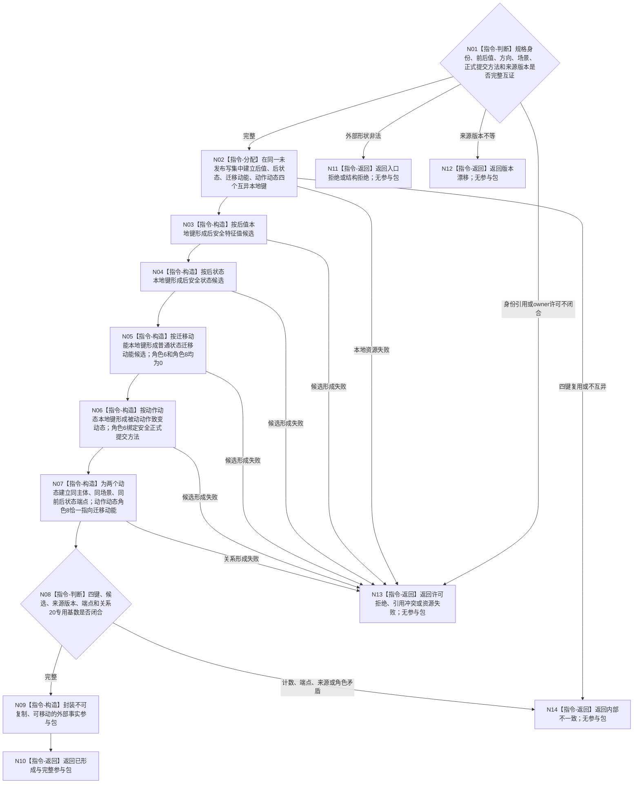

# BIZ-L3-003-01-03 形成安全维护外部事实参与包目标函数流程图 v0.2

更新时间：2026-08-27

## 依据

```text
0050、4050、4190、4220、6140
确认稿 51：安全被动维护双动态同写集发布
父图：BIZ-L2-003-01 v0.2
当前代码：生产提供者未实现；协议中的调用方三稳定主键字段属于待退出旧形状
```

## 身份与边界

正式目标函数设计图。它只在同一未发布 L1 写集候选中形成后值、后状态、状态迁移动能、被动动作致变动态和基础角色关系，并封装为可移动、不可复制的外部事实参与包；不提交、确认、最后发布或分配正式稳定编码。

## 函数合同

```text
根函数：形成安全维护外部事实参与包
归属模块 / 文件 / 目标分解深度：安全维护外部事实参与提供者 / 海中鱼巣/领域/提供者.分层安全外部事实.ixx / BIZ-L3
现有或待新增：公开端口、具体提供者和装配待新增；旧三个正式稳定主键输入退出
完整签名：安全维护外部事实参与结果 安全维护外部事实参与提供者::形成安全维护外部事实参与包(const 安全维护外部事实规格& 规格)
参数：规格为只读借用；绑定原幂等身份、自我、维护族、适用场景、前状态、前后值、方向、单调时间、来源已发布事实批次、被动维护正式提交方法和来源版本；不携带四项新事实的正式稳定编码
返回结果：可移动且不可复制的安全维护外部事实参与结果；已形成时携带同一写集的四个互异本地键、完整候选参与者组、关系候选和来源版本；入口拒绝、许可拒绝、结构拒绝、版本漂移、引用冲突、资源失败或内部不一致时无参与包
被调函数流程图：无独立 BIZ-L4；本函数内逐项展开写集本地键、四事实候选和关系候选，底层只调用现行 L1 不透明写集构造能力
```

## 流程图



## 节点合同

| 节点 | 类型 | 输入绑定 | 输出绑定 | 事实读写 | 后继条件 | 验证 |
| --- | --- | --- | --- | --- | --- | --- |
| N01 | 指令-判断 | 原幂等身份、规格和来源版本 | 入口、版本、许可和引用裁决 | 无 | 全部闭合才形成候选 | 调用方不传新正式编码 |
| N02 | 指令-分配 | 单一写集候选 | 四个写集本地键 | 只改未发布候选 | 四键互异 | 正式编码尚不存在 |
| N03—N04 | 指令-构造 | 前值、后值、前状态和本地键 | 后值、后状态候选 | 仅候选 | 值、状态和维护族互证 | 不提前发布 |
| N05—N07 | 指令-构造 | 自我、场景、端点、提交方法和两动态本地键 | 迁移动能、动作动态及关系候选 | 仅候选 | 两动态身份互异且端点同源 | 迁移动能角色6/8为0；动作动态角色6/8各恰一 |
| N08—N10 | 判断 / 构造 / 返回 | 全参与者和关系视图 | move-only参与包或内部不一致 | 无发布 | 计数与来源完整才交付 | 外部调用方不取得裸会话、锁、撤销权或正式编码 |

## 关键边界

- 本函数不得请求提交、确认或最后发布；正式编码只由后继 L1 原子发布返回的新编码映射取得。
- 状态迁移动能与被动动作致变动态必须身份互异、主体/场景/端点同源；动作动态只能以角色8引用迁移动能，迁移动能不得自引用、不得绑定来源动作，也不得被补写成动作动态。
- 无值变化分支不调用本函数，不创建值、状态或动态候选。
- 旧 `安全维护外部事实身份规格{后值稳定主键, 后状态稳定主键, 状态变化动态稳定主键}` 退出目标 ABI；不得扩成第四个调用方稳定主键，也不得复用三个旧键。
- 本图落实确认稿51的目标裁决；`HEAD` 6140第9节尚未同步，故当前结论是“目标设计已裁决、正式规范待同步”，不是代码实施许可。
