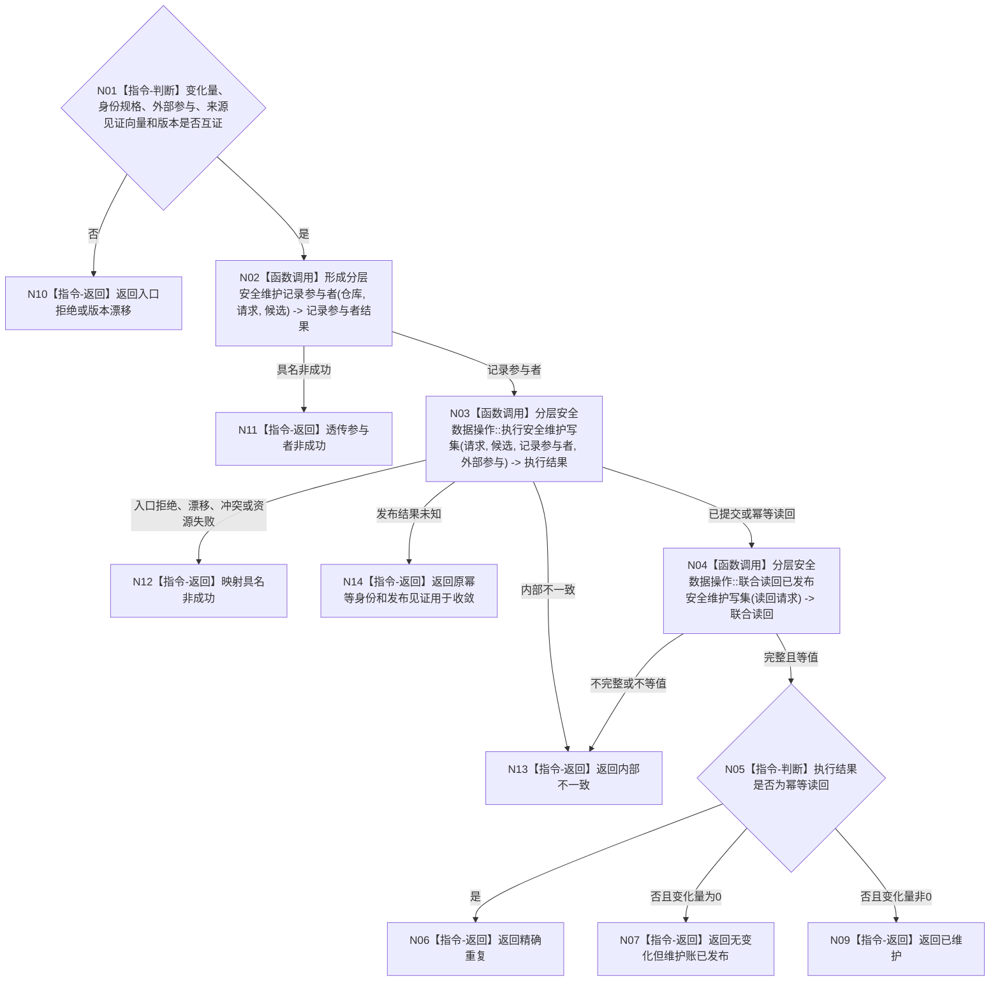

# BIZ-L3-003-01-04 提交安全维护候选目标函数流程图 v0.1

更新时间：2026-08-03

## 依据

```text
0050、6140
父图：BIZ-L2-003-01
当前代码：海中鱼巣/领域/数据操作.分层安全.ixx
```

## 身份与边界

正式目标函数设计图。当前复用的唯一分层安全数据操作；值变化与无值变化共用同一发布语义，但使用不同事务入口。

## 函数合同

```text
根函数：提交安全维护候选
归属模块 / 文件 / 层级：分层安全数据操作 / 海中鱼巣/领域/数据操作.分层安全.ixx / L3
现有或待新增：当前复用并目标适配；协议DTO需承接具名来源见证向量和发布见证分账
完整签名：安全维护结果 分层安全数据操作::提交安全维护候选(const 安全维护请求& 请求, const 安全维护载荷& 候选, std::optional<安全维护外部事实参与载荷>&& 外部参与) noexcept
参数：请求和候选为只读借用；外部参与为可选右值并转移所有权；变化量非零时必须存在完整外部参与和三项身份规格，零变化时两者都必须为空
返回结果：安全维护结果；包含已维护、无变化、精确重复、幂等冲突、入口拒绝、版本漂移、资源失败、发布结果未知或内部不一致，以及发布后完整载荷、权威代次、发布见证和持久证据状态
被调函数流程图：BIZ-L4-003-01-04-01、BIZ-L4-003-01-04-02、BIZ-L4-003-01-04-03，分别冻结维护记录参与者、变化/无变化统一执行路由和发布后联合读回；节点直接身份结构写入执行器作为已存在通用事务能力复用
```

## 流程图



## 节点合同

| 节点 | 类型 | 输入绑定 | 输出绑定 | 事实读写 | 后继条件 | 验证 |
| --- | --- | --- | --- | --- | --- | --- |
| N02 | 函数调用 | 仓库、请求和候选 | 唯一移动维护记录参与者 | 仅候选 | 已形成 | 幂等、版本和来源见证 |
| N03 | 函数调用 | 请求、候选、记录参与者和可选外部包 | 结构化执行结果 | 一个统一事实事务 | 已发布、重复或具名非成功 | 零变化走仅参与者事务；变化走核心写集事务 |
| N04 | 函数调用 | 原请求、候选、执行发布代次/见证和可选外部包 | 维护账与外部事实联合读回 | 只读已发布代次 | 逐项等值 | SQL、日志或普通返回不代替读回 |
| N05—N14 | 指令-判断 / 返回 | 执行与读回状态 | 具名安全维护结果 | 无新增写入 | 返回 | 已维护、无变化、重复、未知和内部不一致分离 |

## 关键边界

- 无值变化必须使用仅参与者事务，禁止伪造哨兵节点。
- 值变化必须在同一事务发布值、状态、动态、关系和维护账。
- 发布后读回不一致不能撤销已发布事实，只能返回内部不一致并进入审计路径。
- 发布结果未知只能按原幂等身份与发布见证回读；不得更换身份重新形成状态或动态。
