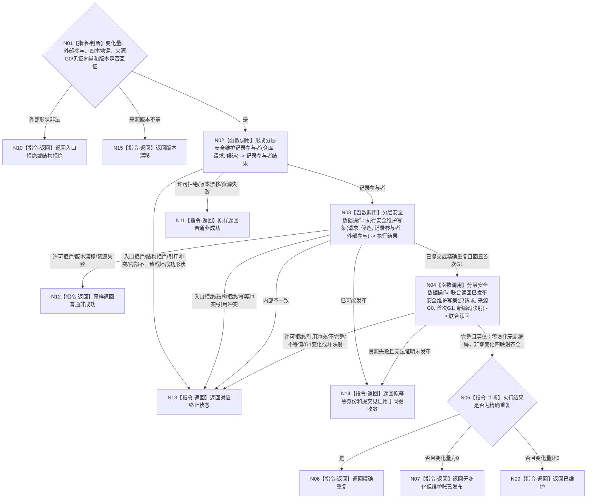

# BIZ-L3-003-01-04 提交安全维护候选目标函数流程图 v0.2

更新时间：2026-08-27

## 依据

```text
0050、6140
父图：BIZ-L2-003-01 v0.2
当前代码：HEAD 无 `数据操作.分层安全.ixx`；目标数据操作待实现
```

## 身份与边界

正式目标函数设计图。值变化与无值变化共用同一发布语义，但使用不同事务入口；HEAD 尚无该数据操作实现。

## 函数合同

```text
根函数：提交安全维护候选
归属模块 / 文件 / 目标分解深度：分层安全数据操作 / 海中鱼巣/领域/数据操作.分层安全.ixx / BIZ-L3
现有或待新增：目标数据操作待新增；协议DTO需承接具名来源见证向量、写集本地键、新编码映射和发布见证分账
完整签名：安全维护结果 分层安全数据操作::提交安全维护候选(const 安全维护请求& 请求, const 安全维护载荷& 候选, std::optional<安全维护外部事实参与载荷>&& 外部参与) noexcept
参数：请求和候选为只读借用；外部参与为可选右值并转移所有权；变化量非零时必须存在含四个互异写集本地键的完整外部参与，零变化时外部参与必须为空
返回结果：安全维护结果；包含已维护、无变化但维护账已发布、精确重复、入口拒绝、许可拒绝、结构拒绝、版本漂移、幂等冲突、引用冲突、资源失败、已可能发布或内部不一致。三个成功状态携带完整首次已发布载荷、来源G0、首次G1和非零值变化时的四项新编码映射；已可能发布只携带原幂等身份与提交见证
被调函数流程图：BIZ-L4-003-01-04-01—03 v0.2，分别冻结维护记录参与者、变化/无变化统一执行路由和发布后联合读回；L1不透明写集执行能力不重复展开
```

## 流程图



## 节点合同

| 节点 | 类型 | 输入绑定 | 输出绑定 | 事实读写 | 后继条件 | 验证 |
| --- | --- | --- | --- | --- | --- | --- |
| N02 | 函数调用 | 仓库、请求和候选 | 唯一移动维护记录参与者 | 仅候选 | 已形成 | 原幂等身份、来源G0、版本和见证互证 |
| N03 | 函数调用 | 请求、候选、记录参与者和可选外部包 | 结构化执行结果、首次G1、提交见证与新编码映射 | 一个统一事实事务 | 已发布、重复、已可能发布或具名非成功 | 零变化走仅参与者事务；变化走含四本地键核心写集事务 |
| N04 | 函数调用 | 原请求、候选、来源G0、首次G1、见证和映射 | 维护账与可选四项外部事实联合读回 | 只读首次已发布G1 | 逐项等值 | 非零变化读回后值、后状态、迁移动能、动作动态及角色关系；SQL、日志或普通返回不代替读回 |
| N05—N15 | 指令-判断 / 返回 | 执行与读回状态 | 具名安全维护结果 | 无新增写入 | 返回 | 已维护、无变化、重复、已可能发布和内部不一致分离 |

## 关键边界

- 无值变化必须使用仅参与者事务，禁止伪造哨兵节点。
- 值变化必须在同一事务发布后值、后状态、互异的状态迁移动能与被动动作致变动态、关系和维护账；四个正式编码由L1按本地键分配并在成功结果中回显。
- 发布后读回不一致不能撤销已发布事实，只能返回内部不一致并进入审计路径。
- 发布结果未知或提交后读回资源失败只能按原幂等身份与提交见证回读；不得更换身份重新形成状态或动态。精确重复必须回显首次G1和首次新编码映射。
