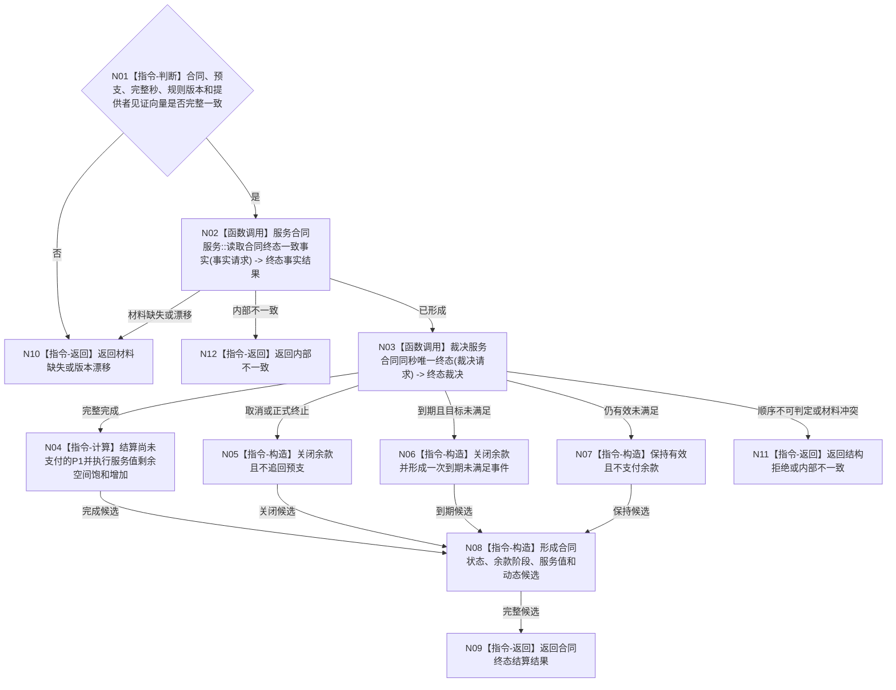

# BIZ-L3-003-02-01 形成合同终态与完工余款候选目标函数流程图 v0.1

更新时间：2026-08-03

## 依据

```text
6160、6170
父图：BIZ-L2-003-02
```

## 身份与边界

正式目标函数设计图。只形成同秒合同终态、70%余款或余款关闭候选，不重复30%预支，也不单独发布。

## 函数合同

```text
根函数：形成合同终态与完工余款候选
归属模块 / 文件 / 层级：服务合同治理 / 海中鱼巣/领域/服务.服务合同.ixx / L3
现有或待新增：待新增；复用需求、任务、目标和合同只读服务
完整签名：合同终态结算结果 服务合同服务::形成合同终态与完工余款候选(const 合同终态结算请求& 请求) const
参数：请求为只读借用；包含当前确定性完整秒边界、合同身份组、已发布预支结果、服务值前状态、冻结提供者见证向量、合同/目标/结算规则版本和来源治理身份；完成/取消/终止与目标当前事实由本函数重新读取
返回结果：合同终态结算结果；包含保持有效、完整完成并支付余款、取消/到期/终止并关闭余款、精确重复、材料缺失、版本漂移或内部错误，以及合同/服务值候选和可选到期未满足事件
被调函数流程图：BIZ-L4-003-02-01-01 `服务合同服务::读取合同终态一致事实`；BIZ-L4-003-02-01-02 `裁决服务合同同秒唯一终态`
```

## 流程图



## 节点合同

| 节点 | 类型 | 输入绑定 | 输出绑定 | 事实读写 | 后继条件 | 验证 |
| --- | --- | --- | --- | --- | --- | --- |
| N02 | 函数调用 | 合同组、完整秒和冻结见证向量 | 目标、完成、取消、终止、到期及结算阶段一致事实 | 只读正式领域事实 | 已形成才裁决 | 任务完成/回执不直接等于目标满足 |
| N03 | 函数调用 | 一致事实、完整秒和规则版本 | 唯一终态裁决 | 无 | 终态、仍有效或具名非成功 | 不用容器、消息或日志顺序 |
| N04 | 指令-计算 | B、P0、P1、当前V | 实际写入与舍弃值 | 无 | P1只一次 | 饱和边界 |
| N06 | 指令-构造 | 到期且未满足证据 | 一次性事件候选 | 无 | 不恢复合同 | 30天门禁 |

## 关键边界

- 任务完成不直接等于需求满足；只有独立目标事实确认完整完成才支付余款。
- 取消、到期、终止永不支付P1，已付P0不追回。
- 所有输出只是候选，必须与补回、衰减和安全根回归进入同一聚合事务。

