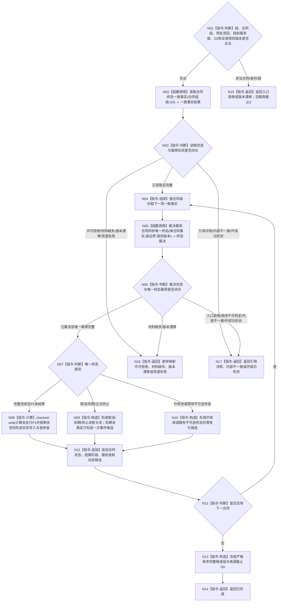

# BIZ-L3-003-02-01 形成合同终态与完工余款候选目标函数流程图 v0.2

更新时间：2026-08-27

## 依据

```text
0050、4050、5160、6160、6170
父图：BIZ-L2-003-02 v0.2
```

## 身份与边界

正式目标函数设计图。函数按来源事实截止 `G0` 读取并裁决当前确定性段内的合同终态，只形成合同、余款、服务值和动态候选；不重复30%预支、不写事实、不拥有幂等账，也不得把相同值式输出宣称为权威精确重复。

## 函数合同

```text
根函数：形成合同终态与完工余款候选
归属模块 / 文件 / 目标分解深度：服务合同治理 / 海中鱼巣/领域/服务.服务合同.ixx / BIZ-L3
现有或待新增：待新增；发布源码无该provider，只有L2治理骨架空壳
完整签名：合同终态结算结果 服务合同服务::形成合同终态与完工余款候选(const 合同终态结算请求& 请求) const noexcept
参数：请求为只读借用；绑定当前确定性完整秒段、合同身份组、已发布预支结果、段前服务值、来源事实截止G0、合同/目标/结算规则版本
返回结果：已形成时携带按合同身份有序的完整候选组和截止G0；保持有效、既有不可逆终态、取消、到期、终止和完整完成均是候选组内的具名形状。入口拒绝、许可拒绝、材料缺失、版本漂移、引用冲突、资源失败或内部不一致均空载荷、截止0
被调函数流程图：BIZ-L4-003-02-01-01 v0.2；BIZ-L4-003-02-01-02 v0.2
```

## 流程图



## 节点合同

| 节点 | 类型 | 输入绑定 | 输出绑定 | 事实读写 | 后继条件 | 验证 |
| --- | --- | --- | --- | --- | --- | --- |
| N01—N03 | 判断 / 调用 | 当前段、合同、正式预支、G0和版本 | 同截止一致事实或具名非成功 | 只读正式事实 | 成功状态与载荷同时成立才继续 | G0前后守卫、0/N合同、坏成功形状 |
| N04—N07 | 选择 / 调用 / 判断 | 单合同完整事实 | 唯一终态裁决 | 无 | 不依赖消息、容器或日志顺序 | 完成/取消/终止/到期同秒顺序 |
| N08—N11 | 计算 / 构造 / 追加 | B、P0、P1、段前V和终态 | 分账候选 | 无已发布写入 | P1只一次；到期事件只一次 | 饱和、舍弃、既有终态零变化 |
| N12—N17 | 循环 / 构造 / 返回 | 全合同结果 | 有序候选组或空载荷非成功 | 无 | 返回父图 | 候选函数无“精确重复”权威状态 |

## 关键边界

- 任务或消息完成不等于需求目标满足；只有同 `G0` 正式目标事实与合法完成依据共同成立才取得P1资格。
- 取消、到期、终止不支付P1且不追回P0；饱和未写入值舍弃，但结算阶段候选仍完成。
- 本函数的全部输出只是值式候选；权威精确重复只能由 `BIZ-L3-003-02-05` 按原幂等身份读回首次发布事实。
