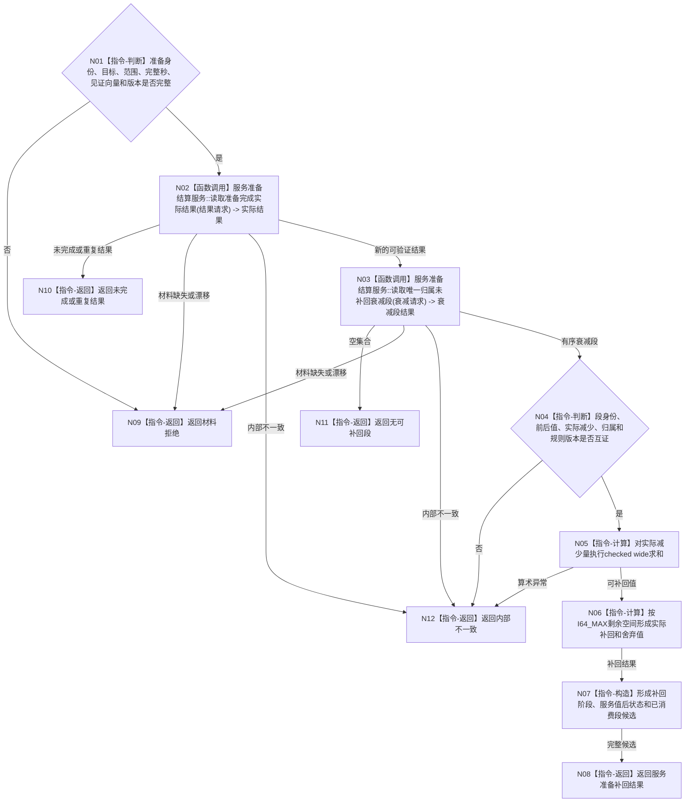

# BIZ-L3-003-02-02 形成服务准备补回候选目标函数流程图 v0.1

更新时间：2026-08-03

## 依据

```text
6160、6170
父图：BIZ-L2-003-02
```

## 身份与边界

正式目标函数设计图。只补回已经发生、已发布且唯一归属完成准备的衰减，不产生预算、预支或净增长。

## 函数合同

```text
根函数：形成服务准备补回候选
归属模块 / 文件 / 层级：服务准备结算 / 海中鱼巣/领域/服务.服务准备结算.ixx / L3
现有或待新增：待新增
完整签名：服务准备补回结果 服务准备结算服务::形成服务准备补回候选(const 服务准备补回请求& 请求) const
参数：请求为只读借用；包含准备身份、目标、范围、当前服务值、当前完整秒边界、冻结提供者见证向量和规则版本；实际结果、完成验证与唯一归属衰减段由本函数重新读取
返回结果：服务准备补回结果；包含已形成补回、无可补回段、未完成、重复结果、精确重复、材料拒绝或内部错误，以及实际补回、舍弃值和已消费衰减段组
被调函数流程图：BIZ-L4-003-02-02-01 `服务准备结算服务::读取准备完成实际结果`；BIZ-L4-003-02-02-02 `服务准备结算服务::读取唯一归属未补回衰减段`
```

## 流程图



## 节点合同

| 节点 | 类型 | 输入绑定 | 输出绑定 | 事实读写 | 后继条件 | 验证 |
| --- | --- | --- | --- | --- | --- | --- |
| N02 | 函数调用 | 准备、目标、范围、截止和见证 | 已发布实际结果与验证 | 只读任务、方法、状态和动态事实 | 新结果才继续 | 回执、线程状态和显示不自证完成 |
| N03 | 函数调用 | 准备身份、结果版本和当前完整秒 | 唯一归属且尚未补回的有序段组 | 只读服务衰减事实 | 空或完整 | 并行准备；本秒新段排除 |
| N05 | 指令-计算 | 各段实际减少量 | 可补回总值 | 无 | checked wide | 多段边界 |
| N06 | 指令-计算 | 当前V与可补回值 | 实际补回/舍弃 | 无 | 不产生净增长 | 饱和边界 |

## 关键边界

- 本秒新衰减不能由同秒刚完成准备提前补回。
- 失败或终止准备的已归属段不改配给其它准备。
- 饱和舍弃值不得以后补领；阶段仍标记已结算。
