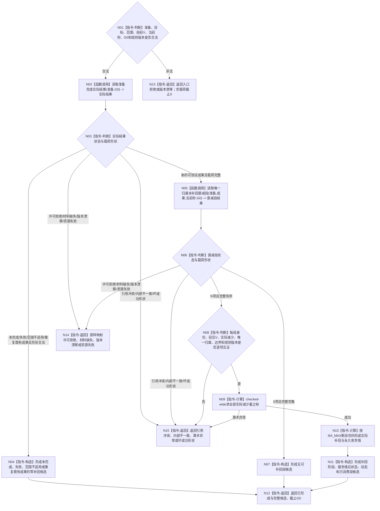

# BIZ-L3-003-02-02 形成服务准备补回候选目标函数流程图 v0.2

更新时间：2026-08-27

## 依据

```text
0050、4050、6160、6170
父图：BIZ-L2-003-02 v0.2
```

## 身份与边界

正式目标函数设计图。函数只依据来源截止 `G0` 的正式准备成果和此前已发布、唯一归属且未补回的衰减段形成补回候选；不产生预算、预支或净增长，不改配失败准备的衰减段，不写事实，也不拥有权威精确重复语义。

## 函数合同

```text
根函数：形成服务准备补回候选
归属模块 / 文件 / 目标分解深度：服务准备结算 / 海中鱼巣/领域/服务.服务准备结算.ixx / BIZ-L3
现有或待新增：待新增；HEAD无该provider
完整签名：服务准备补回结果 服务准备结算服务::形成服务准备补回候选(const 服务准备补回请求& 请求) const noexcept
参数：请求为只读借用；绑定准备身份、目标、范围、段前服务值、当前完整秒、G0和结果/衰减/归属/补回规则版本
返回结果：已形成时携带已形成补回、未完成、重复既有成果或无可补回段之一的完整值式候选与截止G0；非成功为空载荷、截止0
被调函数流程图：BIZ-L4-003-02-02-01 v0.2；BIZ-L4-003-02-02-02 v0.2
```

## 流程图



## 节点合同

| 节点 | 类型 | 输入绑定 | 输出绑定 | 事实读写 | 后继条件 | 验证 |
| --- | --- | --- | --- | --- | --- | --- |
| N01—N03 | 判断 / 调用 | 准备和G0 | 正式成果读回 | 只读任务、方法、状态、动态和验证事实 | 新成果或合法零补回形状 | 回执/线程/日志不自证完成 |
| N05—N08 | 调用 / 判断 | 成果、当前秒和G0 | 完整0/N衰减段组 | 只读衰减与归属事实 | 本秒新段排除；唯一归属闭合 | 0/N、历史/当前、并行准备 |
| N09—N11 | 计算 / 构造 | 实际减少量和段前V | 补回、舍弃、后V与动态候选 | 无已发布写入 | 不超过无衰减反事实值 | I64_MAX、wide求和、饱和 |
| N12—N15 | 返回 | 候选或具名非成功 | 完整载荷或空载荷 | 无 | 返回父图 | 坏成功形状进入内部不一致 |

## 关键边界

- 本秒新衰减不能由同秒刚完成准备提前补回；归属一经衰减事实发布即不可因后续完成顺序改配。
- 饱和舍弃值不得以后补领；未完成、失败、重复成果和合法空段组都只是零补回候选，不是权威精确重复。
- 补回、随后本秒衰减和安全根回归必须分别保留前后值与动态，不能只发布净值。
