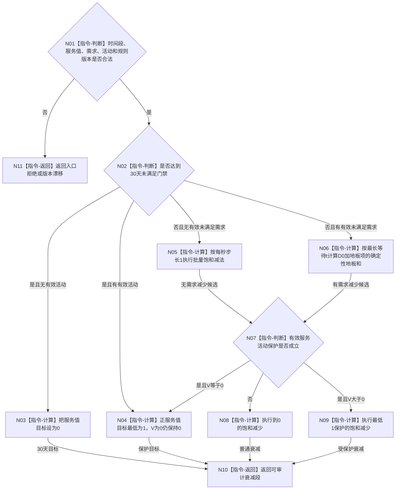

# BIZ-L3-003-02-03 计算服务值时间衰减段目标函数流程图 v0.1

更新时间：2026-08-03

## 依据

```text
6160、6170
父图：BIZ-L2-003-02
```

## 身份与边界

正式目标函数设计图。纯值批量算法必须与逐完整秒顺序等价；不读取仓库、不发布服务值。

## 函数合同

```text
根函数：计算服务值时间衰减段
归属模块 / 文件 / 层级：服务时间维护算法 / 海中鱼巣/领域/算法.服务时间维护.ixx / L3
现有或待新增：待新增
完整签名：服务衰减计算结果 计算服务值时间衰减段(const 服务衰减计算请求& 请求) noexcept
参数：请求为只读借用；包含确定性完整秒段、补回后服务值、有效未满足需求及最长等待、到期未满足事件、有效服务活动、D0、T和规则版本
返回结果：服务衰减计算结果；包含前后服务值、实际减少、保护下界、30天门禁、段审计和规则版本，或入口拒绝、版本漂移、算术错误
被调函数流程图：无独立被调项目函数；确定性地板和、跨秒跳跃、最低1保护和算术异常均为本函数内明确指令
```

## 流程图



## 节点合同

| 节点 | 类型 | 输入绑定 | 输出绑定 | 事实读写 | 后继条件 | 验证 |
| --- | --- | --- | --- | --- | --- | --- |
| N02 | 指令-判断 | t、T和到期事件 | 30天门禁 | 无 | 同秒终态已先处理 | T-1/T/T+1 |
| N06 | 指令-计算 | D0、t、段长 | 请求减少量 | 无 | 宽整数成功 | 批量逐秒等价 |
| N07-N09 | 判断/计算 | 活动五项门禁与V | 实际减少量 | 无 | 活动不从0造值 | 0/1保护 |

## 关键边界

- 多需求只取最长等待，不按数量叠加步长。
- 循环次数、消息数和墙钟不参与计算。
- 余数直接舍弃；结果需要为正却截断为0时才取1。
