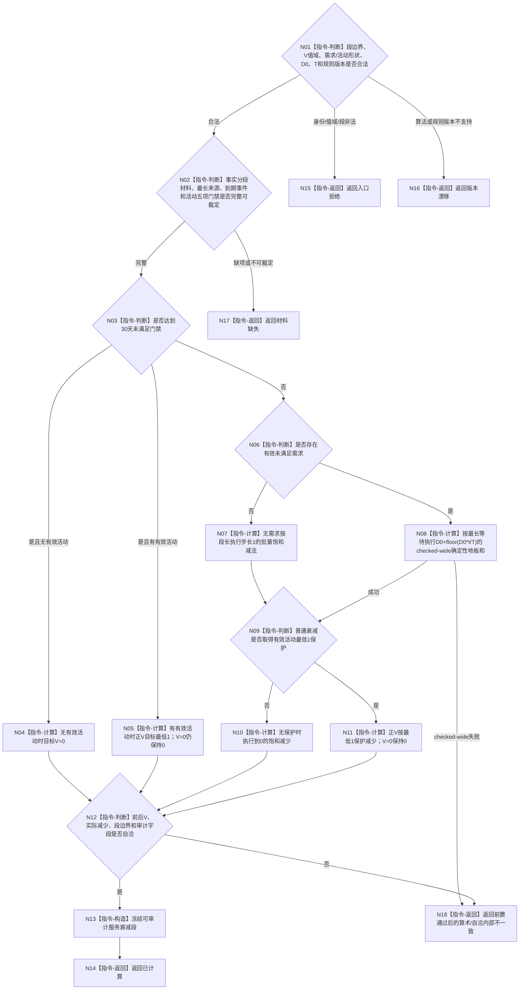

# BIZ-L3-003-02-03 计算服务值时间衰减段目标函数流程图 v0.2

更新时间：2026-08-27

## 依据

```text
0050、4050、6160、6170
父图：BIZ-L2-003-02 v0.2
```

## 身份与边界

正式目标函数设计图。纯值函数对一个已经按事实边界切好的确定性完整秒段计算服务值衰减，必须与逐秒参考顺序等价；不读取仓库、不发布服务值、不累计余数，也不产生权威精确重复。

## 函数合同

```text
根函数：计算服务值时间衰减段
归属模块 / 文件 / 目标分解深度：服务时间维护算法 / 海中鱼巣/领域/算法.服务时间维护.ixx / BIZ-L3
现有或待新增：待新增；HEAD无该算法
完整签名：服务衰减计算结果 计算服务值时间衰减段(const 服务衰减计算请求& 请求) noexcept
参数：请求为只读借用；包含确定性秒段、补回后V、有效未满足需求完整投影、并列最长来源、到期未满足事件、有效服务活动完整门禁、D0、T、地板和证明版本及规则版本
返回结果：已计算时携带前后V、请求/实际减少、保护下界、30天门禁、完整段审计和规则版本；入口拒绝、材料缺失、版本漂移或内部不一致均空载荷
被调函数流程图：无；全部判断、checked-wide地板和与跳跃均为本函数内指令
```

## 流程图



## 节点合同

| 节点 | 类型 | 输入绑定 | 输出绑定 | 事实读写 | 后继条件 | 验证 |
| --- | --- | --- | --- | --- | --- | --- |
| N01/N02 | 判断 | 类型化段材料与版本 | 合法、缺失或漂移 | 无 | 全部事实边界已由父图切分 | 非法/不支持/缺项分账 |
| N03—N05 | 判断 / 计算 | t、T、到期事件和活动 | 30天目标 | 无 | 同秒终态先处理 | T-1/T/T+1、V=0/正值 |
| N06—N11 | 判断 / 计算 | 最长等待、段长、D0和活动 | 请求/实际减少 | 无 | checked-wide且批量等价逐秒 | 多需求不叠加、0/1保护 |
| N12—N18 | 判断 / 构造 / 返回 | 全部计算材料 | 审计段或具名非成功 | 无 | 自洽才成功 | 算术异常只在前置通过后归内部不一致 |

## 关键边界

- 循环次数、消息数、墙钟和需求数量不参与数值；多需求只使用一个最长等待值并保留全部并列来源。
- 余数直接舍弃且不跨秒累计；批量算法必须保留可验证的逐秒等价证明版本。
- 纯值函数的相同输出不是权威精确重复；只有最终统一发布入口拥有幂等账和首次读回语义。
