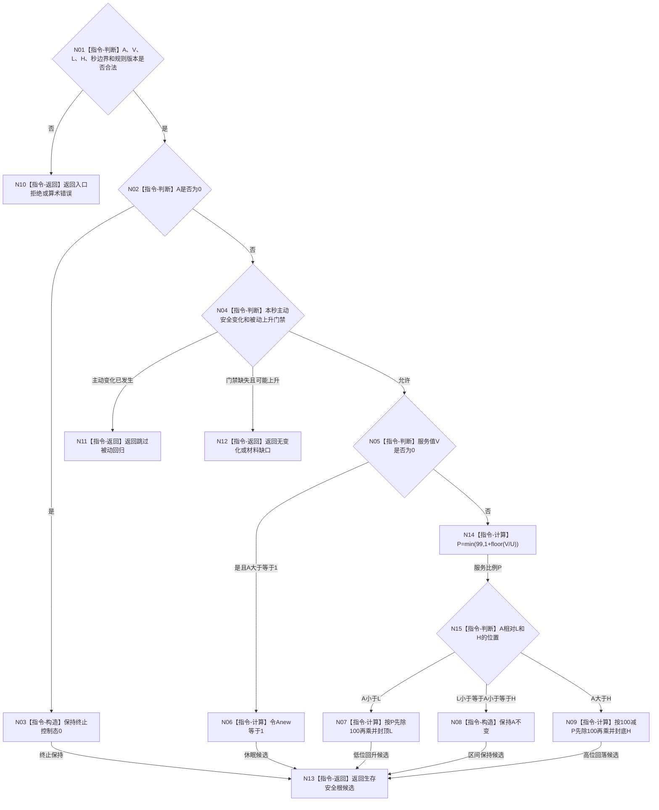

# BIZ-L3-003-02-04 计算服务调节生存安全根回归目标函数流程图 v0.1

更新时间：2026-08-03

## 依据

```text
6120、6170
父图：BIZ-L2-003-02
```

## 身份与边界

正式目标函数设计图。纯值函数只在本秒没有主动安全根变化且安全门禁完整时计算被动回归。

## 函数合同

```text
根函数：计算服务调节生存安全根回归
归属模块 / 文件 / 层级：服务生存回归算法 / 海中鱼巣/领域/算法.服务生存回归.ixx / L3
现有或待新增：待新增
完整签名：生存安全根回归结果 计算服务调节生存安全根回归(const 生存安全根回归请求& 请求) noexcept
参数：请求为只读借用；包含A、V、L、H、I64_MAX、服务比例单位U、无主动安全变化门禁、安全因果门禁、完整秒边界和规则版本
返回结果：生存安全根回归结果；包含终止保持、休眠目标、低位回升、闭区间保持或高位回落，以及前后A、有符号变化和控制态候选
被调函数流程图：无
```

## 流程图



## 节点合同

| 节点 | 类型 | 输入绑定 | 输出绑定 | 事实读写 | 后继条件 | 验证 |
| --- | --- | --- | --- | --- | --- | --- |
| N02 | 指令-判断 | A | 终止先行 | 无 | A=0不进入其它分支 | 终止不可唤醒 |
| N04 | 指令-判断 | 主动安全和因果门禁 | 允许/跳过/缺口 | 无 | 主动优先 | 同秒事件 |
| N14 | 指令-计算 | V、U | P=1..99 | 无 | 向下取整 | V最小正值和I64_MAX |
| N07/N09 | 指令-计算 | 距离与P | Anew | 无 | 最小步长1 | 阈值和比例档位 |

## 关键边界

- 合同、预支或人类请求本身不直接改变A。
- V=0把A>=1调到1，但A=0始终保持0。
- 本函数不得生成物理伤害、安全改善或因素排除事实。
