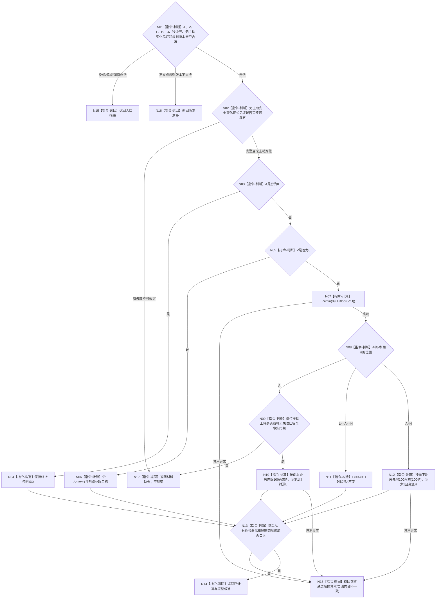

# BIZ-L3-003-02-04 计算服务调节生存安全根回归目标函数流程图 v0.2

更新时间：2026-08-27

## 依据

```text
0050、4050、6120、6170
父图：BIZ-L2-003-02 v0.2
```

## 身份与边界

正式目标函数设计图。父图只有在当前段不存在已发布主动安全根变化时才调用本纯值函数；函数依据完整安全因果门禁计算服务调节的被动回归，不读取仓库、不发布安全事实、不覆盖主动安全结算，也不生成物理伤害、改善或因素排除事实。

## 函数合同

```text
根函数：计算服务调节生存安全根回归
归属模块 / 文件 / 目标分解深度：服务生存回归算法 / 海中鱼巣/领域/算法.服务生存回归.ixx / BIZ-L3
现有或待新增：待新增；发布源码无该算法
完整签名：生存安全根回归结果 计算服务调节生存安全根回归(const 生存安全根回归请求& 请求) noexcept
参数：请求为只读借用；包含段前A、本段候选V、L、H、I64_MAX、比例单位U、无主动变化正式见证、安全因果门禁、完整秒边界及定义/回归规则版本
返回结果：已计算时唯一携带终止保持、休眠目标、低位回升、闭区间保持或高位回落，以及前后A、有符号变化和控制态候选；其它状态空载荷
被调函数流程图：无
```

## 流程图



## 节点合同

| 节点 | 类型 | 输入绑定 | 输出绑定 | 事实读写 | 后继条件 | 验证 |
| --- | --- | --- | --- | --- | --- | --- |
| N01/N02 | 判断 | 定义、事实见证和门禁 | 合法、材料缺失或漂移 | 无 | 父图已排除主动变化，函数仍互证见证 | 坏输入、坏版本、缺门禁分账 |
| N03—N06 | 判断 / 构造 / 计算 | A和V | 终止保持或休眠目标 | 无 | A=0先于全部其它分支 | A=0不可唤醒；V=0且A>=1到1 |
| N07—N12 | 计算 / 判断 | V、U、A、L、H和因果门禁 | 比例与回归候选 | 无 | 低位上升必须有完整安全门禁 | 比例1..99、阈值边界、最小步长1 |
| N13—N18 | 判断 / 返回 | 计算结果 | 完整候选或空载荷非成功 | 无 | 自洽才成功 | 前置通过后异常为内部不一致 |

## 关键边界

- 合同、预支、人类请求或高服务值都不能直接写A；`A=0` 始终保持终止。
- 主动安全结算由父图优先保留，本函数没有“跳过主动结算”的成功替代状态。
- 相同纯值结果不是权威精确重复，控制态也只是由候选A派生的值式结果。
