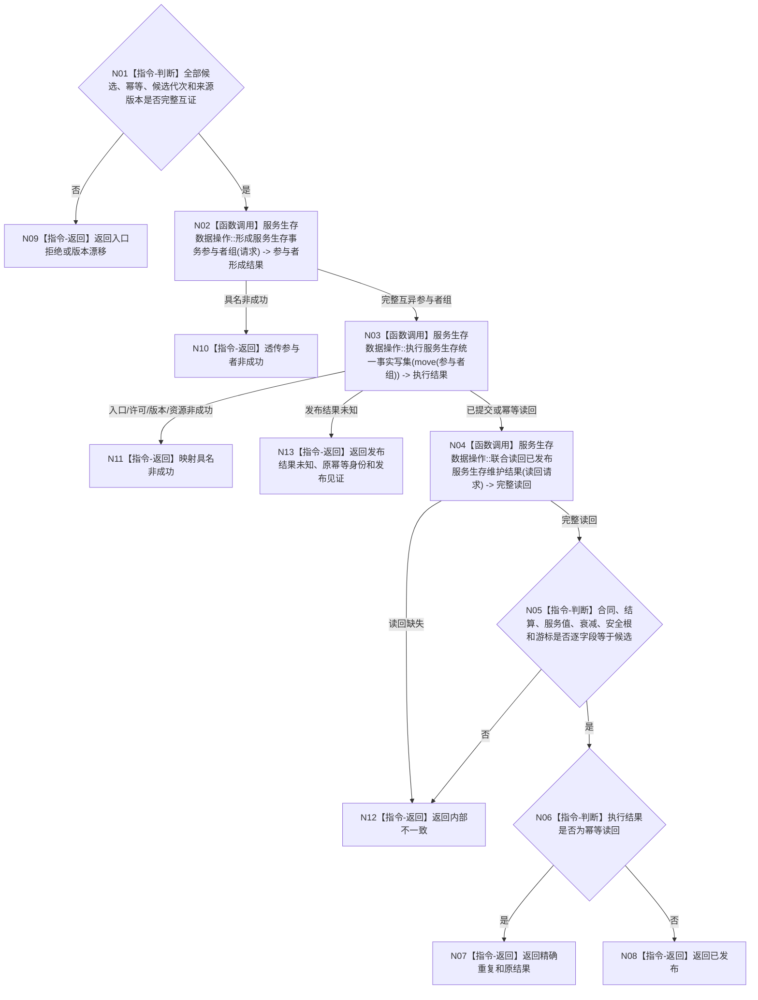

# BIZ-L3-003-02-05 发布服务生存维护事务目标函数流程图 v0.1

更新时间：2026-08-03

## 依据

```text
0050、6160、6170
父图：BIZ-L2-003-02
```

## 身份与边界

正式目标函数设计图。它是合同终态、余款或准备补回、服务衰减和生存安全根回归的唯一共同线性化点。

## 函数合同

```text
根函数：发布服务生存维护事务
归属模块 / 文件 / 层级：服务生存数据操作 / 海中鱼巣/领域/数据操作.服务生存治理.ixx / L3
现有或待新增：待新增
完整签名：服务生存事务发布结果 服务生存数据操作::发布服务生存维护事务(服务生存事务发布请求&& 请求) noexcept
参数：请求为右值并转移全部候选所有权；包含合同、结算阶段、服务值状态动态、衰减段、准备归属、安全根状态动态、维护游标、幂等账、候选代次和来源版本
返回结果：服务生存事务发布结果；包含已发布、精确重复、入口拒绝、版本漂移、资源失败或内部不一致，以及权威读回的完整服务生存维护载荷
被调函数流程图：BIZ-L4-003-02-05-01 `服务生存数据操作::形成服务生存事务参与者组`；BIZ-L4-003-02-05-02 `服务生存数据操作::执行服务生存统一事实写集`；BIZ-L4-003-02-05-03 `服务生存数据操作::联合读回已发布服务生存维护结果`
```

## 流程图



## 节点合同

| 节点 | 类型 | 输入绑定 | 输出绑定 | 事实读写 | 后继条件 | 验证 |
| --- | --- | --- | --- | --- | --- | --- |
| N02 | 函数调用 | move-only完整请求 | 事务参与者组 | 仅候选 | 参与者非空互异 | 所有权 |
| N03 | 函数调用 | 核心候选与参与者组 | 执行结果 | 原子发布 | 全确认或逆序撤销 | 故障注入 |
| N04/N05 | 调用/判断 | 幂等身份与候选 | 权威完整读回 | 只读已发布代次 | 全字段一致 | 发布见证 |

## 关键边界

- 30%预支不进入本事务；它已经由合同建立入口独立发布。
- 合同终态、70%余款或准备补回、当秒衰减和安全根回归不得拆成可见中间事务。
- 服务准备补回、本秒服务衰减和生存安全根回归必须保留各自前后值、实际增减与动态，不得只发布净值。
- 发布后不一致不得伪装回滚，必须返回内部不一致并停止依赖路径。
