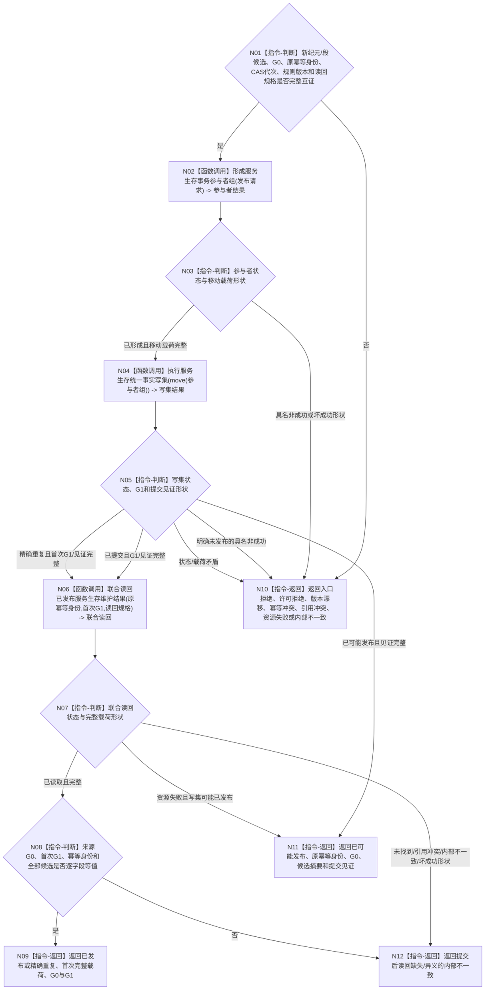

# BIZ-L3-003-02-05 发布服务生存维护事务目标函数流程图 v0.2

更新时间：2026-08-27

## 依据

```text
0050、4040、4050、4190、6160、6170
父图：BIZ-L2-003-02 v0.2
```

## 身份与边界

正式目标函数设计图。它是新时间纪元/连续性缺口、合同终态、余款或准备补回、服务值衰减、生存安全根回归、状态动态和维护游标的唯一共同线性化点。来源事实统一截止为 `G0`；首次内存权威发布和正式联合读回截止为 `G1`。精确重复必须返回首次 `G1` 与首次完整载荷。

## 函数合同

```text
根函数：发布服务生存维护事务
归属模块 / 文件 / 目标分解深度：服务生存数据操作 / 海中鱼巣/领域/数据操作.服务生存治理.ixx / BIZ-L3
现有或待新增：待新增；HEAD无数据操作、事务入口或联合读回
完整签名：服务生存事务发布结果 服务生存数据操作::发布服务生存维护事务(服务生存事务发布请求&& 请求) noexcept
参数：请求为右值并转移全部候选；绑定新纪元可选候选、全部段候选、原幂等身份、来源G0、各owner紧邻写入前CAS代次、规则版本和完整读回规格
返回结果：已发布/精确重复唯一携带首次完整维护载荷、来源G0、首次G1和发布见证；已可能发布只携带原幂等身份、来源G0、候选摘要和提交见证；其它非成功空业务载荷、G1=0
被调函数流程图：BIZ-L4-003-02-05-01—03 v0.2
```

## 流程图



## 节点合同

| 节点 | 类型 | 输入绑定 | 输出绑定 | 事实读写 | 后继条件 | 验证 |
| --- | --- | --- | --- | --- | --- | --- |
| N01—N03 | 判断 / 调用 | 全候选、G0、CAS、幂等和版本 | 唯一移动参与者包 | 仅候选 | 状态×载荷闭合 | 新纪元且N=0、N段、空可选分支 |
| N04/N05 | 调用 / 判断 | 移动事务包 | 明确未发布、已提交、重复或已可能发布 | 一个原子写集 | 首次发布形成G1 | 故障注入、逆序撤销、交换后失败 |
| N06—N08 | 调用 / 判断 | 原键、首次G1与冻结摘要 | 同G1完整联合读回 | 只读已发布事实 | 全字段等值才成功 | 首次/重复/推进后按原键读回 |
| N09—N12 | 返回 | 已互证载荷或见证 | 结构化结果 | 无额外写入 | 返回父图 | G0/G1分账；未知只按原键收敛 |

## 关键边界

- `N=0` 且存在新时间纪元候选时仍必须发布纪元、连续性缺口和当前游标；没有新纪元候选的 `N=0` 不调用本函数。
- 30%预支已由合同建立入口独立发布，不进入本写集；其它同秒维护事实不得拆成可见中间事务。
- 已提交后读回失败不能声称回滚；资源不确定返回已可能发布，确定缺账或异义返回内部不一致。
- 当前发布源码仅有空壳，不具备本图的参与者、统一写集、联合读回或首次幂等载荷能力。
