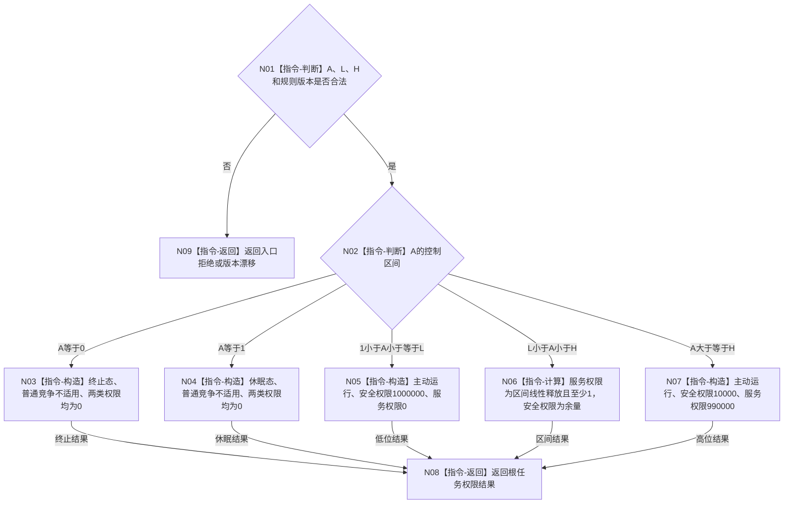

# BIZ-L3-003-03-01 计算生存控制与根任务权限目标函数流程图 v0.1

更新时间：2026-08-03

## 依据

```text
6120、6170
父图：BIZ-L2-003-03
```

## 身份与边界

正式目标函数设计图。纯值函数只从生存安全根值形成控制态以及安全/服务普通任务根权限。

## 函数合同

```text
根函数：计算生存控制与根任务权限
归属模块 / 文件 / 层级：服务生存权限算法 / 海中鱼巣/领域/算法.服务生存权限.ixx / L3
现有或待新增：待新增
完整签名：根任务权限结果 计算生存控制与根任务权限(const 根任务权限请求& 请求) noexcept
参数：请求为只读借用；包含A、L、H、生存安全定义版本和权限规则版本，必须满足0<=A<=I64_MAX且1<L<H<=I64_MAX
返回结果：根任务权限结果；包含终止/休眠/主动运行控制态、普通竞争适用性、安全根权限和服务根权限，或入口拒绝、版本漂移、算术错误
被调函数流程图：无
```

## 流程图



## 节点合同

| 节点 | 类型 | 输入绑定 | 输出绑定 | 事实读写 | 后继条件 | 验证 |
| --- | --- | --- | --- | --- | --- | --- |
| N02 | 指令-判断 | A、L、H | 唯一控制分支 | 无 | 等号语义固定 | 0/1/L/H |
| N06 | 指令-计算 | A-L、H-L | 两类权限 | 无 | checked wide成功 | 服务至少1 |
| N03-N07 | 构造/计算 | 当前A | 根权限载荷 | 无 | 主动态和为1000000 | 权限守恒 |

## 关键边界

- A=0和A=1的两类普通任务权限之和为0，不得伪造满刻度。
- 权限只是调度投影，不修改A、服务值、任务或需求。
- 权重不是线程时间、算力或任务数量配额。

