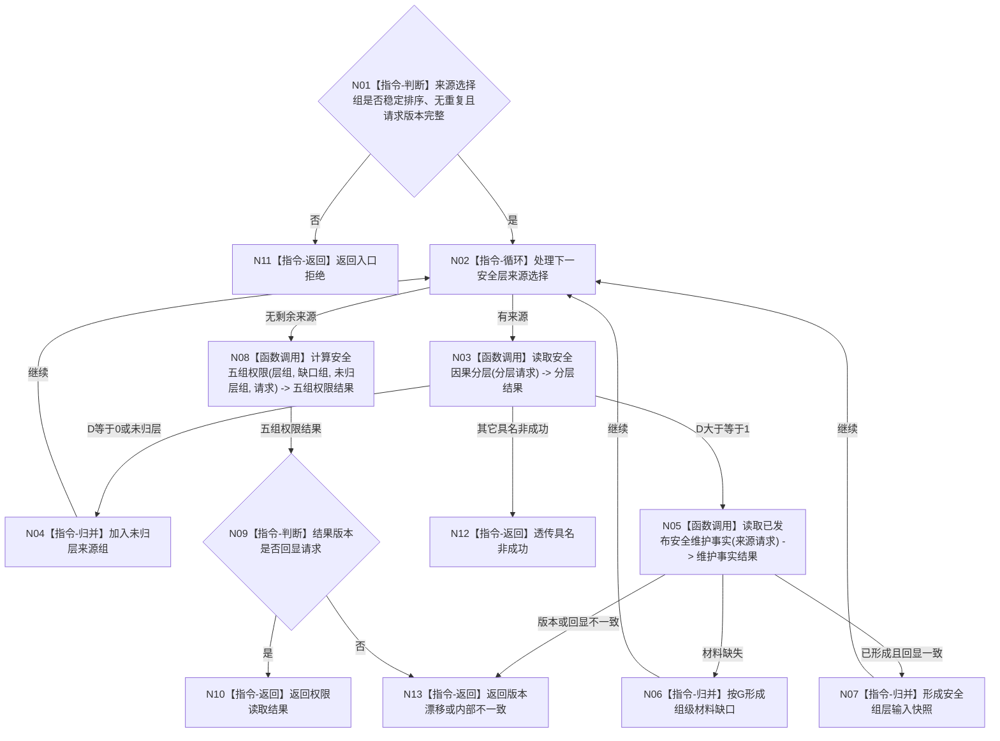

# BIZ-L3-003-03-02 读取安全权限快照目标函数流程图 v0.1

更新时间：2026-08-03

## 依据

```text
6140、6150
父图：BIZ-L2-003-03
当前代码：海中鱼巣/领域/服务.安全任务权限.ixx
```

## 身份与边界

正式目标函数设计图。当前复用的安全类内权限服务；它不包含6170的安全/服务根权限。

## 函数合同

```text
根函数：读取安全权限快照
归属模块 / 文件 / 层级：安全任务权限 / 海中鱼巣/领域/服务.安全任务权限.ixx / L3
现有或待新增：当前复用；具体来源提供者装配仍须由详细设计核对
完整签名：权限读取结果 安全任务权限服务::读取安全权限快照(const 权限读取请求& 请求) const
参数：请求为只读借用；显式绑定自我、场景、稳定无重复来源选择组、事实截止、图版本和权限规则版本
返回结果：权限读取结果；包含五组权限、未归层来源、组级缺口、已形成权限总量和全部输入版本，或具名非成功
被调函数流程图：BIZ-L4-003-03-02-01 `安全因果分层服务::读取安全因果分层`；复用BIZ-L3-003-01-01 `安全维护事实提供者::读取已发布安全维护事实`；BIZ-L4-003-03-02-03 `计算安全五组权限`
```

## 流程图



## 节点合同

| 节点 | 类型 | 输入绑定 | 输出绑定 | 事实读写 | 后继条件 | 验证 |
| --- | --- | --- | --- | --- | --- | --- |
| N03 | 函数调用 | 单项因果选择 | D、G和路径来源 | 只读 | 保留真实D | 多路径与环 |
| N05 | 函数调用 | D>=1维护族选择 | V/L/H及版本 | 只读 | 缺失成为组缺口 | 不默认安全 |
| N08 | 函数调用 | 有序层组/缺口/未归层 | 五组权限 | 无 | 完整时守恒 | 1%/99% |

## 关键边界

- 服务不得隐式枚举当前维护族或读取“最新”版本。
- D=0和无路径不是材料缺失；它们保留为未归层零权限来源。
- 组5只汇总权限，真实D和全部最短路径不得丢失。
