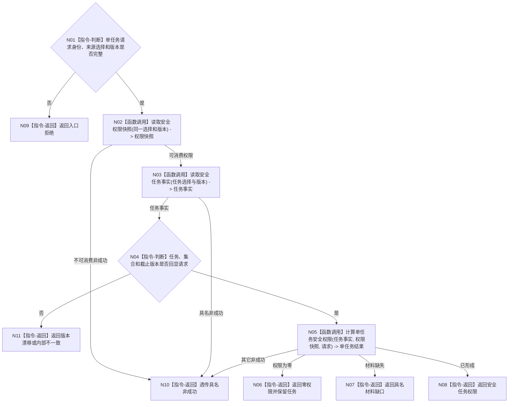

# BIZ-L3-003-03-03 计算任务安全权限目标函数流程图 v0.1

> 历史冻结（2026-08-27）：旧父图 `BIZ-L2-003-03 v0.1` 已退出；本图只处理安全类内单任务候选，不能证明v0.2所需完整候选组、服务来源、根调度配额、共同场景或0..1派发选择，不得施工或自动改挂。

更新时间：2026-08-03

## 依据

```text
6150
父图：BIZ-L2-003-03 v0.1（历史）
当前代码：海中鱼巣/领域/服务.安全任务权限.ixx
```

## 身份与边界

历史目标函数候选。安全类内单任务算法只作相邻复用证据，不再是当前直接子函数合同。

## 函数合同

```text
根函数：计算任务安全权限
归属模块 / 文件 / 层级：安全任务权限 / 海中鱼巣/领域/服务.安全任务权限.ixx / L3
现有或待新增：当前复用
完整签名：任务权限结果 安全任务权限服务::计算任务安全权限(const 任务权限请求& 请求) const
参数：请求为只读借用；绑定自我、场景、任务、来源选择组、事实截止、图版本、任务集合版本和权限规则版本
返回结果：任务权限结果；包含安全类内最高权限、有效优先级、全部来源、并列最高来源和输入版本，或零权限、材料缺失及其它具名非成功
被调函数流程图：复用BIZ-L3-003-03-02 `安全任务权限服务::读取安全权限快照`；BIZ-L4-003-03-03-01 `安全任务事实提供者::读取安全任务事实`；BIZ-L4-003-03-03-02 `计算单任务安全权限`
```

## 流程图



## 节点合同

| 节点 | 类型 | 输入绑定 | 输出绑定 | 事实读写 | 后继条件 | 验证 |
| --- | --- | --- | --- | --- | --- | --- |
| N02 | 函数调用 | 同一来源选择 | 五组权限快照 | 只读 | 可含缺口 | 选择不漂移 |
| N03 | 函数调用 | 任务和集合版本 | 任务授权/状态/来源 | 只读 | 回显一致 | 候选当前性 |
| N05 | 函数调用 | 任务事实与五组权限 | 单任务安全权限 | 无 | 多来源取最高 | 并列保留 |

## 关键边界

- 权限为0不删除、取消或失败任务，也不停止筹办和事实维护。
- 本结果是安全类内部权限，必须由上层再乘安全根权限。
- 任务等待时长、队列位置和线程号不得提高基础优先级。
