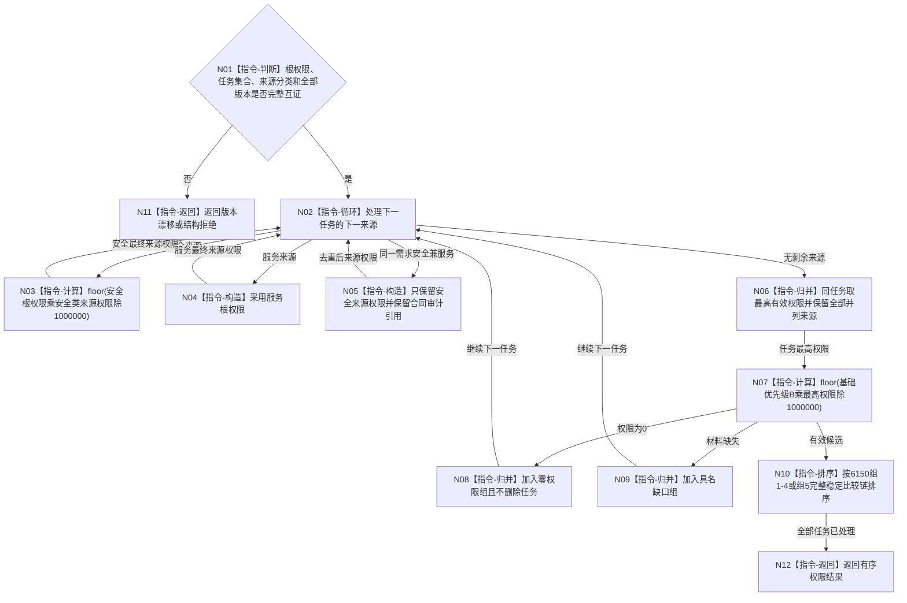

# BIZ-L3-003-03-04 合并并排序任务来源权限目标函数流程图 v0.1

更新时间：2026-08-03

## 依据

```text
6150、6170
父图：BIZ-L2-003-03
当前相邻能力：海中鱼巣/领域/算法.安全任务权限.ixx
```

## 身份与边界

正式目标函数设计图。组合安全根、五级安全权限和服务根权限，形成统一任务排序；不持久化第二份当前权限。

## 函数合同

```text
根函数：合并并排序任务来源权限
归属模块 / 文件 / 层级：任务执行权限组合算法 / 海中鱼巣/领域/算法.任务执行权限组合.ixx / L3
现有或待新增：待新增；现行安全排序算法只作部分复用证据，尚未覆盖服务来源合并和完整U排序材料
完整签名：任务来源权限排序结果 合并并排序任务来源权限(const 任务来源权限排序请求& 请求) noexcept
参数：请求为只读借用；包含根权限、候选任务、逐来源分类与权限、B/U/T/C/K/D、规范化路径、创建序号、稳定身份和全部版本
返回结果：任务来源权限排序结果；包含有序可执行候选、零权限组、材料缺口组、全部并列来源和确定性排序证据，或版本漂移、结构拒绝、算术错误
被调函数流程图：无
```

## 流程图



## 节点合同

| 节点 | 类型 | 输入绑定 | 输出绑定 | 事实读写 | 后继条件 | 验证 |
| --- | --- | --- | --- | --- | --- | --- |
| N03/N04 | 计算/构造 | 根权限与来源权限 | 最终来源权限 | 无 | 不求和 | 根级组合 |
| N06 | 指令-归并 | 同任务全部来源 | 最高值与并列来源 | 无 | 保留全部来源 | 安全兼服务去重 |
| N10 | 指令-排序 | E/Q/B/U/T/C/K/D及稳定键 | 确定顺序 | 无 | 版本不参与强弱 | 组5完整顺序 |

## 关键边界

- 组5顺序必须包含后果严重度、当前安全不足度、时间和因果证据，不能用旧实现缺项兜底。
- 空组权限不赠予其它组，多来源权限不相加。
- 排序结果是可重建投影；只有实际派发消费的快照可作为历史证据冻结。
