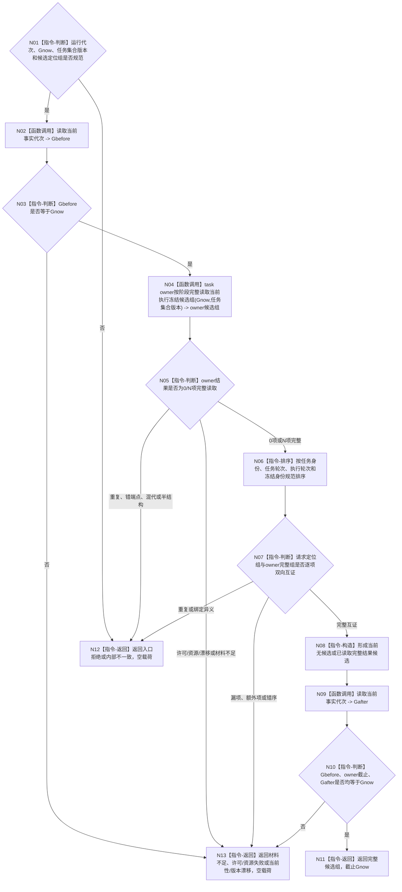

# BIZ-L3-003-03-05 读取当前待普通派发冻结候选组目标函数流程图 v0.1

更新时间：2026-08-27

## 依据

```text
3200、5090、5230、8100、8200
父图：BIZ-L2-003-03 v0.2
```

## 身份与边界

正式目标函数设计图。本函数只读 task owner 在指定 `Gnow` 的全部当前“执行冻结完成且尚未普通派发”任务，并与任务管理线程已经接管的候选定位组作双向完整性互证。它不按线程槽枚举任务、不裁剪候选、不计算调度资格，也不建立第二候选 owner。

task owner 的“按阶段完整读取当前冻结候选组”公开 DATA 入口尚未在 HEAD 冻结；本图只冻结所需业务能力、0/N 完整语义和使用边界，具体 DTO、状态数值和物理索引必须在后续 DATA 提供者设计中闭合，不能由本组合器遍历内部容器代替。

## 函数合同

```text
根函数：读取当前待普通派发冻结候选组
归属模块 / 文件 / 目标分解深度：任务普通派发选择 / 海中鱼巣/领域/内部治理/服务.任务普通派发选择.ixx / BIZ-L3
可见性：module-private；只由BIZ-L2-003-03根组合器调用
现有或待新增：待新增；HEAD没有task owner完整当前候选组公开读取入口
完整签名：普通派发冻结候选读取结果 任务普通派发选择组合器::读取当前待普通派发冻结候选组(const 普通派发冻结候选读取请求& 请求) const noexcept
参数：请求只读借用；含运行代次、非零Gnow、期望任务集合版本，以及任务管理当前全部候选定位组；定位只含任务、三轮次、冻结、实例、路径和冻结材料身份，不含调用方复制的候选正文
返回结果：已读取、当前无候选、入口拒绝、材料不足、当前性漂移、版本漂移、许可拒绝、资源失败或内部不一致；两个完整状态均返回规范有序完整组和截止Gnow，其它状态空载荷、截止0
被调函数流程图：下一层待冻结task owner按阶段完整读取公开DATA入口；不展开DATA内部索引
```

## 流程图



## 节点合同

| 节点 | 类型 | 输入绑定 | 输出绑定 | 事实读写 | 验证 |
| --- | --- | --- | --- | --- | --- |
| N04/N05 | DATA读取 / 判断 | Gnow、任务集合版本 | task owner当前完整候选组 | 只读任务阶段、三轮次、冻结、实例和路径 | 0/1/N、许可/资源、混版本、半结构 |
| N06/N07 | 排序 / 互证 | 请求定位与owner完整组 | 唯一规范有序组 | 无写入 | 漏、多、重、错序、同任务异冻结 |
| N02/N09/N10 | 读取 / 守卫 | Gnow | 同截止证明 | 只读当前事实代次 | 读前/读后漂移 |

## 关键边界

- 请求候选定位组不是候选权威；它只证明任务管理当前槽没有遗漏或额外接管。
- task owner完整读取也不能替代任务管理槽的逐项互证；owner有候选而线程未接管时必须结构化失败，不能静默补入本轮。
- `当前无候选`是完整成功形状，不得被材料不足、许可拒绝或索引读取失败冒充。
- 不允许用任务状态摘要、日志、队列到达顺序或容器遍历结果代替正式完整读取。
