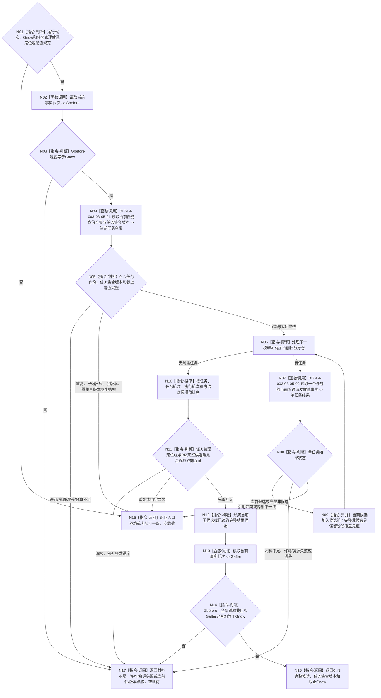

# BIZ-L3-003-03-05 读取当前待普通派发冻结候选组目标函数流程图 v0.2

更新时间：2026-08-27

## 依据

```text
0050、3200、4230、4260、5090、5230、6150、8100、8200
父图：BIZ-L2-003-03 v0.5
```

## 身份与边界

正式目标函数替代图。函数先经中性 DATA 读取 task owner 在 `Gnow` 的全部当前任务身份及任务集合版本，再逐任务读取正式任务存在上的 ARCH-L2 当前阶段、当前轮次、选择 / 路径 / 实例 / 执行冻结和排队事实，由 BIZ 层筛出“执行冻结完成且尚未普通派发”的 0..N 完整候选，最后与任务管理已经接管的候选定位组双向互证。

v0.1 让 task owner “按阶段读取候选”，把 ARCH-L4 阶段解释下推给 DATA-L2，并要求调用方在首次全集读取前自报任务集合版本，均退出。任务管理定位组仍只作接管完整性见证，不能成为任务或候选权威；DATA完整任务组也不能跳过当前阶段、冻结和排队事实的逐任务正式读回。

## 函数合同

```text
根函数：任务普通派发选择组合器::读取当前待普通派发冻结候选组
归属模块 / 文件 / 目标分解深度：任务普通派发选择 / 海中鱼巣/领域/内部治理/服务.任务普通派发选择.ixx / BIZ-L3
可见性：module-private；只由BIZ-L2-003-03 v0.5根组合器调用
现有或待新增：待新增；HEAD无中性当前任务全集、任务集合版本和本BIZ组合读取
完整签名：普通派发冻结候选读取结果 任务普通派发选择组合器::读取当前待普通派发冻结候选组(const 普通派发冻结候选读取请求& 请求) const noexcept
参数：请求只读借用；含运行代次、非零Gnow，以及任务管理当前全部候选定位组；不接收调用方声明的任务集合版本或候选正文
返回结果：已读取、当前无候选、入口拒绝、材料不足、当前性漂移、版本漂移、许可拒绝、资源失败或内部不一致；两个完整状态均返回非零任务集合版本、规范有序0..N候选组和截止Gnow，其它状态空载荷、截止0
被调函数流程图：BIZ-L4-003-03-05-01、BIZ-L4-003-03-05-02；后者复用BIZ-L4-002-05-02-02与BIZ-L4-004-04-06-01
```

## 流程图



## 节点合同

| 节点 | 类型 | 输入绑定 | 输出绑定 | 事实读写 | 验证 |
| --- | --- | --- | --- | --- | --- |
| N04/N05 | L4-05-01 / 判断 | Gnow | 中性当前任务全集、任务集合版本 | 只读task owner | 0/1/N、合法空、完整覆盖、预算、混版本 |
| N06—N09 | 循环 / L4-05-02 | 当前任务身份、Gnow、集合版本 | 当前候选或完整非候选理由 | 只读任务、存在、状态、选择、冻结和排队事实 | 全阶段覆盖、选择/冻结缺口、已有在途、错轮次 |
| N10/N11 | 排序 / 互证 | BIZ候选组与任务管理定位组 | 唯一规范有序完整候选组 | 无写入 | 漏、多、重、错序、同任务异冻结 |
| N02/N13/N14 | 读取 / 守卫 | Gnow | 同截止证明 | 只读当前事实代次 | 读前/逐项/读后漂移 |

## 关键边界

- DATA-L2只提供中性的当前任务结构全集；“执行冻结完成且尚未普通派发”由BIZ层读取ARCH-L2当前阶段和正式排队事实后裁决。
- 任务集合版本唯一来自L4-05-01的正式完整读取；调用方、线程槽和后继安全结果都不得首次提供或反推该版本。
- 请求定位组不是候选权威；它只证明任务管理当前接管范围与BIZ完整候选组没有遗漏或额外项。
- 合法0项必须建立在完整任务全集与逐任务阶段覆盖上；索引失败、预算不足、许可拒绝、材料缺失或资源失败不得冒充当前无候选。
- 具名 DATA 缺口 `DRIFT-DATA-L2-TASK-CURRENT-SET-VERSION-AND-COMPLETE-ENUMERATION-ABI-UNFROZEN` 仍阻断实现，不允许组合器遍历task owner内部容器绕过。

## v0.2 校正记录

- 退出task owner按业务阶段直接筛选候选的错误分层，改为DATA中性全集读取+BIZ逐任务阶段裁决。
- 退出调用方首次自报任务集合版本，改为由完整任务全集读取结果正式产生并供后继调度复用。
- 将已排队 / 已有恢复锚点从线程状态改为正式排队事实互证，任务管理定位组只保留接管完整性作用。
