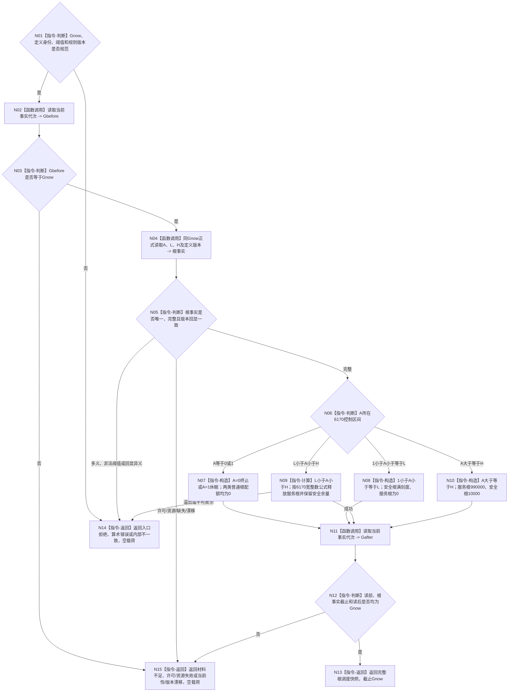

# BIZ-L3-003-03-06 读取同Gnow生存控制与根调度快照目标函数流程图 v0.1

更新时间：2026-08-27

## 依据

```text
6120、6170、8100、8200
父图：BIZ-L2-003-03 v0.3
```

## 身份与边界

正式目标函数设计图。本函数在同一 `Gnow` 正式读取生存安全根值 `A`、低位阈值 `L`、高位阈值 `H`及其定义/规则版本，并按6170唯一派生生存控制态和安全/服务两类普通任务根调度配额。它不读取任务、不计算6150安全类内倍率，也不发布第二份控制态或配额事实。

旧 BIZ-L3-003-03-01 的 6170 纯值区间算法可以作为实现复用证据，但其历史函数身份不恢复；本函数增加同 `Gnow` 正式读取、回显互证和前后当前性守卫，因此是新的当前目标函数。

## 函数合同

```text
根函数：读取同Gnow生存控制与根调度快照
归属模块 / 文件 / 目标分解深度：任务普通派发选择 / 海中鱼巣/领域/内部治理/服务.任务普通派发选择.ixx / BIZ-L3
可见性：module-private；只由BIZ-L2-003-03 v0.3根组合器调用
现有或待新增：待新增；可复用运行期只读查询与6170纯值公式
完整签名：任务根调度快照读取结果 任务普通派发选择组合器::读取同Gnow生存控制与根调度快照(const 任务根调度快照读取请求& 请求) const noexcept
参数：请求只读借用；含运行代次、非零Gnow、生存安全根特征定义、低/高阈值定义及期望版本、服务生存调度规则版本；请求不得携带声明控制态或声明根配额
返回结果：已读取、入口拒绝、材料不足、当前性漂移、版本漂移、许可拒绝、资源失败、算术错误或内部不一致；已读取始终含A/L/H、控制态、普通竞争适用性、两类根调度配额、全部版本和截止Gnow
被调函数流程图：复用运行期只读查询的正式A/L/H读取能力；6170区间和配额公式为本函数内纯值指令
```

## 流程图



## 节点合同

| 节点 | 类型 | 输入绑定 | 输出绑定 | 事实读写 | 验证 |
| --- | --- | --- | --- | --- | --- |
| N04/N05 | 正式读取 / 互证 | Gnow、A/L/H定义 | 唯一根事实 | 只读正式特征和定义 | 缺失、多义、错定义、错版本 |
| N06—N10 | 判断 / 纯计算 | A/L/H、6170规则 | 控制态与两类根配额 | 无写入 | A=0/1/L/H及开区间、宽整数、守恒 |
| N02/N11/N12 | 读取 / 守卫 | Gnow | 同截止证明 | 只读当前事实代次 | 读前/读后漂移 |

## 关键边界

- `A=0/1`也是完整读取结果，只是普通竞争关闭；不能映射成材料不足。
- 只有 `A>1` 时两类根调度配额之和为满刻度；终止/休眠时精确为0。
- 配额是本次派发读取的值式投影，不是线程、时间、任务数量、现实授权或持久当前事实。
- 任务积压、队列长度和工作线程数量不得反向影响A、L、H或根配额。
