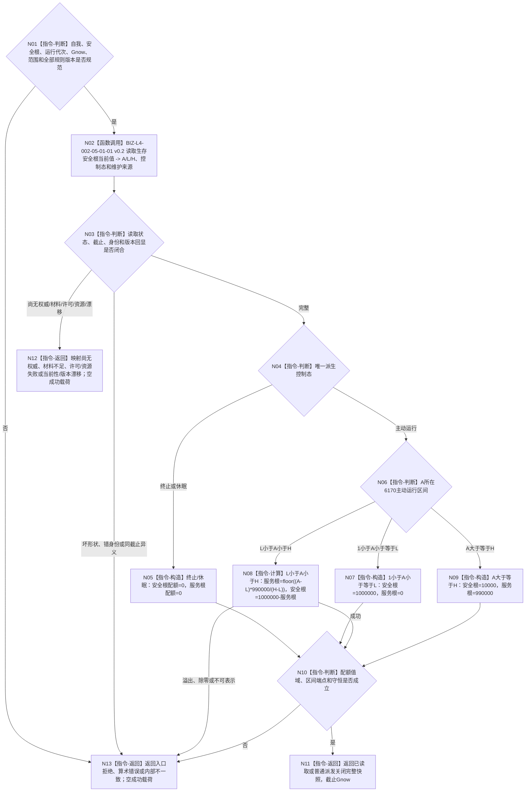

# BIZ-L3-003-03-06 读取同Gnow生存控制与根调度快照目标函数流程图 v0.2

更新时间：2026-08-27

## 依据

```text
0050、6120、6170、8100
父图：BIZ-L2-003-03 v0.5
复用：BIZ-L4-002-05-01-01 v0.2
替代关系：v0.2以现有生存安全根正式读取叶替代v0.1未具名的A/L/H读取能力
```

## 身份与边界

正式目标函数替代图。函数把唯一自我、安全根、运行代次、事实范围版本和非零 `Gnow` 原样交给既有 `服务生存治理服务::读取生存安全根当前值`，取得同截止的 `A/L/H`、定义/规则版本、维护来源与唯一派生控制态；随后只在本函数内按6170计算安全根、服务根普通调度配额。

本函数不重复读取安全根底层事实，不建立第二控制态或当前配额事实。根调度配额只是本次普通派发的可重建值式投影；调用方不得声明 `A/L/H`、控制态或配额，也不得以任务数量、线程状态、缓存或旧冻结补输入。

## 函数合同

```text
根函数：任务普通派发选择组合器::读取同Gnow生存控制与根调度快照
归属模块 / 文件 / 目标分解深度：任务普通派发选择 / 海中鱼巣/领域/内部治理/服务.任务普通派发选择.ixx / BIZ-L3
可见性：module-private；只由BIZ-L2-003-03 v0.5根组合器调用
现有或待新增：待新增module-private组合；正式A/L/H读取复用既有目标叶，6170配额公式为本函数内纯值指令
完整签名：任务根调度快照读取结果 任务普通派发选择组合器::读取同Gnow生存控制与根调度快照(const 任务根调度快照读取请求& 请求) const noexcept
参数：请求只读借用；含唯一自我、运行代次、事实范围版本、安全根强类型身份、非零Gnow、安全根定义版本、生存安全回归规则版本、服务维护规则版本和服务生存调度规则版本；不携带声明A/L/H、控制态或配额
返回结果：已读取、普通派发关闭、尚无权威、材料不足、当前性漂移、版本漂移、入口拒绝、许可拒绝、资源失败、算术错误或内部不一致；两个完整状态均携带A/L/H、维护来源、唯一控制态、两类根配额、全部版本和截止Gnow
被调函数流程图：BIZ-L4-002-05-01-01 v0.2 服务生存治理服务::读取生存安全根当前值；6170区间、守恒和宽整数计算不另建L4算法图
```

## 流程图



## 节点合同

| 节点 | 类型 | 输入绑定 | 输出绑定 | 事实读写 | 验证 |
| --- | --- | --- | --- | --- | --- |
| N02/N03 | 复用正式读取 / 互证 | 自我、安全根、Gnow、范围与版本 | A/L/H、控制态、维护来源 | 只经BIZ-L4-002-05-01-01读取；无写入 | 身份、截止、定义和规则版本逐字段回显 |
| N04—N09 | 判断 / 纯计算 | 正式A/L/H和控制态 | 两类普通根调度配额 | 无写入 | A=0/1/L/H及开区间、checked wide integer |
| N10/N11 | 完整性 / 返回 | 根调度候选 | 完整快照 | 无写入 | A>1时总和1000000；A=0/1时总和0 |
| N12/N13 | 返回 | 具名非成功来源 | 空成功载荷 | 无写入 | 尚无权威、材料、许可、漂移、资源、算术和内部错误分账 |

## 关键边界

- `A=0/1`是完整正式读取，只是普通派发关闭；不得降格成材料不足。
- `A=L`仍为安全根满刻度；`A=H`进入1%安全、99%服务；开区间服务配额至少为1。
- 调用方不能用旧控制态、旧根配额或阈值配置跳过正式安全根读回。
- 本图只复用一个现有L4读取叶，配额计算已经在本函数内闭合，不为纯值公式制造第二L4函数。

## v0.2 校正记录

- 将A/L/H、控制态和维护来源的唯一读取固定为BIZ-L4-002-05-01-01 v0.2。
- 删除v0.1“复用运行期只读查询”的模糊入口，明确调用方不提供根事实或配额。
- 冻结6170四个端点/区间、两类配额守恒和宽整数失败分账。
