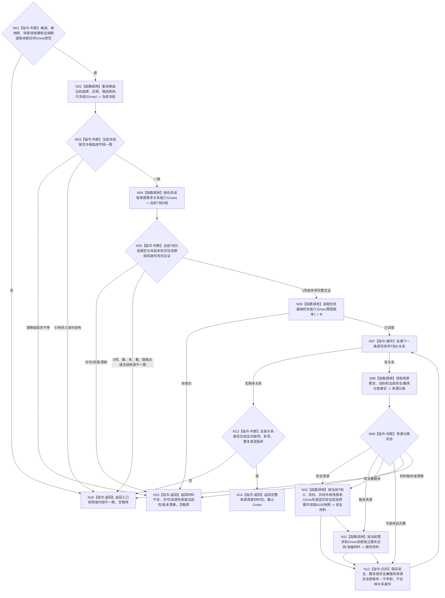

# BIZ-L3-003-03-07 读取一个冻结候选的当前来源调度材料目标函数流程图 v0.1

更新时间：2026-08-27

## 依据

```text
3200、5090、5200、5230、6150、6170
父图：BIZ-L2-003-03 v0.2
```

## 身份与边界

正式目标函数设计图。本函数针对一个已经由 L3-003-03-05 完整读回的冻结候选，在同一 `Gnow` 重读当前选择、实例、执行冻结、本轮实际 `T→D` 关系、逐来源需求/目标、共同作用场景、任务基础优先级及安全/服务来源材料，形成可供纯值投影的完整读取包。它不计算最终配额、不选任务，也不把需求列表其它成员补入来源。

6150要求安全层来源选择必须由显式、完整、稳定读取键形成。该键只能由后续具名“调度来源选择提供者”依据当前 `T→D`、当前需求目标、共同作用场景和 `Gnow` 形成；本函数不得枚举安全仓库，也不得从任务名称、方法名称、旧冻结快照或 self 位置补造。具体提供者 ABI 尚待下一层冻结。

## 函数合同

```text
根函数：读取一个冻结候选的当前来源调度材料
归属模块 / 文件 / 目标分解深度：任务普通派发选择 / 海中鱼巣/领域/内部治理/服务.任务普通派发选择.ixx / BIZ-L3
可见性：module-private；只由BIZ-L2-003-03根组合器逐候选调用
现有或待新增：待新增；HEAD有部分任务/需求/安全读取能力，但无本函数完整同Gnow组合
完整签名：冻结候选来源调度材料读取结果 任务普通派发选择组合器::读取一个冻结候选的当前来源调度材料(const 冻结候选来源调度材料读取请求& 请求) const noexcept
参数：请求只读借用；含L3-05单候选、L3-06根快照引用、运行代次、Gnow、共同作用场景读取键、图/任务集合/基础优先级/安全值阈值/调度规则期望版本
返回结果：已读取、材料不足、当前性漂移、版本漂移、入口拒绝、许可拒绝、资源失败或内部不一致；已读取形状含候选当前冻结、规范有序且非空的本轮实际T→D组、逐来源安全/服务分类及全部正式读取材料、B、版本向量和截止Gnow
被调函数流程图：下一层待按真实能力拆分任务冻结复核、按任务T→D完整读取、调度来源选择、需求/目标/服务合同和6150安全快照读取；不得展开各DATA内部实现
```

## 流程图



## 节点合同

| 节点 | 类型 | 输入绑定 | 输出绑定 | 事实读写 | 验证 |
| --- | --- | --- | --- | --- | --- |
| N02—N05 | 正式读取 / 互证 | 候选、T、Gnow | 当前冻结与完整T→D组 | 只读task owner | 冻结变化、0/1/N来源、漏/多/重/错端点 |
| N06 | 正式读取 | T、基础优先级版本 | B及来源版本 | 只读任务优先级owner | 零值、错版本、漂移 |
| N08—N12 | 逐来源组合读取 | T→D、D目标、共同作用场景、Gnow | 安全/服务分类与完整来源材料 | 只读需求、因果、安全、服务owner | 安全、服务、兼有、不适用、材料缺口 |
| N13/N14 | 完整性 / 返回 | 全部当前关系和逐项材料 | 同序完整材料包 | 无写入 | 顺序无关、版本同Gnow、截止一致 |

## 关键边界

- 当前来源只等于执行冻结本轮实际消费的正式 `T→D` 关系；需求列表成员、历史关系和旧投影都不得加入。
- 人类服务需求若同时能解除安全问题，调度只按安全来源计算，但服务合同身份仍保留作审计，不生成第二份服务调度来源。
- 共同作用场景必须来自目标、方法、当前路径和执行冻结的正式同义绑定；不得从 self 位置、首动作、对象名称或公共祖先推导。
- 当前任务正式来源和执行冻结本轮消费成员均要求非空；读取到0条关系属于内部不一致。只有“非空关系组均完整，但没有任何有效安全或服务来源”才由后继形成完整零调度资格。
