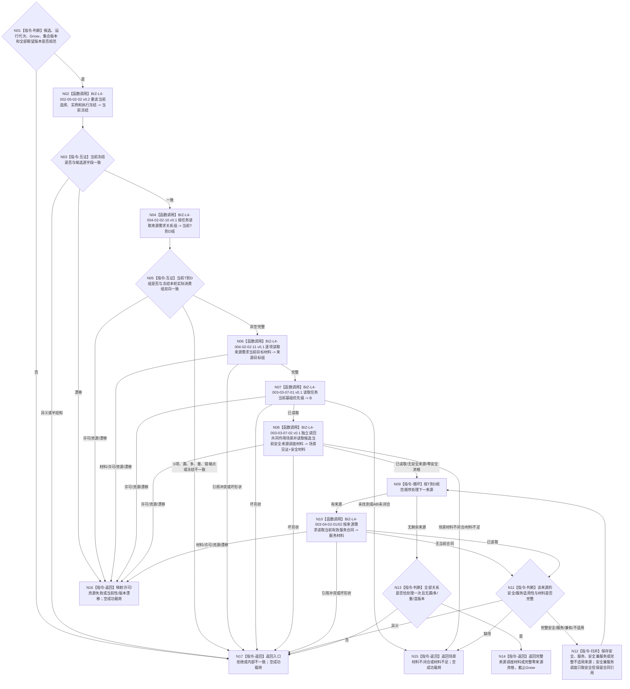

# BIZ-L3-003-03-07 读取一个冻结候选的当前来源调度材料目标函数流程图 v0.2

更新时间：2026-08-27

## 依据

```text
0050、3200、5090、5200、5230、6150、6170
父图：BIZ-L2-003-03 v0.4
复用：BIZ-L4-002-05-02-02 v0.2、BIZ-L4-004-02-02-10/11 v0.1、BIZ-L4-003-04-02-01/02 v0.1
新增叶：BIZ-L4-003-03-07-01/02 v0.1
替代关系：v0.2退出独立调度场景producer和从动作目标/self位置推导场景的错误口径
```

## 身份与边界

正式目标函数替代图。本函数针对 L3-05 完整候选，在同一 `Gnow` 重读当前选择/实例/执行冻结，读取完整当前 `T→D` 组和逐来源目标材料，再读取任务当前基础优先级 `B`。安全来源只经具名安全调度材料叶独立读回目标合同、方法动作适用合同、当前路径、执行绑定冻结材料和场景owner事实，形成共同作用场景互证见证；服务来源逐需求读取当前有效服务合同。全部材料闭合后，本函数形成供 L3-08 纯值投影消费的逐来源读取包。

共同作用场景与动作直接主体、间接结果主体、观察范围、自我当前位置分账。它不是调用方传入的裸调度键，也不由独立owner再次生产；只有目标合同和方法动作适用合同对该场景的约束均满足、当前路径与执行绑定冻结材料显式绑定同一非零场景、全部现实改变动作回显同一场景，且场景未退出、所需成员归属无缺失或多义时，才能作为现行单场景权限读取的 `适用场景`。任一条件不满足均返回场景材料不闭合。

## 函数合同

```text
根函数：任务普通派发选择组合器::读取一个冻结候选的当前来源调度材料
归属模块 / 文件 / 目标分解深度：任务普通派发选择 / 海中鱼巣/领域/内部治理/服务.任务普通派发选择.ixx / BIZ-L3
可见性：module-private；只由BIZ-L2-003-03 v0.4根组合器逐候选调用
现有或待新增：待新增；可复用当前冻结、T→D、目标和服务合同读取；基础优先级DATA ABI仍缺，正式共同作用场景字段与同Gnow互证属于代码实现缺口而非机器语义DRIFT
完整签名：冻结候选来源调度材料读取结果 任务普通派发选择组合器::读取一个冻结候选的当前来源调度材料(const 冻结候选来源调度材料读取请求& 请求) const noexcept
参数：请求只读借用；含L3-05单候选、L3-05任务集合版本、运行代次、Gnow及图/任务集合/基础优先级/安全值阈值/权限/服务生存调度期望版本；不得携带调用方声明B、裸场景或需求身份组替代T→D
返回结果：已读取、完整零来源资格、场景材料不闭合、材料不足、当前性漂移、版本漂移、入口拒绝、许可拒绝、资源失败或内部不一致；两个完整状态含当前冻结、非空规范T→D组、逐来源目标、安全/服务分类和材料、B、共同作用场景互证见证、版本向量及截止Gnow
被调函数流程图：BIZ-L4-002-05-02-02 v0.2；BIZ-L4-004-02-02-10/11 v0.1；BIZ-L4-003-03-07-01/02 v0.1；逐来源服务合同复用BIZ-L4-003-04-02-01/02 v0.1
```

## 流程图



## 节点合同

| 节点 | 类型 | 输入绑定 | 输出绑定 | 事实读写 | 验证 |
| --- | --- | --- | --- | --- | --- |
| N02—N06 | 复用正式读取 / 互证 | 候选、T、Gnow | 当前冻结、完整T→D和逐来源目标 | 只读task/需求/目标owner | 冻结变化、0/1/N来源、关系与材料一一守恒 |
| N07 | DATA读取 | T、集合/规则版本、Gnow | 非负B及来源版本 | 只读task owner基础优先级事实 | B=0、错定义、错版本、漂移 |
| N08 | BIZ安全读取 | 候选、目标/方法/路径/冻结读取键、来源目标、Gnow | 共同作用场景互证见证、安全来源、五级倍率、缺口/未归层 | 只读任务、方法、场景、因果和安全owner | 目标/方法约束满足、路径/冻结场景相等、动作回显、成员归属、0/N安全来源、混版本 |
| N09—N12 | 逐来源服务读取 / 归并 | 每条T→D、目标和安全材料 | 安全/服务/兼有/不适用分类 | 只读服务合同owner | 无合同合法；合同缺项失败；兼有不重复调度 |
| N13/N14 | 完整性 / 返回 | 全部关系与材料 | 完整读取包 | 无写入 | 数量、身份、顺序、版本和截止完全一致 |

## 关键边界

- 当前来源只等于执行冻结本轮实际消费的正式 `T→D`；需求列表成员、历史关系和旧投影不得加入。
- 共同作用场景是任务级统一执行上下文，不等于动作主体、结果主体、观察范围或self位置；目标/方法/路径/冻结任一读回缺失、异义或非当前时整个安全读取不能成功。
- 人类服务需求若同时直接解除安全问题，调度只按安全来源计算，但服务合同身份仍保留作审计。
- 当前T→D非空但全部来源均完整不适用时返回完整零来源资格；任一应适用材料缺失不得伪装成零。
- 当前仍具名阻断的是 `DRIFT-DATA-L2-TASK-BASE-PRIORITY-CURRENT-READ-ABI-UNFROZEN`。共同作用场景语义已冻结；代码未贯穿字段或读回只能登记实现缺失，不得恢复旧 `DRIFT-L4-FRESH-SCHEDULING-SCENE-SOURCE-UNDECLARED`，也不授权从线程、动作目标或旧请求补造。

## v0.2 校正记录

- 复用现有当前冻结、T→D与逐来源目标读取叶，删除未具名的“完整T→D provider待拆”表述。
- 将任务基础优先级拆为独立中性DATA读取叶。
- 退出独立任务级调度场景producer；改为由安全读取叶在Gnow独立读回目标/方法/路径/冻结中的共同作用场景并形成互证见证。
- 服务合同逐来源读取与安全来源分账；安全兼服务只取安全调度但保留服务审计引用。
