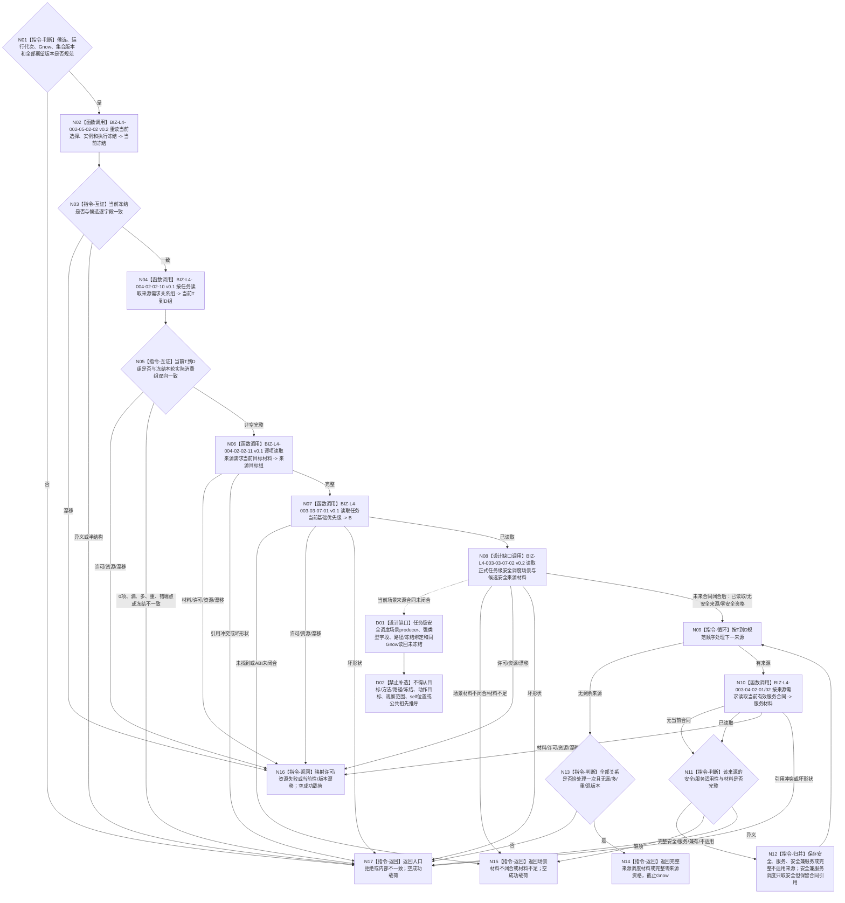

# BIZ-L3-003-03-07 读取一个冻结候选的当前来源调度材料目标函数流程图 v0.3

更新时间：2026-08-28

## 依据

```text
0050 v1.9、3200、5090 v0.7、5200、5230 v1.2、6150 v0.7、6170
父图：BIZ-L2-003-03 v0.5
复用：BIZ-L4-002-05-02-02 v0.2、BIZ-L4-004-02-02-10/11 v0.1、BIZ-L4-003-04-02-01/02 v0.2
新增叶：BIZ-L4-003-03-07-01 v0.1；BIZ-L4-003-03-07-02 v0.2为场景来源设计缺口图
替代关系：v0.3撤回v0.2把目标/方法/路径/冻结互证解释为正式共同作用场景来源的未授权结论
```

## 身份与边界

正式目标函数设计缺口图。本函数针对 L3-05 完整候选，在同一 `Gnow` 重读当前选择/实例/执行冻结，读取完整当前 `T→D` 组、逐来源目标材料、任务当前基础优先级 `B` 和逐来源当前有效服务合同；这些独立材料不依赖安全调度场景，可以继续冻结目标边界。

安全来源读取仍需要一个任务级安全调度适用场景。用户已确认 self、控制设施和受影响存在可作为同一较高层场景中的不同存在，但该世界边界不指定某个任务应使用哪一个正式调度场景。HEAD 5230 v1.2 / 6150 v0.7尚无唯一producer、强类型字段、路径/冻结绑定和同Gnow正式读回。因此安全材料分支必须停在BIZ-L4-003-03-07-02 v0.2设计缺口，不得从目标/方法/路径/冻结、动作目标、观察范围、self位置或公共祖先补造。

## 函数合同

```text
根函数：任务普通派发选择组合器::读取一个冻结候选的当前来源调度材料
归属模块 / 文件 / 目标分解深度：任务普通派发选择 / 海中鱼巣/领域/内部治理/服务.任务普通派发选择.ixx / BIZ-L3
可见性：module-private；只由BIZ-L2-003-03 v0.5根组合器逐候选调用
现有或待新增：部分目标已冻结但整体不可施工；当前冻结、T→D、目标和服务合同读取可复用，基础优先级DATA ABI与安全调度场景来源合同分别为具名缺口
完整签名：目标函数身份保留；场景来源字段未冻结前不得据本图生成完整C++ ABI
参数：已确定含L3-05单候选、任务集合版本、运行代次、Gnow及图/任务集合/基础优先级/安全值阈值/权限/服务生存调度期望版本；未来还必须消费正式任务级安全调度场景绑定，不得携带调用方裸场景或用需求身份组替代T→D
返回结果：至少区分已读取、完整零来源资格、场景材料不闭合、材料不足、当前性/版本漂移、入口/许可拒绝、资源失败或内部不一致；成功必须含正式场景绑定及同Gnow读回见证，字段待场景合同闭合
被调函数流程图：BIZ-L4-002-05-02-02 v0.2；BIZ-L4-004-02-02-10/11 v0.1；BIZ-L4-003-03-07-01 v0.1；BIZ-L4-003-03-07-02 v0.2设计缺口；服务合同复用BIZ-L4-003-04-02-01/02 v0.2
```

## 流程图



## 节点合同

| 节点 | 类型 | 输入绑定 | 输出绑定 | 事实读写 | 验证 |
| --- | --- | --- | --- | --- | --- |
| N02—N06 | 复用正式读取 / 互证 | 候选、T、Gnow | 当前冻结、完整T→D和逐来源目标 | 只读task/需求/目标owner | 冻结变化、0/1/N来源、关系与材料一一守恒 |
| N07 | DATA读取 | T、集合/规则版本、Gnow | 非负B及来源版本 | 只读task owner基础优先级事实 | B=0、错定义、错版本、漂移 |
| N08/D01/D02 | BIZ安全读取设计缺口 | 候选、正式任务级安全调度场景绑定、来源目标、Gnow | 目标为正式场景读回见证、安全来源、五级倍率、缺口/未归层 | 当前零调用、零写入 | producer、字段、绑定和读回矩阵冻结后才允许展开；不得用相邻材料补造 |
| N09—N12 | 逐来源服务读取 / 归并 | 每条T→D、目标和安全材料 | 安全/服务/兼有/不适用分类 | 只读服务合同owner | 无合同合法；合同缺项失败；兼有不重复调度 |
| N13/N14 | 完整性 / 返回 | 全部关系与材料 | 完整读取包 | 无写入 | 数量、身份、顺序、版本和截止完全一致 |

## 关键边界

- 当前来源只等于执行冻结本轮实际消费的正式 `T→D`；需求列表成员、历史关系和旧投影不得加入。
- self、控制设施和受影响存在可同属一个较高层场景，但该事实不自动等于任务级安全调度适用场景已经被正式选择和冻结。
- 人类服务需求若同时直接解除安全问题，调度只按安全来源计算，但服务合同身份仍保留作审计。
- 当前T→D非空但全部来源均完整不适用时返回完整零来源资格；任一应适用材料缺失不得伪装成零。
- 当前具名阻断包括 `DRIFT-DATA-L2-TASK-BASE-PRIORITY-CURRENT-READ-ABI-UNFROZEN` 与 `DRIFT-L4-FRESH-SCHEDULING-SCENE-SOURCE-UNDECLARED`。前者阻断B读取，后者阻断安全来源调度；二者均不得以线程、动作目标、旧请求或内部容器绕过。

## v0.3 校正记录

- 复用现有当前冻结、T→D与逐来源目标读取叶，删除未具名的“完整T→D provider待拆”表述。
- 将任务基础优先级拆为独立中性DATA读取叶。
- 撤回v0.2把目标/方法/路径/冻结同义解释为正式共同作用场景来源的结论，恢复任务级安全调度场景来源DRIFT。
- 保留“同一较高层场景中的多个存在”世界边界，但明确它不能替代producer、强类型字段、冻结绑定或同Gnow读回。
- 服务合同逐来源读取与安全来源分账；安全兼服务只取安全调度但保留服务审计引用。
