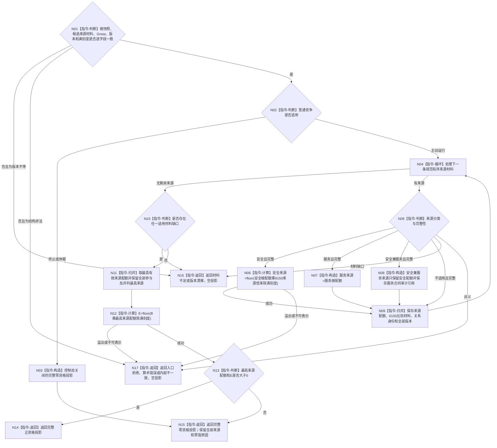

# BIZ-L3-003-03-08 形成一个冻结候选的fresh调度投影目标函数流程图 v0.1

更新时间：2026-08-27

## 依据

```text
5200、6150、6170
父图：BIZ-L2-003-03 v0.3
```

## 身份与边界

正式目标函数设计图。本函数只消费 L3-003-03-06 根调度快照和 L3-003-03-07 一个候选的完整来源材料，按6170逐来源形成最终调度配额、按6150保留安全来源比较材料，并以任务基础优先级计算有效执行优先级。它是纯值算法，不读取仓库、不生成身份、不修改任务或安全/服务事实。

旧 BIZ-L3-003-03-03 只覆盖安全类内单任务权限，旧04把缺少完整读取的候选直接统一排序；二者都不能直接复用为当前函数。现有宽整数、五组倍率和稳定比较算法只能在字段与规则版本逐项一致后作为内部实现证据复用。

## 函数合同

```text
根函数：形成一个冻结候选的fresh调度投影
归属模块 / 文件 / 目标分解深度：任务普通派发选择 / 海中鱼巣/领域/内部治理/服务.任务普通派发选择.ixx / BIZ-L3
可见性：module-private纯值函数；只由BIZ-L2-003-03 v0.3根组合器逐候选调用
现有或待新增：待新增；可复用6150/6170纯值算法片段
完整签名：冻结候选fresh调度投影结果 形成一个冻结候选的fresh调度投影(const 冻结候选fresh调度投影请求& 请求) noexcept
参数：请求只读借用；含一个候选完整来源材料、同Gnow根调度快照、满刻度和调度规则版本
返回结果：完整正资格、完整零资格、材料不足、版本漂移、入口拒绝、算术错误或内部不一致；完整形状含全部参与来源、并列最高来源、主来源、来源调度配额Qsource、B、E、安全组/组5材料、稳定键、版本向量和Gnow
被调函数流程图：无；逐来源组合、最大值、宽整数乘除和投影完整性均为本函数内纯值指令
```

## 流程图



## 节点合同

| 节点 | 类型 | 输入绑定 | 输出绑定 | 事实读写 | 验证 |
| --- | --- | --- | --- | --- | --- |
| N02/N03 | 判断 / 构造 | 控制态、根配额 | 控制关闭零资格 | 无写入 | A=0/1、零根配额 |
| N04—N09 | 循环 / 纯计算 | 逐T→D来源与根配额 | 逐来源最终调度配额 | 无写入 | 安全、服务、兼有、不适用、宽整数 |
| N10/N11 | 完整性 / 归并 | 全部来源 | 最高值、参与组、并列组 | 无写入 | 不求和、空来源、任一缺口fail-closed |
| N12—N15 | 计算 / 返回 | B、最高来源配额 | E和完整正/零投影 | 无写入 | B=0、Q=0、向下取整为0、溢出 |

## 关键边界

- 任一应适用来源材料缺失时，该候选不得以其它完整来源伪装成完整正资格；返回候选级材料不足。
- 多来源只取最大并保留全部并列，绝不求和；安全兼服务的同一需求不重复取得服务配额。
- `Qsource=0`或向下取整后`E=0`是完整零资格，不删除任务、来源、筹办、实例或冻结。
- 版本只作当前性与兼容门禁，不进入倍率、优先级或稳定同值强弱比较。
