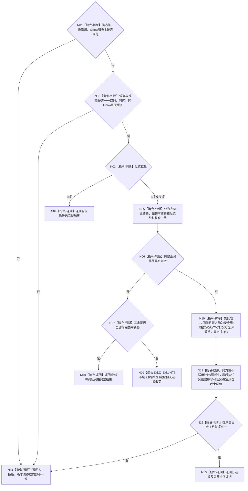

# BIZ-L3-003-03-09 从完整候选投影选择零或一个普通派发任务目标函数流程图 v0.1

更新时间：2026-08-27

## 依据

```text
3200、5200、6150、6170
父图：BIZ-L2-003-03 v0.5
```

## 身份与边界

正式目标函数设计图。本函数只对同一候选全集、同一 `Gnow` 的 L3-003-03-08 投影作完整性检查、确定性排序并选择 0..1 项。它不读取事实、不把材料缺口当零资格、不按队列顺序兜底，也不把排序结果写成任务状态。

旧 BIZ-L3-003-03-04 的部分宽整数与稳定排序方向可以作为复用证据，但它缺完整候选全集、服务来源、候选级材料缺口和当前父图的0..1返回合同，因此保持历史身份，不直接改挂。

## 函数合同

```text
根函数：从完整候选投影选择零或一个普通派发任务
归属模块 / 文件 / 目标分解深度：任务普通派发选择 / 海中鱼巣/领域/内部治理/服务.任务普通派发选择.ixx / BIZ-L3
可见性：module-private纯值函数；只由BIZ-L2-003-03 v0.5根组合器调用
现有或待新增：待新增；可复用6150确定性比较片段
完整签名：普通派发候选选择结果 从完整候选投影选择零或一个普通派发任务(const 普通派发候选选择请求& 请求) noexcept
参数：请求只读借用；含L3-05完整候选组、逐候选L3-08结果、Gnow、任务集合版本和排序规则版本
返回结果：已选择、当前无候选、全部零调度资格、材料不足、版本漂移、入口拒绝或内部不一致；已选择恰含一个候选、其完整投影、全部参与/并列来源及排序证据，三个完整状态截止均为Gnow
被调函数流程图：无；集合双射、过滤和稳定比较均为本函数内纯值指令
```

## 流程图



## 节点合同

| 节点 | 类型 | 输入绑定 | 输出绑定 | 事实读写 | 验证 |
| --- | --- | --- | --- | --- | --- |
| N01/N02 | 完整性 | 候选全集、逐候选投影 | 一一双射同快照组 | 无写入 | 缺、多、重、错任务、错G、混版本 |
| N05—N09 | 分组 / 返回 | 正、零、缺口投影 | 0项完整或材料不足 | 无写入 | 全零、零加缺口、全缺口、正加缺口 |
| N10/N11 | 确定性排序 | E、Q、B及适用安全比较材料 | 全序候选 | 无写入 | E优先；组1—4、组5完整链、服务/跨类不适用项、稳定同值 |
| N12/N13 | 判断 / 返回 | 全序候选 | 恰一所选项及证据 | 无写入 | 多任务完全并列、排序规则漂移 |

## 关键边界

- 有完整正资格候选时，候选级材料缺口项不参加本次比较，但必须保留缺口定位；不得把其排成零值，也不得阻止其它完整候选参加正常竞争。
- 只有“无正资格且其余全部完整零资格”才能返回全部零调度资格；混有材料缺口时返回材料不足。
- 6150组5的后果、安全不足、时间和因果证据只在对应比较项对双方均适用时使用；服务来源或跨类同值不得把不适用材料伪装成0或最大值。
- 队列位置、线程号、等待时长、容器地址和版本号都不得进入强弱排序。
