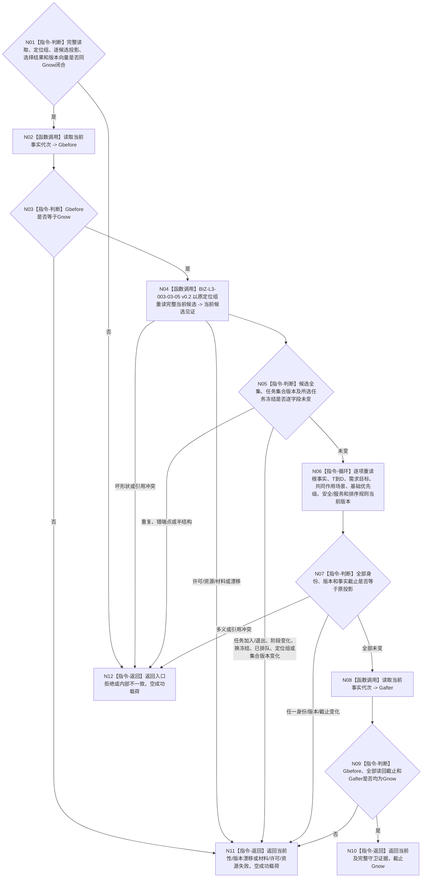

# BIZ-L3-003-03-10 复核普通派发选择当前性目标函数流程图 v0.2

更新时间：2026-08-27

## 依据

```text
0050、3200、4230、5230、6150、6170、8100
父图：BIZ-L2-003-03 v0.3
复用：BIZ-L3-003-03-05 v0.2
```

## 身份与边界

正式目标函数替代图。本函数在返回派发选择前，先以原 `Gnow` 和原任务管理候选定位组重新调用 L3-05 v0.2，重新取得中性任务全集、逐任务阶段筛选后的完整候选组及任务集合版本；再对根调度、逐候选 `T→D` / 来源材料和全部规则版本执行读后守卫。它只证明刚形成的值式选择仍绑定同一当前事实，不发布排队事实、不构造工作包，也不替代动作开始前的再次 fresh 复核。

v0.1 让 task owner 直接重读“当前候选组”，继续混入业务阶段筛选；本版退出该读法。只重读所选任务、只比较线程定位组或只看全局事实代次均不足；候选新增、退出、阶段变化、换冻结、已排队或任务集合版本变化都使旧选择失效。

## 函数合同

```text
根函数：任务普通派发选择组合器::复核普通派发选择当前性
归属模块 / 文件 / 目标分解深度：任务普通派发选择 / 海中鱼巣/领域/内部治理/服务.任务普通派发选择.ixx / BIZ-L3
可见性：module-private；只由BIZ-L2-003-03 v0.3根组合器在返回前调用
现有或待新增：待新增
完整签名：普通派发选择当前性复核结果 任务普通派发选择组合器::复核普通派发选择当前性(const 普通派发选择当前性复核请求& 请求) const noexcept
参数：请求只读借用；含原L3-05完整候选读回、原任务管理完整候选定位组、L3-06根快照、L3-07/08逐候选证据、L3-09选择结果、Gnow及全部来源版本向量
返回结果：当前、当前性漂移、版本漂移、材料不足、入口拒绝、许可拒绝、资源失败或内部不一致；只有当前返回原完整结果身份、正式读回截止Gnow和逐项守卫证据
被调函数流程图：BIZ-L3-003-03-05 v0.2；各正式owner版本读取能力，不重新计算投影
```

## 流程图



## 节点合同

| 节点 | 类型 | 输入绑定 | 输出绑定 | 事实读写 | 验证 |
| --- | --- | --- | --- | --- | --- |
| N04/N05 | L3-05复用 / 互证 | 原候选、原定位组、原集合版本、Gnow | 当前完整候选见证 | 只读task、存在、状态、选择、冻结和排队事实 | 新增、退出、阶段变化、换冻结、已排队、定位变化、集合版本变化 |
| N06/N07 | 逐owner重读 / 判断 | 原输入版本向量 | 全部未变或具名漂移 | 只读任务、需求、因果、安全、服务owner | 单项漂移、错场景、错T→D、规则变化 |
| N02/N08/N09 | 读取 / 守卫 | Gnow | 读后共同截止 | 只读当前事实代次 | 读前、逐项、读后不一致 |

## 关键边界

- task owner不按业务阶段返回候选；L3-05 v0.2的中性全集+逐任务BIZ筛选必须整体重放。
- 只重读一个所选任务不足；完整任务集合或任一任务阶段变化都可能改变候选全集与排序结果。
- 摘要可以作传输校验，但不能替代任务、阶段、轮次、冻结、排队、来源、版本和截止逐字段互证。
- 守卫成功只覆盖选择返回前；BIZ-L2-004-04派发和BIZ-L2-004-07动作开始前仍须各自按当前事实复核。

## v0.2 校正记录

- 复用L3-05 v0.2重读中性任务全集与BIZ候选，不再调用task owner业务阶段候选入口。
- 将任务集合版本来源固定为L4-05-01正式读取，并把阶段变化和已排队纳入候选失效矩阵。
